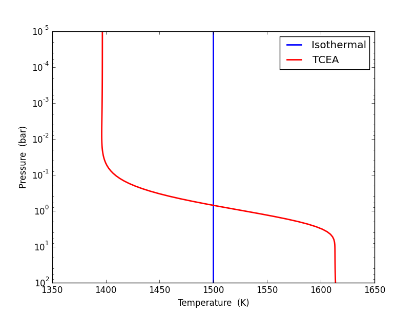
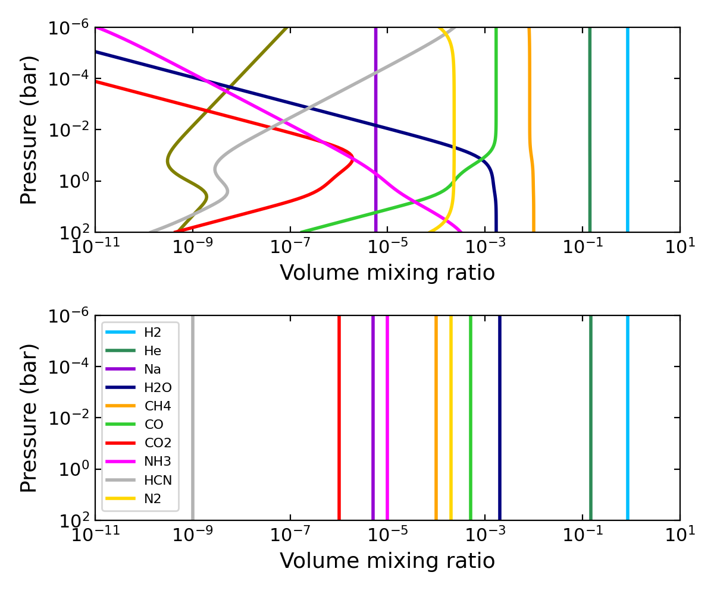
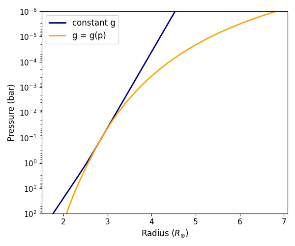

.. |H2O| replace:: H\ :sub:`2`\ O
.. |CO2| replace:: CO\ :sub:`2`
.. |CH4| replace:: CH\ :sub:`4`
.. |H2|  replace:: H\ :sub:`2`

.. |kappa|  replace:: :math:`\log_{10}(\kappa')`
.. |gamma1| replace:: :math:`\log_{10}(\gamma_1)`
.. |gamma2| replace:: :math:`\log_{10}(\gamma_2)`
.. |alpha|  replace:: :math:`\alpha`
.. |beta|   replace:: :math:`\beta`
.. |Tirr|   replace:: :math:`T_{\rm irr}`
.. |Tint|   replace:: :math:`T_{\rm int}`

.. |logp1| replace:: :math:`\log_{10}(p_1)`
.. |logp2| replace:: :math:`\log_{10}(p_2)`
.. |logp3| replace:: :math:`\log_{10}(p_3)`
.. |a1|    replace:: :math:`a_1`
.. |a2|    replace:: :math:`a_2`
.. |T0|    replace:: :math:`T_0`

.. _atmospheretutorial:

Atmosphere Tutorial
===================

This run mode generates a 1D atmospheric model (pressure, temperature,
abundances, and altitude profiles).  At minimum, the user needs to
provide the arguments required to compute the pressure and temperature
profiles.  Further, ``Pyrat Bay`` can compute abundance (volume-mixing
ratio, VMR) profiles only if the user sets the ``chemistry`` and
respective arguments.  Likewise, the code will compute the altitude
profiles only if the user provides the ``radmodel`` and respective
arguments (which also require that the abundance profiles to be
defined).

Regardless of which profiles are computed, in an interactive run the
code returns a five-element tuple containing the pressure profile
(barye), the temperature profile (Kelvin), the abundance profiles
(volume mixing fraction), the species names, and the altitude profile
(cm).  The outputs that were not calculated are set to ``None``.
Also, regardless of the input units, the output variables will always
be in CGS units.

In the config file, the user can set the ``atmfile`` argument to
specify an input atmospheric file from where to read pressure,
temperature, volume mixing ratios, and/or altitude profiles.  The
``output_atmfile`` argument instead can be set to specify a file name
where to store the outputs.

Pressure Profile
----------------

The pressure profile model is an equi-spaced array in log-pressure,
determined by the pressure at the top of the atmosphere ``ptop``, at
the bottom of the atmosphere ``pbottom``, and the number of layers
``nlayers``.

The units for the ``ptop`` and ``pbottom`` pressures may be defined
in-place along with the variable value (e.g., ``pbottom = 100 bar``)
or through the ``punits`` key (in-place units take precedence over
``punits``).  See :ref:`units` for a list of available units.

.. _temp_profile:

Temperature Profiles
--------------------

Currently, there are three temperature models (``tmodel`` argument) to
compute temperature profiles.  Each one requires a different set of
parameters (``tpars``), which is described in the table and sections below:

=================== ==================================================== ====
Models (``tmodel``) Parameters (``tpars``)                               References
=================== ==================================================== ====
isothermal          :math:`T_0`                                          ---
guillot             |kappa|, |gamma1|, |gamma2|, |alpha|, |Tirr|, |Tint| [Line2013]_
madhu               |logp1|, |logp2|, |logp3|, |a1|, |a2|, |T0|          [Madhusudhan2009]_
=================== ==================================================== ====

Isothemal profile
^^^^^^^^^^^^^^^^^

The isothermal model is the simplest model, having just one free
parameter (``tpars``): the temperature (:math:`T_0`) at all layers.

Here is an example of an isothermal atmosphere configuration file:

.. literalinclude:: ../examples/tutorial/pt_isothermal.cfg
    :caption: File: pt_isothermal.cfg

Guillot profile
^^^^^^^^^^^^^^^

The guillot model has six parameters as defined in [Line2013]_: |kappa|,
|gamma1|, |gamma2|, |alpha|, |Tirr| and |Tint|.  The temperature
profile is given as:

.. math::
   T^4(p) = \frac{3 T_{\rm int}^{4}}{4} \left(\frac{2}{3} + \tau\right)
    + (1-\alpha) \frac{3 T_{\rm irr}^{4}}{4} \xi_1(\tau)
    +    \alpha  \frac{3 T_{\rm irr}^{4}}{4} \xi_2(\tau),

with

.. math::
    \xi_i(\tau) = \frac{2}{3}
        + \frac{2}{3\gamma_i} \left[1 + \left(\frac{\gamma_i\tau}{2}-1\right)e^{-\gamma_i\tau}\right]
        + \frac{2\gamma_i}{3} \left(1-\frac{\tau^{2}}{2}\right)E_{2}(\gamma_i\tau),

where :math:`E_{2}(\gamma_{i}\tau)` is the second-order exponential
integral; |Tint| is the internal heat temperature; and :math:`\tau(p)
= \kappa' p` (note that this parameterization differs from that of
[Line2013]_, which are related as :math:`\kappa' \equiv \kappa/g`).
|Tirr| parametrizes the stellar irradiation absorbed by the planet:

.. math::
  T_{\rm irr} = \left(\frac{1-A}{f}\right)^{1/4}
                \left( \frac{R_{\rm s}}{2a}\right)^{1/2} T_{\rm s},

Here is an example of a ``guillot`` atmosphere configuration file
(`pt_guillot.cfg
<https://github.com/pcubillos/pyratbay/blob/master/examples/tutorial/pt_guillot.cfg>`_):

.. literalinclude:: ../examples/tutorial/pt_guillot.cfg
    :caption: File: pt_guillot.cfg

Madhu profile
^^^^^^^^^^^^^

The madhu model has six parameters: |logp1|, |logp2|, |logp3|, |a1|,
|a2|, and |T0|, as described in [Madhusudhan2009]_, where the pressure
values must be given in bars.  The temperature profile is given as:

.. math::
  T(p) = \left\{
  \begin{array}{lll}
  T_0 + \left[\frac{1}{a_1}\ln(p/p_0)\right]^2 & \text{if } p < p_1
     & (\rm layer\ 1) \\
  T_2 + \left[\frac{1}{a_2}\ln(p/p_2)\right]^2 & \text{if } p_1 \le p < p_3
     & (\rm layer\ 2) \\
  T_3   & \text{if } p \ge p_3 & (\rm layer\ 3)
  \end{array} \right.

A thermally inverted profile will
result when :math:`p_1 < p_2`; a non-inverted profile will result when
:math:`p_2 < p_1`.  The pressure parameters must also satisfy:
:math:`p_1 < p_3`.

Here is an example of a ``madhu`` atmosphere configuration file
(`pt_madhu.cfg
<https://github.com/pcubillos/pyratbay/blob/master/examples/tutorial/pt_madhu.cfg>`_):

.. literalinclude:: ../examples/tutorial/pt_madhu.cfg

-------------------------------------------------------------------

Temperature-profile Examples
^^^^^^^^^^^^^^^^^^^^^^^^^^^^

.. note:: Before running this example, download the configuration
          files shown above, e.g., with these shell commands:

          .. code-block:: shell

              tutorial_path=https://raw.githubusercontent.com/pcubillos/pyratbay/master/examples/tutorial
              wget $tutorial_path/pt_isothermal.cfg
              wget $tutorial_path/pt_guillot.cfg
              wget $tutorial_path/pt_madhu.cfg

The following Python script creates and plots the pressure-temperature
profiles for the configuration files shown above:

.. code-block:: python

  import matplotlib.pyplot as plt
  plt.ion()

  import pyratbay as pb
  import pyratbay.constants as pc

  # Generate PT profiles:
  press, t_iso = pb.run("pt_isothermal.cfg")[0:2]
  press, t_guillot = pb.run("pt_guillot.cfg")[0:2]
  press, t_madhu = pb.run("pt_madhu.cfg")[0:2]

  # Plot the PT profiles:
  plt.figure(11)
  plt.clf()
  plt.semilogy(t_iso, press/pc.bar, color='mediumblue', lw=2, label='isothermal')
  plt.semilogy(t_guillot, press/pc.bar, color='orange', lw=2, label='guillot')
  plt.semilogy(t_madhu, press/pc.bar, color='tab:green', lw=2, label='madhu')
  plt.ylim(100, 1e-5)
  plt.xlim(800, 1200)
  plt.legend(loc="best", fontsize=12)
  plt.xlabel("Temperature  (K)", fontsize=12)
  plt.ylabel("Pressure  (bar)", fontsize=12)
  plt.tight_layout()

And the results should look like this:

.. note:: If any of the required variables is missing form the
          configuration file, ``Pyrat Bay`` will throw an error
          indicating the missing value, and **stop executing the
          run.** Similarly, ``Pyrat Bay`` will throw a warning for a
          missing variable that was defaulted, and **continue
          executing the run.**

----------------------------------------------------------------------

.. _abundance_profile:

Abundance Profiles
------------------

Currently, there are two models to set the base volume-mixing-ratio
chemistry (``chemistry`` argument): ``uniform`` or ``tea``.  Each one
requires a different set of arguments, which is described in the table
and sections below:

====================== ==================================================== ====
Models (``chemistry``) Required arguments [optional arguments]              References
====================== ==================================================== ====
uniform                ``species``, ``uniform``, [``vmr_vars``]             ---
tea                    ``species``, [``vmr_vars``]                          [Blecic2016]_
====================== ==================================================== ====

Uniform abundances
^^^^^^^^^^^^^^^^^^

To produce a uniform-abundance model, the configuration file must
contain the ``species`` key specifying a list of the name of the
species to include in the atmosphere, and the ``uniform`` key
specifying the mole mixing fraction for each of the species listed in
``species``.

Here is an example of a uniform atmosphere configuration file (`tutorial_atmosphere_uniform.cfg
<https://github.com/pcubillos/pyratbay/blob/master/examples/tutorial_atmosphere_uniform.cfg>`_):

.. literalinclude:: ../examples/tutorial_atmosphere_uniform.cfg

Thermochemical-equilibrium Abundances
^^^^^^^^^^^^^^^^^^^^^^^^^^^^^^^^^^^^^

``Pyrat Bay`` computes thermochemical equilibrium abundances (TEA) via
the chemcat package, by minimizing the Gibbs free energy at each
layer.  To produce a TEA model, the configuration file must set
``chemistry=tea``.  The ``species`` argument sets the species to
include in the atmosphere.

The TEA run assumes a solar elemental composition from [Asplund2021]_
as the base for the thermochemical equilibrium model; however, the
user can customize the elemental abundances using the ``vmr_vars``
argument.  The table below shows the available options.

================= ===
``vmr_vars``      Notes
================= ===
``[M/H]``         Metallicity of all elemental species (dex units, with respect to solar)
``[X/H]``         Metallicity of element ``X`` (dex units, with respect to solar).  Overrides ``[M/H]``
``X/Y``           Abundance of element ``X`` relative to element ``Y``.  Overrides ``[M/H]`` for ``X``, but ``Y`` can be previously modified by ``[M/H]`` or ``[Y/H]``.
================= ===

.. ``log_mol``       log10(VMR) of species ``mol`` (constant with altitude)

Here is an example of a thermochemical-equilibrium atmosphere
configuration file (`tutorial_atmosphere_tea.cfg
<https://github.com/pcubillos/pyratbay/blob/master/examples/tutorial_atmosphere_tea.cfg>`_):

.. literalinclude:: ../examples/tutorial_atmosphere_tea.cfg

----------------------------------------------------------------------

.. _abundance_tutorial_example:

Abundance-profile Examples
^^^^^^^^^^^^^^^^^^^^^^^^^^

.. note:: Before running this example, download the configuration
          files shown above, e.g., with these shell commands:

          .. code-block:: shell

              tutorial_path=https://raw.githubusercontent.com/pcubillos/pyratbay/master/examples
              wget $tutorial_path/tutorial_atmosphere_tea.cfg
              wget $tutorial_path/tutorial_atmosphere_uniform.cfg

The following Python script creates and plots the abundance
Aprofiles for the configuration files shown above:

.. code-block:: python

    import matplotlib.pyplot as plt
    plt.ion()

    import pyratbay as pb
    import pyratbay.plots as pp

    # Generate a uniform and a thermochemical-equilibrium atmospheric model:
    atm_tea = pb.run("tutorial_atmosphere_tea.cfg")
    atm_uni = pb.run("tutorial_atmosphere_uniform.cfg")

    # Plot the results:
    plt.figure(12, (6,5))
    plt.clf()
    ax1 = plt.subplot(211)
    ax1 = pp.abundance(
        atm_tea.vmr, atm_tea.press, atm_tea.species,
        colors='default', xlim=[1e-12, 3.0], legend_fs=8, ax=ax1,
    )
    ax2 = plt.subplot(212)
    ax2 = pp.abundance(
        atm_uni.vmr, atm_uni.press, atm_uni.species,
        colors='default', xlim=[1e-12, 3.0], legend_fs=0, ax=ax2,
    )
    plt.tight_layout()

And the results should look like this:

----------------------------------------------------------------------

.. _altitude_profile:

Altitude Profiles
-----------------

If the user sets the ``radmodel`` key, the code will to compute the
atmospheric altitude profile (radius profile).  The currently
available models solve for the hydrostatic-equilibrium equation,
combined with the ideal gas law with a pressure-dependent gravity
(``radmodel=hydro_m``, recommended):

.. math::
   \frac{dr}{r^2} = -\frac{k_{\rm B}T}{\mu G M_p} \frac{dp}{p},

or a constant surface gravity (``radmodel=hydro_g``):

.. math::
   dr = -\frac{k_{\rm B}T}{\mu g} \frac{dp}{p},

where :math:`M_{\rm p}` is the mass of the planet, :math:`T(p)` is the
atmospheric temperature, :math:`\mu(p)` is the atmospheric mean
molecular mass, :math:`k_{\rm B}` is the Boltzmann constant, and
:math:`G` is the gravitational constant.  Note that :math:`T(p)` and
:math:`\mu(p)` are computed from the models of the :ref:`temp_profile`
and :ref:`abundance_profile`, respectively.

To obtain the particular solution of these differential equations,
the user needs to supply a pair of radius--pressure reference values
to define the boundary condition :math:`r(p_0) = R_0`.  The
``rplanet`` and ``refpressure`` keys set :math:`R_0` and :math:`p_0`,
respectively.
The ``mplanet`` and ``gplanet`` keys set the planetary mass (:math:`M_p`)
and surface gravity (:math:`g`) corresponding to ``rplanet``, respectively.

.. Note:: Note that the user needs only to define one variable between
    ``mplanet`` and ``gplanet`` since they are related
    through the equation: :math:`g(R_0) = G M_p / R_0^2`.  Whenever
    ``mplanet`` is set to a given value, ``gplanet`` is updated
    consistently, and vice versa.

Note that the selection of the :math:`\{p_0,R_0\}` pair is arbitrary.
A good practice is to choose values close to the transit radius of
the planet.  Although the pressure at the transit radius is a priori
unknown for a give particular case [Griffith2014]_, its value lies
at around 0.1 bar.

Here is an example of a hydrostatic-equilibrium atmosphere
configuration file (`atmosphere_hydro_m.cfg
<https://github.com/pcubillos/pyratbay/blob/master/examples/tutorial/atmosphere_hydro_m.cfg>`_):

.. literalinclude:: ../examples/tutorial/atmosphere_hydro_m.cfg

Altitude-profile Examples
^^^^^^^^^^^^^^^^^^^^^^^^^^

.. note:: Before running this example, download the configuration
          files shown above, e.g., with these shell commands:

          .. code-block:: shell

              tutorial_path=https://raw.githubusercontent.com/pcubillos/pyratbay/master/examples/tutorial
              wget $tutorial_path/atmosphere_hydro_m.cfg
              wget $tutorial_path/atmosphere_hydro_g.cfg

The following Python script creates and plots the profiles
for the configuration file shown above:

.. code-block:: python

    import matplotlib.pyplot as plt
    plt.ion()

    import pyratbay as pb
    import pyratbay.constants as pc

    # Kepler-11c mass and radius:
    pressure, temp, q, species, radius = pb.run("atmosphere_hydro_m.cfg")
    pressure, temp, q, species, radius_g = pb.run("atmosphere_hydro_g.cfg")

    # Plot the results:
    plt.figure(12, (6,5))
    plt.clf()
    ax = plt.subplot(111)
    ax.semilogy(radius_g/pc.rearth, pressure/pc.bar, lw=2, c='navy', label='constant g')
    ax.semilogy(radius/pc.rearth, pressure/pc.bar, lw=2, c='orange', label='g = g(p)')
    ax.set_ylim(1e2, 1e-6)
    ax.set_xlabel(r'Radius $(R_{\oplus})$', fontsize=12)
    ax.set_ylabel('Pressure (bar)', fontsize=12)
    ax.tick_params(labelsize=11)
    ax.legend(loc='upper left', fontsize=12)
    plt.tight_layout()

And the results should look like this:

