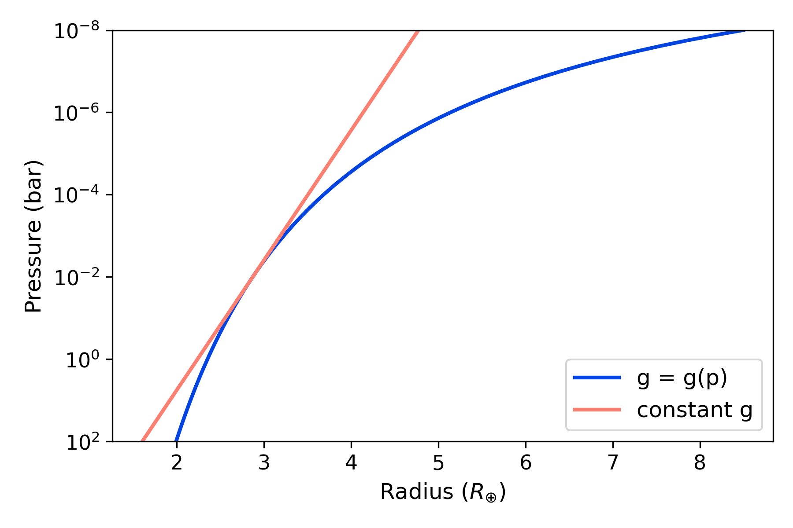

.. include:: _substitutions.rst

.. _atmospheretutorial:

Atmosphere Modeling
===================

This documentation shows how to model 1D planetary atmospheres.  There
are four properties that can be modeled:

1. :ref:`Pressure profile <pressure>`
2. :ref:`Temperature profile <temperature_profile>`
3. :ref:`Abundance profiles (volume mixing ratios) <abundance_profile>`
4. :ref:`Radius profile <radius_profile>`

--------------------------------------------------------

.. _pressure:

Pressure
--------

The ``pa.pressure()`` function allows users to compute pressure
profiles equi-spaced in log-pressure.  Users need to provide the the
pressure at the top of the atmosphere ``ptop``, at the bottom
``pbottom``, the number of layers ``nlayers``, and (optionally) the
units ``units``.  See :ref:`units` for a list of
available pressure units.

Examples
^^^^^^^^

.. tab-set::

  .. tab-item:: default units
     :selected:

     .. code-block:: python

       import pyratbay.atmosphere as pa

       # Generate pressure profile (default units are bars):
       press = pa.pressure(ptop=1e-8, pbottom=1e2, nlayers=61)

       print(press)

     Expected output:

     .. code-block:: none

      [1.00000000e-08 1.46779927e-08 2.15443469e-08 3.16227766e-08
       4.64158883e-08 6.81292069e-08 1.00000000e-07 1.46779927e-07
       2.15443469e-07 3.16227766e-07 4.64158883e-07 6.81292069e-07
       1.00000000e-06 1.46779927e-06 2.15443469e-06 3.16227766e-06
       4.64158883e-06 6.81292069e-06 1.00000000e-05 1.46779927e-05
       2.15443469e-05 3.16227766e-05 4.64158883e-05 6.81292069e-05
       1.00000000e-04 1.46779927e-04 2.15443469e-04 3.16227766e-04
       4.64158883e-04 6.81292069e-04 1.00000000e-03 1.46779927e-03
       2.15443469e-03 3.16227766e-03 4.64158883e-03 6.81292069e-03
       1.00000000e-02 1.46779927e-02 2.15443469e-02 3.16227766e-02
       4.64158883e-02 6.81292069e-02 1.00000000e-01 1.46779927e-01
       2.15443469e-01 3.16227766e-01 4.64158883e-01 6.81292069e-01
       1.00000000e+00 1.46779927e+00 2.15443469e+00 3.16227766e+00
       4.64158883e+00 6.81292069e+00 1.00000000e+01 1.46779927e+01
       2.15443469e+01 3.16227766e+01 4.64158883e+01 6.81292069e+01
       1.00000000e+02]

  .. tab-item:: string inputs

     .. code-block:: python

       import pyratbay.atmosphere as pa

       # Generate pressure profile (specify units in pressure boundaries):
       press = pa.pressure(ptop='1e-8 bar', pbottom='1e2 bar', nlayers=61)

       print(press)

     Expected output:

     .. code-block:: none

      [1.00000000e-08 1.46779927e-08 2.15443469e-08 3.16227766e-08
       4.64158883e-08 6.81292069e-08 1.00000000e-07 1.46779927e-07
       2.15443469e-07 3.16227766e-07 4.64158883e-07 6.81292069e-07
       1.00000000e-06 1.46779927e-06 2.15443469e-06 3.16227766e-06
       4.64158883e-06 6.81292069e-06 1.00000000e-05 1.46779927e-05
       2.15443469e-05 3.16227766e-05 4.64158883e-05 6.81292069e-05
       1.00000000e-04 1.46779927e-04 2.15443469e-04 3.16227766e-04
       4.64158883e-04 6.81292069e-04 1.00000000e-03 1.46779927e-03
       2.15443469e-03 3.16227766e-03 4.64158883e-03 6.81292069e-03
       1.00000000e-02 1.46779927e-02 2.15443469e-02 3.16227766e-02
       4.64158883e-02 6.81292069e-02 1.00000000e-01 1.46779927e-01
       2.15443469e-01 3.16227766e-01 4.64158883e-01 6.81292069e-01
       1.00000000e+00 1.46779927e+00 2.15443469e+00 3.16227766e+00
       4.64158883e+00 6.81292069e+00 1.00000000e+01 1.46779927e+01
       2.15443469e+01 3.16227766e+01 4.64158883e+01 6.81292069e+01
       1.00000000e+02]

  .. tab-item:: units argument

     .. code-block:: python

       import pyratbay.atmosphere as pa

       # Generate pressure profile (specify units):
       press = pa.pressure(ptop=1e-8, pbottom=1e2, units='bar', nlayers=61)

       print(press)

     Expected output:

     .. code-block:: none

      [1.00000000e-08 1.46779927e-08 2.15443469e-08 3.16227766e-08
       4.64158883e-08 6.81292069e-08 1.00000000e-07 1.46779927e-07
       2.15443469e-07 3.16227766e-07 4.64158883e-07 6.81292069e-07
       1.00000000e-06 1.46779927e-06 2.15443469e-06 3.16227766e-06
       4.64158883e-06 6.81292069e-06 1.00000000e-05 1.46779927e-05
       2.15443469e-05 3.16227766e-05 4.64158883e-05 6.81292069e-05
       1.00000000e-04 1.46779927e-04 2.15443469e-04 3.16227766e-04
       4.64158883e-04 6.81292069e-04 1.00000000e-03 1.46779927e-03
       2.15443469e-03 3.16227766e-03 4.64158883e-03 6.81292069e-03
       1.00000000e-02 1.46779927e-02 2.15443469e-02 3.16227766e-02
       4.64158883e-02 6.81292069e-02 1.00000000e-01 1.46779927e-01
       2.15443469e-01 3.16227766e-01 4.64158883e-01 6.81292069e-01
       1.00000000e+00 1.46779927e+00 2.15443469e+00 3.16227766e+00
       4.64158883e+00 6.81292069e+00 1.00000000e+01 1.46779927e+01
       2.15443469e+01 3.16227766e+01 4.64158883e+01 6.81292069e+01
       1.00000000e+02]

.. _temperature_profile:

Temperature
-----------

Currently, there are three available temperature models:

..   :widths: 7, 20, 25

.. list-table:: Temperature profile models
   :header-rows: 1

   * - Model name
     - Parameter names
     - References
   * - ``isothermal``
     - ``T_iso``
     - ---
   * - ``guillot``
     - ``log_kappa'``, ``log_gamma1``, ``log_gamma2``, ``alpha``, ``T_irr``, ``T_int``
     - [Line2013]_
   * - ``madhu``
     - ``log_p1``, ``log_p2``, ``log_p3``, ``a1``, ``a2``, ``T0``
     - [Madhusudhan2009]_

Any of these models can be used either as stand-alone functions or via
the ``pb.run()`` function with a configuration file.

Examples
^^^^^^^^

Temperature profiles can be generated from configuration files, which
can be *either* run from the command line or from interactive Python
sessions. Here are examples for each of the models:

.. tab-set::

  .. tab-item:: isothermal
     :selected:

     .. raw:: html

        

        
Click here to show/hide: temperature_profile_isothermal.cfg

     .. literalinclude:: ./_static/data/temperature_profile_isothermal.cfg
         :language: ini
         :caption: File: `temperature_profile_isothermal.cfg <./_static/data/temperature_profile_isothermal.cfg>`__

     .. raw:: html

        

     Copy this configuration file to your local folder.  Then users
     can generate temperature profiles, either from an interactive
     python session, as in the following script:

     .. code-block:: python

       import pyratbay as pb

       # Generate an atmosphere object with the profiles:
       atm = pb.run("temperature_profile_isothermal.cfg")

       # The atm object contains the temperature profile, among other properties:
       # (e.g., see also atm.press for the pressure array)
       print(atm.temp)

     .. code-block:: none

       [990. 990. 990. 990. 990. 990. 990. 990. 990. 990. 990. 990. 990. 990.
        990. 990. 990. 990. 990. 990. 990. 990. 990. 990. 990. 990. 990. 990.
        990. 990. 990. 990. 990. 990. 990. 990. 990. 990. 990. 990. 990. 990.
        990. 990. 990. 990. 990. 990. 990. 990. 990. 990. 990. 990. 990. 990.
        990. 990. 990. 990. 990.]

     Which will create an output .atm file with the
     pressure-temperature profile (same root file name as ``logfile``
     in the configuration file).

     Alternatively, users can execute this script from the command line:

     .. code-block:: shell

       pbay -c temperature_profile_isothermal.cfg

  .. tab-item:: guillot

     .. raw:: html

        

        
Click here to show/hide: temperature_profile_guillot.cfg

     .. literalinclude:: ./_static/data/temperature_profile_guillot.cfg
         :language: ini
         :caption: File: `temperature_profile_madhu.cfg <./_static/data/temperature_profile_guillot.cfg>`__

     .. raw:: html

        

     Copy this configuration file to your local folder.  Then users
     can generate temperature profiles, either from an interactive
     python session, as in the following script:

     .. code-block:: python

       import pyratbay as pb

       # Generate an atmosphere object with the profiles:
       atm = pb.run("temperature_profile_guillot.cfg")

       # The atm object contains the temperature profile, among other properties:
       # (e.g., see also atm.press for the pressure array)
       print(atm.temp)

     .. code-block:: none

       [ 893.13809757  893.13809472  893.13809066  893.13808487  893.13807664
         893.13806493  893.13804829  893.13802468  893.13799121  893.13794384
         893.13787688  893.13778235  893.13764913  893.13746171  893.13719851
         893.13682967  893.13631394  893.13559461  893.13459405  893.13320653
         893.13128901  893.1286492   893.12503098  893.12009655  893.11340618
         893.10439669  893.092362    893.07644255  893.05563579  893.02884952
         892.99503549  892.95346546  892.90425101  892.84926945  892.79374973
         892.74890619  892.7361951   892.79400726  892.98786822  893.42537591
         894.27686781  895.80153311  898.37522069  902.5089626   908.83533653
         918.02632402  930.60377954  946.63515057  965.39004504  985.14468916
        1003.38444149 1017.57191204 1026.32163644 1030.23462361 1031.37402834
        1031.6122709  1031.73878338 1031.91095189 1032.16328573 1032.53332577
        1033.07575077]

     Which will create an output .atm file with the
     pressure-temperature profile (same root file name as ``logfile``
     in the configuration file).

     Alternatively, users can execute this script from the command line:

     .. code-block:: shell

       pbay -c temperature_profile_guillot.cfg

  .. tab-item:: madhu

     .. raw:: html

        

        
Click here to show/hide: temperature_profile_madhu.cfg

     .. literalinclude:: ./_static/data/temperature_profile_madhu.cfg
         :language: ini
         :caption: File: `temperature_profile_madhu.cfg <./_static/data/temperature_profile_madhu.cfg>`__

     .. raw:: html

        

     Copy this configuration file to your local folder.  Then users
     can generate temperature profiles, either from an interactive
     python session, as in the following script:

     .. code-block:: python

       import pyratbay as pb

       # Generate an atmosphere object with the profiles:
       atm = pb.run("temperature_profile_madhu.cfg")

       # The atm object contains the temperature profile, among other properties:
       # (e.g., see also atm.press for the pressure array)
       print(atm.temp)

     .. code-block:: none

       [ 850.31978367  850.67004908  851.24532311  852.09429012  853.24712497
         854.71853396  856.51414567  858.63564929  861.08344173  863.85759587
         866.95812108  870.38501736  874.13828472  878.21792316  882.62393267
         887.35631326  892.41506491  897.80018765  903.51168146  909.54954634
         915.9137823   922.60438934  929.62136744  936.96471663  944.63443689
         952.63052822  960.95299063  969.60182411  978.57702867  987.8786043
         997.50655101 1007.46086879 1017.74155765 1028.34861758 1039.28204858
        1050.54166067 1062.12637581 1074.0308543  1086.2350518  1098.68260322
        1111.25730855 1123.79165051 1136.13907285 1148.27829152 1160.35458503
        1172.60739618 1185.23773307 1198.28698302 1211.52304248 1224.33040902
        1235.73387588 1244.72660511 1250.79507726 1254.20443381 1255.76698116
        1256.34273652 1256.51152735 1256.5505651  1256.55759081 1256.55849942
        1256.55849942]

     Which will create an output .atm file with the
     pressure-temperature profile (same root file name as ``logfile``
     in the configuration file).

     Alternatively, users can execute this script from the command line:

     .. code-block:: shell

       pbay -c temperature_profile_madhu.cfg

Interactive notebooks
^^^^^^^^^^^^^^^^^^^^^

This Notebook explains the model parameters and shows how to use the
temperature models in a Python script:

- `Temperature profiles: basics <cookbooks/temperature_profiles.ipynb>`__
- `Temperature profiles: in depth <cookbooks/temperature_profiles_indepth.ipynb>`__

--------------------------------------------------------

.. _abundance_profile:

Abundance
---------

``Pyrat bay`` offers two options to compute volume mixing ratio
abundances (VMRs):

- Set ``chemistry = equilibrium`` to compute thermochemical-equilibrium abundances
- Set ``chemistry = free`` to compute free-chemistry abundances

.. tab-set::

  .. tab-item:: Free VMRs
     :selected:

     Free-chemistry calculations allow users to set VMR abundances for
     each species, independently of others, and independently of the
     temperature profile.  These runs must set ``chemistry = free`` in
     the configuration file, list the species present in the
     atmosphere (``species`` key), and set their VMRs
     (``uniform_vmr``).  For example:

     .. code-block:: ini

         # Chemistry model and composition [free equilibrium]
         chemistry = free
         species =       H2     He   H2O   CH4    CO   CO2   SO2
         uniform_vmr = 0.85  0.149  4e-3  1e-5  5e-3  3e-7  1e-6

     These abundances are constant-with-altitude; however, they can be
     further modified with the ``vmr_vars`` key into constant or
     non-isobaric profiles.

     Whenever VMRs are being modified with ``vmr_vars`` key, users
     must define which are the '*filler*' gasses, whose VMRs are
     adjusted such that the sum of all VMRs equal 1.0 at each layer).
     The ``bulk`` key defines the filler gases.  For example, for
     primary atmospheres hydrogen and helium are assumed as fillers
     (``bulk = H2 He``).  If there is more than one ``bulk`` species,
     the code preserves the relative VMRs ratios between the bulk
     species.

     .. list-table::
         :header-rows: 1

         * - ``vmr_vars``
           - Description
           - Comments

         * - ``log_X``
           - Constant with altitude VMR of species ``X`` (for example, ``log_H2O``)
           - Set :math:`\log_{10}({\rm VMR})` of species ``X``

         * - ``slant_X``
           - Non-isobaric VMR profile for species ``X``
             (for example ``slant_CH4``)
           - A 5-parameter model that allows for non-constant VMR
             profiles

     **Examples**

     .. tab-set::

          .. tab-item:: Constant VMR
             :selected:

             .. raw:: html

                

                
Click here to show/hide: vmr_profile_free_constant.cfg

             .. literalinclude:: ./_static/data/vmr_profile_free_constant.cfg
                 :language: ini
                 :caption: File: `vmr_profile_free_constant.cfg <./_static/data/vmr_profile_free_constant.cfg>`__

             .. raw:: html

                 

             This example configuration file below computes free-VMR
             profiles with |H2| and He as filler gasses.  The
             ``vmr_vars`` key defines one model per row (|H2O| and
             |CH4|), where the first field is the model name and the
             second field its parameter value(s):

             .. code-block:: python

                 bulk = H2 He
                 vmr_vars =
                     log_H2O  -3.0
                     log_CH4  -4.3

             Copy this file to your local folder.  Then you can
             generate VMR profiles with the Python script below:

             .. code-block:: python

                 import matplotlib.pyplot as plt
                 import pyratbay as pb
                 import pyratbay.plots as pp
                 plt.ion()

                 # Generate a free-chemistry atmosphere
                 atm = pb.run("vmr_profile_free_constant.cfg")

                 # Plot the results
                 plt.figure(12, figsize=(7, 3.5))
                 plt.clf()
                 plt.subplots_adjust(0.1, 0.14, 0.99, 0.97)
                 ax = pp.abundance(
                     atm.vmr, atm.press, atm.species,
                     colors='default', xlim=[1e-8, 2.0], ax=plt.subplot(111),
                 )

             And the results should look like this:

             .. image:: ./figures/pyrat_vmr_free_constant.png
                :width: 70%
                :align: center

          .. tab-item:: Non-isobaric VMR

             The ``slant_X`` (non-isobaric) model consist of a slanted
             $\\log {\\rm VMR}$-$\\log p$ profile, capped between two
             VMR values. The model has five free parameters, as
             described below:

             ===============  ===
             Parameter        Description
             ===============  ===
             ``slope``        Slope of VMR profile: ${\\rm d}(\\log {\\rm VMR}) / {\\rm d}(\\log p)$
             ``log_VMR0``     Reference VMR value at reference pressure ``log_p0``
             ``log_p0``       Reference pressure level
             ``max_log_VMR``  Minimum VMR value (VMR profile is capped)
             ``min_log_VMR``  Maximum VMR value (VMR profile is capped)
             ===============  ===

             The example configuration file below computes free-VMR
             profiles with |H2| and He as filler gasses.  The
             ``vmr_vars`` key defines the VMR models. Each row defines
             which model (here, a non-isobaric |CH4| profile and a
             constant |H2O| profile), followed by the model
             parameters:

             .. code-block:: python

                 bulk = H2 He

                 # slant params: slope  VMR0  p0   min   max
                 vmr_vars =
                     slant_CH4   1.5  -3.5  -3.0  -inf  -3.2
                     log_H2O    -3.0

             .. raw:: html

                

                
Click here to show/hide: vmr_profile_free_non_isobaric.cfg

             .. literalinclude:: ./_static/data/vmr_profile_free_non_isobaric.cfg
                 :language: ini
                 :caption: File: `vmr_profile_free_non_isobaric.cfg <./_static/data/vmr_profile_free_non_isobaric.cfg>`__

             .. raw:: html

                

             Copy this file to your local folder.  Then you can
             generate VMR profiles with the Python script below:

             .. code-block:: python

                 import matplotlib.pyplot as plt
                 import pyratbay as pb
                 import pyratbay.plots as pp
                 plt.ion()

                 # Generate a free-chemistry atmosphere
                 atm = pb.run("vmr_profile_free_non_isobaric.cfg")

                 # Plot the results
                 plt.figure(12, figsize=(7, 3.5))
                 plt.clf()
                 plt.subplots_adjust(0.1, 0.14, 0.99, 0.97)
                 ax = pp.abundance(
                     atm.vmr, atm.press, atm.species,
                     colors='default', xlim=[1e-8, 2.0], ax=plt.subplot(111),
                 )

             And the results should look like this:

             .. image:: ./figures/pyrat_vmr_free_non_isobaric.png
                :width: 70%
                :align: center

             .. note:: While 5 parameters sounds like a lot, the
                 advantage of this model is its flexibility. It can
                 reproduce a range of constant, slanted, and
                 slanted+constant profiles. See the examples in the
                 figure below.  In most cases, not all 5 parameters
                 are relevant (this is particularly important for
                 retrieval runs).

                 .. figure:: ./figures/non_isobaric_vmr_model.png
                    :width: 70%
                    :align: center

                    **Caption:** ``slant_x`` models for a variety of profiles from [Moses2011]_

     **More Examples:**

     - `Free VMR profiles used in an interactive notebook <cookbooks/vmr_free_profiles.ipynb>`__
     - :doc:`Free constant VMR profiles used in retrieval <cookbooks/wasp39b/transmission_retrieval>`

  .. tab-item:: Equilibrium VMRs

     Equilibrium calculations take heritage from the ``TEA`` package
     [Blecic2016]_, allowing users to select the set of atmospheric
     species, computing thermochemical equilibrium abundances via a
     Gibbs minimization (given the elemental composition, and
     pressure-temperature profile).

     An equilibrium run must set ``chemistry = equilibrium`` in the
     configuration file, and define the set of species present in the
     atmosphere via the ``species`` key.  For example, for a SCHON
     chemistry:

     .. code-block:: ini

         # Chemistry model and composition [free equilibrium]
         chemistry = equilibrium
         species =
             H2  He  H  H2O  CH4  CO  CO2  HCN  NH3  N2  OH  C2H2
             S2  SH  H2S  SO2  SO  OCS  CS  CS2

     The equilibrium calculation assumes a solar elemental composition
     from [Asplund2021]_ as starting point.  These elemental
     abundances can be further customized in a variety of ways via the
     ``vmr_vars`` key.  The table below shows the available
     options:

     .. list-table::
         :header-rows: 1

         * - ``vmr_vars``
           - Description
           - Comments

         * - ``[M/H]``
           - Global metallicity scale factor for all metal elements (i.e., everything except H and He)
           - dex units relative to solar.

         * - ``[X/H]``
           - Metallicity scale factor for element ``X``
             (for example ``[C/H]`` or ``[O/H]``)
           - dex units relative to solar.
             Note this overrides ``[M/H]`` for element ``X``

         * - ``X/Y``
           - Set abundance of element ``X`` relative to element ``Y``
             (for example ``C/O`` ratio)
           - Note this overrides ``[M/H]`` for ``X``, but ``Y`` can be
             previously scaled by ``[M/H]`` or ``[Y/H]``

     .. note:: Note that users can use and combine as many VMR
               parameters as desired!

     **Examples**

     This sample configuration file computes equilibrium VMRs, scaling
     the abundances of carbon, oxygen, and all other metals.

     .. raw:: html

        

        
Click here to show/hide: vmr_profile_equilibrium.cfg

     .. literalinclude:: ./_static/data/vmr_profile_equilibrium.cfg
         :language: ini
         :caption: File: `vmr_profile_equilibrium.cfg <./_static/data/vmr_profile_equilbrium.cfg>`__

     .. raw:: html

        

     Copy this file to your local folder. Then you can generate VMR
     profiles with the Python script below:

     .. code-block:: python

         import numpy as np
         import matplotlib.pyplot as plt
         plt.ion()

         import pyratbay as pb
         import pyratbay.plots as pp

         # Compute a thermochemical-equilibrium atmosphere
         atm = pb.run("vmr_profile_equilibrium.cfg")

         # Only show molecules of interest
         mol_show = ['H2', 'He', 'H', 'H-', 'e-', 'H2O', 'CO', 'CO2', 'CH4', 'TiO', 'VO']
         imol = np.isin(atm.species, mol_show)

         plt.figure(12, figsize=(7, 3.5))
         plt.clf()
         plt.subplots_adjust(0.1, 0.14, 0.99, 0.97)
         ax = pp.abundance(
             atm.vmr[:,imol], atm.press, atm.species[imol],
             colors='default', xlim=[1e-14, 2.0], ax=plt.subplot(111),
         )

     And the results should look like this:

     .. image:: ./figures/pyrat_vmr_equilibrium.png
        :width: 70%
        :align: center

     **More Examples:**

     - :doc:`Equilibrium chemistry VMRs used in retrieval <cookbooks/wasp18b/eclipse_retrieval>`

  .. tab-item:: Hybrid VMRs

     ``Pyrat Bay`` also enables hybrid-chemistry calculations that
     embed free VMR profiles into an equilibrium-chemistry atmosphere.
     A hybrid-chemistry run must set ``chemistry = equilibrium`` in
     the configuration file, and define the set of species present in
     the atmosphere via the ``species`` key.

     As for the equilibrium mode, the ``vmr_vars`` key allows one to
     customize the elemental composition, except that now users can
     include free VMR profiles with the ``log_X`` option:

     .. list-table::
         :header-rows: 1

         * - ``vmr_vars``
           - Description
           - Comments

         * - ``[M/H]``
           - Global metallicity scale factor for all metal elements (i.e., everything except H and He)
           - dex units relative to solar.

         * - ``[X/H]``
           - Metallicity scale factor for element ``X``
             (for example ``[C/H]`` or ``[O/H]``)
           - dex units relative to solar.
             Note this overrides ``[M/H]`` for element ``X``

         * - ``X/Y``
           - Set abundance of element ``X`` relative to element ``Y``
             (for example ``C/O`` ratio)
           - Note this overrides ``[M/H]`` for ``X``, but ``Y`` can be
             previously scaled by ``[M/H]`` or ``[Y/H]``

         * - ``log_X``
           - Constant with altitude VMR of species ``X`` (for example, ``log_H2O``)
           - The VMR profile for species ``X`` is taken out of equilibrium

     .. note:: In hybrid-chemistry runs, first all equilibrium
               variables will define the equilibrium-chemistry
               composition.  Then, the ``log_X`` variables (if any)
               will override the abundance of the ``X`` species,
               taking them out of equilibrium, *without* altering any
               other abundance.

     **Examples**

     .. raw:: html

        

        
Click here to show/hide: vmr_profile_hybrid.cfg

     .. literalinclude:: ./_static/data/vmr_profile_hybrid.cfg
         :language: ini
         :caption: File: `vmr_profile_hybrid.cfg <./_static/data/vmr_profile_hybrid.cfg>`__

     .. raw:: html

        

     This configuration file computes a hybrid atmosphere in
     equilibrium for all species except |SO2|, which is set to a
     constant VMR abundance (with a much larger than that expected in
     equilibrium):

     .. code-block:: ini
         :emphasize-lines: 16

         # Chemistry model and composition [free equilibrium]
         chemistry = equilibrium
         species =
             H  He  C  N  O  F  Na  Mg  Si  S  K  Ti  V Fe
             H2  H2O  CH4  CO  CO2  HCN  NH3  N2  OH  C2H2  C2H4 OCS CS CS2
             S2  SH  H2S  SO2  SO  TiO  VO  TiO2  VO2   SiO  SiH  SiS  SiH4
             e-  H-  H+  H2+  He+  Na-  Na+  Mg+ K-  K+  Fe+  Ti+  V+ SiH+ Si- Si+

         # Scale elemental abundances of carbon, oxygen, and metals.
         # Then, adopt an out-of-equilibrium SO2 profile
         vmr_vars =
             [M/H]    1.0
             [C/H]    0.8
             [O/H]    1.1
             log_SO2 -5.0

     Copy this file to your local folder. Then you can generate VMR
     profiles with the Python script below:

     .. code-block:: python

         import numpy as np
         import pyratbay as pb
         import pyratbay.plots as pp
         import matplotlib.pyplot as plt
         plt.ion()

         # Compute a thermochemical-equilibrium atmosphere
         atm = pb.run("vmr_profile_hybrid.cfg")

         # Only show molecules of interest
         mol_show = ['H2', 'He', 'H2O', 'CO', 'CO2', 'CH4', 'H2S', 'SO2']
         imol = np.isin(atm.species, mol_show)

         plt.figure(12, figsize=(7, 3.5))
         plt.clf()
         plt.subplots_adjust(0.1, 0.14, 0.99, 0.97)
         ax = pp.abundance(
             atm.vmr[:,imol], atm.press, atm.species[imol],
             colors='default', xlim=[1e-10, 2.0], ax=plt.subplot(111),
         )

     And the results should look like this:

     .. image:: ./figures/pyrat_vmr_hybrid.png
        :width: 70%
        :align: center

.. _radius_profile:

Radius
------

Setting the ``radmodel`` key signals the code to compute the radius
profile (altitude of each pressure layer) assuming hydrostatic
equilibrium and ideal gas law.  There are two options, a
pressure-dependent gravity model (``radmodel=hydro_m``, recommended):

.. math::
   \frac{dr}{r^2} = -\frac{k_{\rm B}T}{\mu G M_p} \frac{dp}{p},

or a constant-gravity model (``radmodel=hydro_g``):

.. math::
   dr = -\frac{k_{\rm B}T}{\mu g} \frac{dp}{p},

where :math:`k_{\rm B}` and :math:`G` are the Boltzmann and
gravitational constants, respectively.  :math:`M_{\rm p}` is the mass
of the planet, defined by the user (for example, ``mplanet = 2.9
mearth``).  :math:`T(p)` and :math:`\mu(p)` are the atmospheric
temperature and mean molecular mass profiles.

To solve the hydrostatic-equilibrium equation, users also need to
provide a radius--pressure reference point, defining the condition
:math:`r(p_0) = R_0`.  The ``rplanet`` and ``refpressure`` keys set
:math:`R_0` and :math:`p_0`, respectively.

.. note:: Note that the choice of the :math:`\{p_0,R_0\}` pair is
    somewhat arbitrary.  A good practice is to choose values close to
    the transit radius of the planet.  Although the pressure at the
    transit radius is a priori unknown for a give particular case
    [Griffith2014]_, its value lies at around 0.1 bar.

Examples
^^^^^^^^

Here is an example of a hydrostatic-equilibrium atmosphere
configuration file:

.. raw:: html

   

   
Click here to show/hide: profile_hydro_m.cfg

.. literalinclude:: ./_static/data/profile_hydro_m.cfg
    :language: ini
    :caption: File: `profile_hydro_m.cfg <./_static/data/profile_hydro_m.cfg>`__

.. raw:: html

   

   

   
Click here to show/hide: profile_hydro_g.cfg

.. literalinclude:: ./_static/data/profile_hydro_g.cfg
    :language: ini
    :caption: File: `profile_hydro_g.cfg <./_static/data/profile_hydro_g.cfg>`__

.. raw:: html

   

The following Python script creates and plots the profiles
for the configuration file shown above:

.. code-block:: python

    import matplotlib.pyplot as plt
    plt.ion()
    import pyratbay as pb
    import pyratbay.constants as pc

    # A planet with Kepler-11c mass and radius:
    atm = pb.run("profile_hydro_m.cfg")
    atm_g = pb.run("profile_hydro_g.cfg")

    # Plot the results:
    plt.figure(12, figsize=(6,4))
    plt.clf()
    ax = plt.subplot(111)
    ax.semilogy(atm.radius/pc.rearth, atm.press, lw=2, c='xkcd:blue', label='g = g(p)')
    ax.semilogy(atm_g.radius/pc.rearth, atm_g.press, lw=2, c='salmon', label='constant g')
    ax.set_ylim(1e2, 1e-8)
    ax.set_xlabel(r'Radius $(R_{\oplus})$', fontsize=12)
    ax.set_ylabel('Pressure (bar)', fontsize=12)
    ax.tick_params(labelsize=11)
    ax.legend(loc='lower right', fontsize=12)
    plt.tight_layout()

And the results should look like this:

