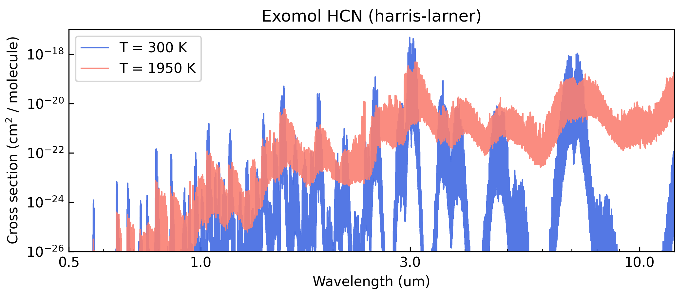

ExoMol line sampling
====================

This tutorial shows how to fetch ExoMol line lists, and sample them
into cross-section files for use in ``Pyrat Bay`` radiative-transfer
calculations.

``Pyrat Bay`` has a two-step process to process line lists:

1. **Convert line lists** from their original format (ExoMol
   ``.states/.trans`` files) **into transition-line information files
   (TLI files)**. This is simple a re-formatting step, the data is
   still kept as the info per line-transition (wavelengths, *gf*,
   *Elow*, isotope). TLI files can readily be used for ``Pyrat Bay``
   radiative-transfer calculations, but such runs are slow as the code
   computes the lines shape and strength *on the fly* to obtain the
   cross sections.

2. **Conver TLI files into cross-section tables** (saved as Numpy
   ``.npz`` files). This step evaluates (i.e., *samples*) the
   line-transition information over a grid of [wavelength, temperature,
   pressure], which involves computing the line shape and strength of
   all lines at each given wl, pressure, and temperature value of the
   grid. Cross-section tables are ideal for radiative-transfer
   calculations, since the code simply interpolates from them (and
   therefore, these calculations are fast).

The main issue with cross-section is that they are not too flexible (one
might want to change, e.g., the wavelength resolution or line broadening
parameters, for which the user would need to re-generate cross-sections
from the TLI files). For this reason ``Pyrat Bay`` was designed with
this two-step approach.

Download ExoMol data
--------------------

You can find HITRAN and HITEMP line lists from their website:

-  https://www.exomol.com/data/molecules

There are 3 types of files to fetch, the ``.trans`` files, the
``.states`` files, and the ``.pf`` files. For this demo, we will get
those for the HCN line lists. We can do this with the following prompt
commands:

.. code:: shell

   # Download the data
   wget https://www.exomol.com/db/HCN/1H-12C-14N/Harris/1H-12C-14N__Harris.states.bz2
   wget https://www.exomol.com/db/HCN/1H-12C-14N/Harris/1H-12C-14N__Harris.trans.bz2
   wget https://www.exomol.com/db/HCN/1H-12C-14N/Harris/1H-12C-14N__Harris.pf

   wget https://www.exomol.com/db/HCN/1H-13C-14N/Larner/1H-13C-14N__Larner.states.bz2
   wget https://www.exomol.com/db/HCN/1H-13C-14N/Larner/1H-13C-14N__Larner.trans.bz2
   wget https://www.exomol.com/db/HCN/1H-13C-14N/Larner/1H-13C-14N__Larner.pf

   # Unzip the data
   bzip2 -d *.bz2

Format the partition function
-----------------------------

Before generating the TLI file, we will format the partition-function
files from ExoMol for use in ``Pyrat Bay``. We can do this with the
following prompt command where we first specify the source (``exomol``)
and then list all *‘.pf’* files of interest (one can combine multiple
isotopologues of a species into a single file):

.. tab-set::

  .. tab-item:: From .pf files
     :selected:

     If the ExoMol .pf files sample the temperature range of
     interest. Then use their .pf files directly:

     .. code:: shell

         pbay -pf exomol 1H-12C-14N__Harris.pf 1H-13C-14N__Larner.pf

  .. tab-item:: From Exomol .states

     If you expect to probe higher temperatures than those sample in
     the .pf files, the we can compute the partitions from the .states
     files with the command below.  Here one specifies the temperature
     ranges and sampling step.

     .. code:: shell

         #             T_low  T_high  delta_T
         pbay -pf states 5.0  6000.0  5.0 \
             1H-12C-14N__Harris.states \
             1H-13C-14N__Larner.states

This will produce the *PF_exomol_HCN.dat* file, which can be passed as
input for the TLI config file.

Compute TLI files
-----------------

The easiest way to generate TLI files is via configuration files and the
command line. The config file below
(`tli_exomol_HCN_cookbook.cfg <https://github.com/pcubillos/pyratbay/blob/master/docs/cookbooks/tli_exomol_HCN_cookbook.cfg>`__)
converts the ExoMol/HCN line-lists (see ``dblist``) into a TLI file (see
``tlifile`` or ``logfile``).

Partition-function information must also be provided (see ``pflist``).
As in this demo (see above), this is the path to a partition-function
file (either a unique PF file for all ``dblist`` files, or one PF file
for each ``dblist`` file). Alternatively, one can set ``pflist=tips`` to
use the partition functions from [Gamache2017]_ [Gamache2021]_.

Lastly, the user can specify the wavelength range of the extracted data
(see ``wl_low`` and ``wl_high``). Normally one want to the widest possible
range (to avoid needing to re-calculating TLI files if a future
calculation needs it), but for sake of this demo, we will extract just
over a narrow region:

.. literalinclude:: ../../_static/data/line_sample_exomol_HCN_tli.cfg
   :caption: File: `line_sample_exomol_HCN_tli.cfg <../../_static/data/line_sample_exomol_HCN_tli.cfg>`__
   :language: ini

To generate the tli files, we run these ``Pyrat Bay`` prompt commands:

.. code:: shell

   pbay -c line_sample_exomol_HCN_tli.cfg

Compute cross-section tables
----------------------------

As with TLI files, cross-section files can be generated via
configuration files and the command line. The config file below
computes a cross-section table (with the output name determined by the
``sampled_cross_sec`` or ``logfile`` parameters).

These parameters define each array of the cross-section table:

-  The ``pbottom``, ``ptop``, and ``nlayers`` parameters define the
   pressure sampling array
-  The ``tmin``, ``tmax``, and ``tstep`` parameters define the
   temperature sampling array
-  The ``wl_low``, ``wl_high``, and ``resolution`` parameters define the
   spectral array at a constant resolution (alternatively, one can
   replace ``resolution`` with ``wnstep`` to sample at constant
   :math:`\Delta \text{wavenumber}`, units in cm\ :math:`^{-1}`)

For the composition (``species``), make sure to include the molecule for
which we are computing the cross-sections. Also, include the
*background* gas, which is relevant for the pressure broadening (here,
we assume a H2/He-dominated atmosphere). Only the VMR values of the
background gasses are important, trace-gas VMRs are irrelevant (see
``chemistry`` or ``uniform_vmr``. ``tmodel`` and ``tpars`` are needed to
define the atmosphere’s temperature profile, but for an opacity run,
these do not impact the calculations.

The optional ``voigt_extent`` and ``voigt_cutoff`` keys set the
extent of the profiles wings from the line centers.  ``voigt_extent``
sets the maximum extent in units of HWHM (default is 300 HWHM).
``voigt_cutoff`` sets the maximum extent in wavenumber units of cm\ :sup:`-1` (default
is 25.0 cm\ :sup:`-1`).  For any given profile, the code truncates the line
wing at the minimum value of either ``voigt_extent`` or
``voigt_cutoff``.

Lastly, the user can set ``ncpu`` to speed up the
calculations using parallel computing.

.. literalinclude:: ../../_static/data/line_sample_exomol_HCN_opacity.cfg
   :caption: File: `line_sample_exomol_HCN_opacity.cfg <../../_static/data/line_sample_exomol_HCN_opacity.cfg>`__
   :language: ini

To generate the cross-section files, we run these ``Pyrat Bay`` prompt
command:

.. code:: shell

   pbay -c line_sample_exomol_HCN_opacity.cfg

-------------------------------------------------

Here's a Python script to take a look at the output cross section:

.. code:: python

   import pyratbay.io as io
   import matplotlib
   import matplotlib.pyplot as plt

   cs_file = 'cross_section_R025K_0150-3000K_0.3-30.0um_exomol_HCN_harris-larner.npz'
   units, mol, temp, press, wn, cross_section = io.read_opacity(cs_file)

   p = 35
   wl = 1e4/wn
   colors = 'royalblue', 'salmon'

   fig = plt.figure(0)
   plt.clf()
   fig.set_size_inches(7, 3)
   plt.subplots_adjust(0.1, 0.145, 0.98, 0.9)
   ax = plt.subplot(111)
   for i,t in enumerate([1,12]):
       label = f'T = {temp[t]:.0f} K'
       plt.plot(
           wl, cross_section[t,p], lw=1.0,
           color=colors[i], alpha=0.9, label=label,
       )
   plt.xscale('log')
   plt.yscale('log')
   ax.xaxis.set_minor_formatter(matplotlib.ticker.NullFormatter())
   ax.xaxis.set_major_formatter(matplotlib.ticker.ScalarFormatter())
   ax.set_xticks([0.5, 1.0, 3.0, 10.0])
   plt.xlim(0.5, 12.0)
   plt.ylim(1e-26, 1e-17)
   plt.title('Exomol HCN (harris-larner)')
   plt.xlabel('Wavelength (um)')
   plt.ylabel(r'Cross section (cm$^{2}$ / molecule)')
   plt.legend(loc='upper left')
   ax.tick_params(which='both', direction='in')

Concluding remarks
------------------

This script uses a relatively *small* line-list data set (70 million
transitions). In many other cases the ExoMol line lists reach the
billions of line transitions, for which computing cross-section spectra
becomes computationally unfeasible. For such cases, the ``repack`` tool
`(Cubillos
2017) <https://ui.adsabs.harvard.edu/abs/2017ApJ...850...32C>`__ helps
to identify and retain the strong line transitions that dominate the
spectrum. ``repack`` effectively the line list down to millions, without
significantly impacting the cross section spectra. The :doc:`line_list_repack` tutorial shows how to use repack-processed ExoMol data in ``Pyrat Bay``.
