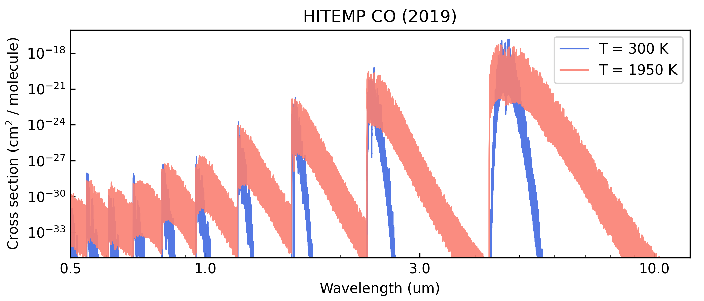

HITRAN line sampling
====================

This tutorial shows how to fetch HITRAN/HITEMP line lists, and sample
them into cross-section files for use in ``Pyrat Bay``
radiative-transfer calculations.

``Pyrat Bay`` has a two-step process to process line lists:

1. **Convert line lists** from their original format (HITRAN's
   ``.par`` files) **into
   transition-line information files (TLI files)**. This is simple a
   re-formatting step, the data is still kept as the info per
   line-transition (wavelengths, *gf*, *Elow*, isotope). TLI files can
   readily be used for ``Pyrat Bay`` radiative-transfer calculations,
   but such runs are slow as the code computes the lines shape and
   strength *on the fly* to obtain the cross sections.

2. **Conver TLI files into cross-section tables** (saved as Numpy
   ``.npz`` files). This step evaluates (i.e., *samples*) the
   line-transition information over a grid of [wavelength, temperature,
   pressure], which involves computing the line shape and strength of
   all lines at each given wl, pressure, and temperature value of the
   grid. Cross-section tables are ideal for radiative-transfer
   calculations, since the code simply interpolates from them (and
   therefore, these calculations are fast).

The main issue with cross-section is that they are not too flexible (one
might want to change, e.g., the wavelength resolution or line broadening
parameters, for which the user would need to re-generate cross-sections
from the TLI files). For this reason ``Pyrat Bay`` was designed with
this two-step approach.

Download data
-------------

You can find HITRAN and HITEMP line lists from their website:

-  https://hitran.org/lbl
-  https://hitran.org/hitemp

For this demo, we will get the HITEMP/CO line lists.  We
can do this with the following prompt commands:

.. code:: shell

   # Download the data
   wget https://hitran.org/hitemp/data/bzip2format/05_HITEMP2019.par.bz2

   # Unzip the data
   bzip2 -d 05_HITEMP2019.par.bz2

Partition functions
-------------------

In addition to the line-list data, we need the partition functions for
each molecule and isotope.  For this we will use again the data
provided by ExoMol and HITRAN TIPS [Gamache2017]_ [Gamache2021]_.

This data is already incorporated into the ``Pyrat Bay`` package, we
only need to generate the partition-function file for CO with the
following command:

.. code:: shell

    pbay -pf tips CO

This will produce the *PF_tips_CO.dat* file, which can be passed as
input for the TLI config file.

Compute TLI files
-----------------

The easiest way to generate TLI files is via configuration files and
the command line.
The ``tlifile`` and ``logfile`` parameters set the name of the output
files.  The ``dblist`` parameter sets the name(s) of the input HITRAN
file(s), along with the ``dbtype`` parameter which specifies the
format of the input data.

Lastly, the user can specify the wavelength range of the extracted
data (see ``wl_low`` and ``wl_high``). Normally one want to the widest
possible range (to avoid needing to re-calculating TLI files if a
future calculation needs it). The config file below converts the
HITRAN CO line list:

.. literalinclude:: ../../_static/data/line_sample_hitran_CO_tli.cfg
    :caption: File: `line_sample_hitran_CO_tli.cfg <../../_static/data/line_sample_hitran_CO_tli.cfg>`_
    :language: ini

.. Note::

    Note that the partition function is a temperature dependent value,
    and thus the temperature range of the input partition function
    sets the minimum and maximum temperature values at which the cross
    section can be evaluated.

To generate the TLI files, we run these ``Pyrat Bay`` prompt commands:

.. code:: shell

   pbay -c line_sample_hitran_CO_tli.cfg

----------------------------

Compute cross-section tables
----------------------------

As with TLI files, cross-section files can be generated via
configuration files and the command line.  The config file below
computes a cross-section table (with output name determined by the
``extfile`` or ``logfile`` parameters).

These parameters define each array of the cross-section table:

-  The ``pbottom``, ``ptop``, and ``nlayers`` parameters define the
   pressure sampling array
-  The ``tmin``, ``tmax``, and ``tstep`` parameters define the
   temperature sampling array
-  The ``wl_low``, ``wl_high``, and ``resolution`` parameters define the
   spectral array at a constant resolution (alternatively, one can
   replace ``resolution`` with ``wnstep`` to sample at constant
   :math:`\Delta`\ wavenumber, units in cm\ :math:`^{-1}`)

For the composition (``species``), make sure to include the molecule for
which we are computing the cross-sections. Also, include the
*background* gas, which is relevant for the pressure broadening (here,
we assume a H2/He-dominated atmosphere). Only the VMR values of the
background gasses are important, trace-gas VMRs are irrelevant (see
``chemistry`` or ``uniform``. ``tmodel`` and ``tpars`` are needed to
define the atmosphere’s temperature profile, but for an opacity run,
these do not impact the calculations.

The optional ``voigt_extent`` and ``voigt_cutoff`` keys set the extent
of the profiles wings from the line centers.  ``voigt_extent`` sets
the maximum extent in units of HWHM (default is 300 HWHM).
``voigt_cutoff`` sets the maximum extent in wavenumber units of cm\
:sup:`-1` (default is 25.0 cm\ :sup:`-1`).  For any given profile, the
code truncates the line wing at the minimum value of either
``voigt_extent`` or ``voigt_cutoff``.

Lastly, the user can set ``ncpu`` to speed up the
calculations using parallel computing.

.. literalinclude:: ../../_static/data/line_sample_hitran_CO_opacity.cfg
    :caption: File: `line_sample_hitran_CO_opacity.cfg <../../_static/data/line_sample_hitran_CO_opacity.cfg>`_
    :language: ini

To generate the cross-section files, run these ``Pyrat Bay`` prompt command:

.. code:: shell

   pbay -c line_sample_hitran_CO_opacity.cfg

-------------------------------------------------

Here's a Python script to take a look at the output cross section:

.. code:: python

   import pyratbay.io as io
   import matplotlib
   import matplotlib.pyplot as plt

   cs_file = 'cross_section_R025K_0150-3000K_0.3-30.0um_hitemp_CO.npz'
   units, mol, temp, press, wn, cross_section = io.read_opacity(cs_file)

   p = 35
   wl = 1e4/wn
   colors = 'royalblue', 'salmon'

   fig = plt.figure(0)
   plt.clf()
   fig.set_size_inches(7, 3)
   plt.subplots_adjust(0.1, 0.145, 0.98, 0.9)
   ax = plt.subplot(111)
   for i,t in enumerate([1,12]):
       label = f'T = {temp[t]:.0f} K'
       plt.plot(
           wl, cross_section[t,p], lw=1.0,
           color=colors[i], alpha=0.9, label=label,
       )
   plt.xscale('log')
   plt.yscale('log')
   ax.xaxis.set_minor_formatter(matplotlib.ticker.NullFormatter())
   ax.xaxis.set_major_formatter(matplotlib.ticker.ScalarFormatter())
   ax.set_xticks([0.5, 1.0, 3.0, 10.0])
   plt.xlim(0.5, 12.0)
   plt.ylim(1e-35, 1e-16)
   plt.title('HITEMP CO (2019)')
   plt.xlabel('Wavelength (um)')
   plt.ylabel(r'Cross section (cm$^{2}$ / molecule)')
   plt.legend(loc='upper right')
   ax.tick_params(which='both', direction='in')

