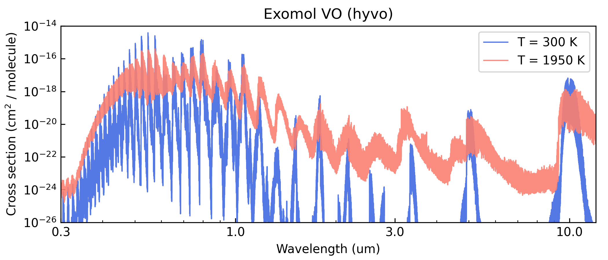

Repack line sampling
====================

Sometimes, computing cross-section spectra from billions of line
transitions becomes unfeasible. For such cases, the ``repack`` tool [Cubillos2017b]_ helps
to identify and retain the strong line transitions that dominate the
spectrum. ``repack`` effectively the line list down to millions, without
significantly impacting the cross section spectra. This tutorial shows
how to fetch line lists that have been pre-processed with ``repack``,
and sample them into cross-section files for use in ``Pyrat Bay``
radiative-transfer calculations.

``Pyrat Bay`` has a two-step process to process line lists:

1. **Convert line lists** from their original format (e.g., HITRAN
   ``.par`` files, ExoMol ``.states/.trans`` files) **into
   transition-line information files (TLI files)**. This is simple a
   re-formatting step, the data is still kept as the info per
   line-transition (wavelengths, *gf*, *Elow*, isotope). TLI files can
   readily be used for ``Pyrat Bay`` radiative-transfer calculations,
   but such runs are slow as the code computes the lines shape and
   strength *on the fly* to obtain the cross sections.

2. **Conver TLI files into cross-section tables** (saved as Numpy
   ``.npz`` files). This step evaluates (i.e., *samples*) the
   line-transition information over a grid of [wavelength, temperature,
   pressure], which involves computing the line shape and strength of
   all lines at each given wl, pressure, and temperature value of the
   grid. Cross-section tables are ideal for radiative-transfer
   calculations, since the code simply interpolates from them (and
   therefore, these calculations are fast).

The main issue with cross-section is that they are not too flexible (one
might want to change, e.g., the wavelength resolution or line broadening
parameters, for which the user would need to re-generate cross-sections
from the TLI files). For this reason ``Pyrat Bay`` was designed with
this two-step approach.

-------------------------------------------------

Download Repack data
--------------------

You can find ExoMol-repacked line lists from this Zenodo repository
(DOI: 10.5281/zenodo.3768503):

-  https://doi.org/10.5281/zenodo.3768503

The following table shows species already processed with ``repack`` and
are ready for use:

.. csv-table:: Available linelists
   :header: "Species/link", "Database name", "Isotopologues", "References"
   :widths: 8, 10, 13, 20

   `H2O <https://zenodo.org/records/14046762/files/H2O_exomol_pokazatel_0.24-500.0um_100-3500K_threshold_0.01_lbl.dat>`__, pokazatel, 116, [Polyansky2018]_

   `CH4 <https://zenodo.org/records/14266247/files/CH4_exomol_mm_0.83-50.0um_100-3000K_threshold_0.03_lbl.dat>`__, mm, 2111, [Yurchenko2024a]_

   `CO2 <https://zenodo.org/records/14266247/files/CO2_ames_ai3000k_0.5-50.0um_100-3500K_threshold_0.01_lbl.dat>`__, ai3000k, "266, 366, 628, 627", [Huang2023]_

   `CO2 <https://zenodo.org/records/14046762/files/CO2_exomol_ucl4000_0.5-500.0um_100-3500K_threshold_0.01_lbl.dat>`__, ucl4000, 266, [Yurchenko2020]_

   `NH3 <https://zenodo.org/records/14046762/files/NH3_exomol_coyute-byte_0.5-500.0um_100-3500K_threshold_0.03_lbl.dat>`__, coyute, "4111, 5111", [Coles2019]_ [Yurchenko2024b]_

   `TiO <https://zenodo.org/records/14046762/files/TiO_exomol_toto_0.33-500um_100-3500K_threshold_0.01_lbl.dat>`__, toto, "66, 76, 86, 96, 06", [McKemmish2019]_

   `VO <https://zenodo.org/records/14266247/files/VO_exomol_hyvo_0.22-50um_100-3500K_threshold_0.01_lbl.dat>`__, hyvo, "16", [Bowesman2024]_

   `HCN <https://zenodo.org/records/14046762/files/HCN_exomol_harris-larner_0.56-500um_100-3500K_threshold_0.01_lbl.dat>`__, harris & larner, "124, 134", [Harris2006]_ [Harris2008]_

   `SO2 <https://zenodo.org/records/14046762/files/SO2_exomol_exoames_1.25-100.0um_100-3500K_threshold_0.03_lbl.dat>`__, exoames, 266, [Underwood2016]_

   `H2S <https://zenodo.org/records/14266247/files/H2S_exomol_ayt2_0.28-500.0um_100-3500K_threshold_0.01_lbl.dat>`__, ayt2, 112, [Azzam2016]_ [Chubb2018]_

   `C2H2 <https://zenodo.org/records/14046762/files/C2H2_exomol_acety_1.0-500.0um_100-3500K_threshold_0.03_lbl.dat>`__, acety, 2211, [Chubb2020]_

For this demo, we will work with the VO repack line list. We fetch the
data can do this with the following prompt commands:

.. code:: shell

   # Download the data
   wget https://zenodo.org/records/14266247/files/VO_exomol_hyvo_0.22-50um_100-3500K_threshold_0.01_lbl.dat
   wget https://www.exomol.com/db/VO/51V-16O/HyVO/51V-16O__HyVO.pf

-------------------------------------------------

Format partition functions
--------------------------

Before generating the TLI file, we will format the partition-function
files from ExoMol for use in ``Pyrat Bay``. We can do this with the
following prompt command where we first specify the source (``exomol``)
and then list all *‘.pf’* files of interest (one can combine multiple
isotopologues of a species into a single file):

.. tab-set::

  .. tab-item:: From .pf files
     :selected:

     If the ExoMol .pf files sample the temperature range of
     interest. Then use their .pf files directly:

     .. code:: shell

         pbay -pf exomol 51V-16O__HyVO.pf

  .. tab-item:: From Exomol .states

     Alternatively, if you expect to probe higher temperatures than
     those sample in the .pf files, the we can compute the partitions
     from the .states files with the command below.  Here one
     specifies the temperature ranges and sampling step.

     .. code:: shell

         #             T_low  T_high  delta_T
         pbay -pf states 5.0  10000.0  5.0  51V-16O__HyVO.states

This will produce the *PF_exomol_VO.dat* file, which can be passed as
input for the TLI config file.

-------------------------------------------------

Compute TLI files
-----------------

The easiest way to generate TLI files is via configuration files and
the command line. The config file below converts the repack ExoMol/VO
line-lists (see ``dblist``) into a TLI file (see ``tlifile`` or
``logfile``).  The partition-function information must also be
provided (see ``pflist``).

Lastly, the user can specify the wavelength range of the extracted data
(see ``wllow`` and ``wlhigh``). Normally one want to the widest possible
range (to avoid needing to re-calculating TLI files if a future
calculation needs it), but for sake of this demo, we will extract just
over a narrow region:

.. literalinclude:: ../../_static/data/line_sample_repack_VO_tli.cfg
    :caption: File: `line_sample_repack_VO_tli.cfg <../../_static/data/line_sample_repack_VO_tli.cfg>`_
    :language: ini

To generate the tli files, we run these ``Pyrat Bay`` prompt commands:

.. code:: shell

   pbay -c line_sample_repack_VO_tli.cfg

-------------------------------------------------

Compute cross-section tables
----------------------------

As with TLI files, cross-section files can be generated via
configuration files and the command line. The config file below
computes a cross-section table (with the output name determined by the
``extfile`` or ``logfile`` parameters).

These parameters define each array of the cross-section table:

-  The ``pbottom``, ``ptop``, and ``nlayers`` parameters define the
   pressure sampling array
-  The ``tmin``, ``tmax``, and ``tstep`` parameters define the
   temperature sampling array
-  The ``wllow``, ``wlhigh``, and ``resolution`` parameters define the
   spectral array at a constant resolution (alternatively, one can
   replace ``resolution`` with ``wnstep`` to sample at a constant
   :math:`\Delta \text{wavenumber}`, units in cm\ :math:`^{-1}`)

For the composition (``species``), make sure to include the molecule for
which we are computing the cross-sections. Also, include the
*background* gas, which is relevant for the pressure broadening (here,
we assume a H2/He-dominated atmosphere). Only the VMR values of the
background gasses are important, trace-gas VMRs are irrelevant (see
``chemistry`` or ``uniform``. ``tmodel`` and ``tpars`` are needed to
define the atmosphere’s temperature profile, but for an opacity run,
these do not impact the calculations.

The optional ``voigt_extent`` and ``voigt_cutoff`` keys set the extent
of the profiles wings from the line centers.  ``voigt_extent`` sets
the maximum extent in units of HWHM (default is 300 HWHM).
``voigt_cutoff`` sets the maximum extent in wavenumber units of cm\
:sup:`-1` (default is 25.0 cm\ :sup:`-1`).  For any given profile, the
code truncates the line wing at the minimum value of either
``voigt_extent`` or ``voigt_cutoff``.

Lastly, the user can set ``ncpu`` to speed up the
calculations using parallel computing.

.. literalinclude:: ../../_static/data/line_sample_repack_VO_opacity.cfg
    :caption: File: `line_sample_repack_VO_opacity.cfg <../../_static/data/line_sample_repack_VO_opacity.cfg>`_
    :language: ini

To generate the cross-section files, run this ``Pyrat Bay`` prompt
command:

.. code:: shell

   pbay -c line_sample_repack_VO_opacity.cfg

-------------------------------------------------

Here's a Python script to take a look at the output cross section:

.. code:: python

   import pyratbay.io as io
   import matplotlib
   import matplotlib.pyplot as plt

   cs_file = 'cross_section_R025K_0150-3000K_0.3-30.0um_exomol_VO_hyvo.npz'
   units, mol, temp, press, wn, cross_section = io.read_opacity(cs_file)

   p = 35
   wl = 1e4/wn
   colors = 'royalblue', 'salmon'

   fig = plt.figure(0)
   plt.clf()
   fig.set_size_inches(7, 3)
   plt.subplots_adjust(0.1, 0.145, 0.98, 0.9)
   ax = plt.subplot(111)
   for i,t in enumerate([1,12]):
       label = f'T = {temp[t]:.0f} K'
       plt.plot(
           wl, cross_section[t,p], lw=1.0,
           color=colors[i], alpha=0.9, label=label,
       )
   plt.xscale('log')
   plt.yscale('log')
   ax.xaxis.set_minor_formatter(matplotlib.ticker.NullFormatter())
   ax.xaxis.set_major_formatter(matplotlib.ticker.ScalarFormatter())
   ax.set_xticks([0.3, 1.0, 3.0, 10.0])
   plt.xlim(0.3, 12.0)
   plt.ylim(1e-26, 1e-14)
   plt.title('Exomol VO (hyvo)')
   plt.xlabel('Wavelength (um)')
   plt.ylabel(r'Cross section (cm$^{2}$ / molecule)')
   plt.legend(loc='upper right')
   ax.tick_params(which='both', direction='in')

