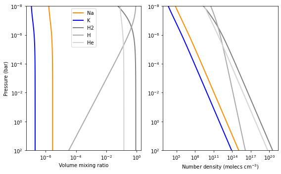
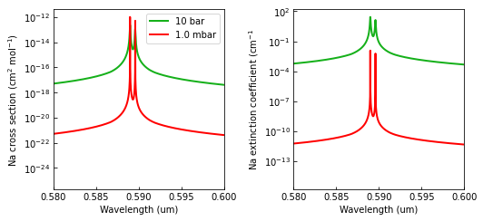
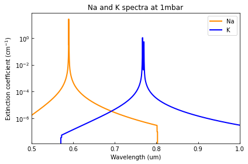
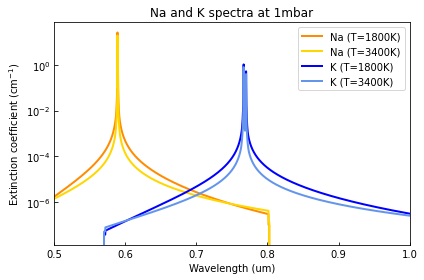

.. _opacity_alkali:

Alkali Opacities Tutorial
=========================

This tutorial shows how to create Alkali opacity objects and compute
their extinction coefficient spectra for a given atmospheric profile.

.. Note::
    You can also find this tutorial as a `Python scrip here
    <https://github.com/pcubillos/pyratbay/blob/master/docs/cookbooks/opacity_alkali.py>`_
    or as a `jupyter notebook here
    <https://github.com/pcubillos/pyratbay/blob/master/docs/cookbooks/opacity_alkali.ipynb>`_.

Let’s start by importing some necessary modules:

.. code:: ipython3

    import pyratbay.atmosphere as pa
    import pyratbay.constants as pc
    import pyratbay.opacity as op
    import pyratbay.spectrum as ps
    
    import matplotlib.pyplot as plt
    import matplotlib
    import numpy as np

Preamble
--------

We will sample the models over a wavelength array and over an
atmospheric profile. Lets create these first:

.. code:: ipython3

    # We will sample the opacity over a constant-resolution wavelength array
    # (values have micron units)
    wl_min = 0.5
    wl_max = 1.0
    resolution = 30000.0
    wl = ps.constant_resolution_spectrum(wl_min, wl_max, resolution)
    
    
    
    # For the atmoshere, consider a simple solar-abundance isothermal atmosphere
    nlayers = 81
    pressure = pa.pressure('1e-8 bar', '1e2 bar', nlayers)
    temperature = np.tile(1800.0, nlayers)
    species = ['Na', 'K', 'H2', 'H', 'He']
    
    # Volume mixing ratios in thermochemical equilibrium
    vmr = pa.abundance(pressure, temperature, species)
    # Number-density profiles under IGL (molecules per cm3)
    number_densities = pa.ideal_gas_density(vmr, pressure, temperature)
    
    Na_number_density = number_densities[:,0]
    K_number_density = number_densities[:,1]
    
    
    # Show profiles:
    cols = ['darkorange', 'blue', 'gray', 'darkgray', 'lightgray']
    plt.figure(1, (8,5))
    plt.clf()
    ax = plt.subplot(121)
    for i, spec in enumerate(species):
        ax.plot(vmr[:,i], pressure/pc.bar, color=cols[i], lw=2.0, label=spec)
    ax.set_xscale('log')
    ax.set_yscale('log')
    ax.set_ylim(100, 1e-8)
    ax.set_xlabel('Volume mixing ratio')
    ax.set_ylabel('Pressure (bar)')
    ax.legend(loc='best')
    
    ax = plt.subplot(122)
    for i, spec in enumerate(species):
        ax.plot(number_densities[:,i], pressure/pc.bar, color=cols[i], lw=2.0, label=spec)
    ax.set_xscale('log')
    ax.set_yscale('log')
    ax.set_ylim(100, 1e-8)
    ax.set_xlabel('Number density (molecs cm$^{-3}$)')
    plt.tight_layout()

A Sodium opacity model
----------------------

.. code:: ipython3

    # Initialize a Na model: arguments are pressure and wavenumner (CGS units)
    sodium = op.alkali.SodiumVdW(pressure, 1e4/wl)
    
    # A print() call shows some useful info about the object
    print(sodium)

.. parsed-literal::

    Model name (name): 'sodium_vdw'
    Model species (mol): Na
    Species mass (mass, amu): 22.989769
    Profile hard cutoff from line center (cutoff, cm-1): 4500.0
    Detuning parameter (detuning): 30.0
    Lorentz-width parameter (lpar): 0.071
    Partition function (Z): 2.0
    Wavenumber  Wavelength          gf   Lower-state energy
          cm-1          um               cm-1
          (wn)                    (gf)   (elow)
      16960.87    0.589592   6.546e-01   0.000e+00
      16978.07    0.588995   1.309e+00   0.000e+00
    Wavenumber (wn, cm-1):
       [20000.00 19999.33 19998.67 ... 10000.81 10000.47 10000.14]
    Pressure (pressure, barye):
    [1.000e-02 1.334e-02 1.778e-02 2.371e-02 3.162e-02 4.217e-02 5.623e-02
     7.499e-02 1.000e-01 1.334e-01 1.778e-01 2.371e-01 3.162e-01 4.217e-01
     5.623e-01 7.499e-01 1.000e+00 1.334e+00 1.778e+00 2.371e+00 3.162e+00
     4.217e+00 5.623e+00 7.499e+00 1.000e+01 1.334e+01 1.778e+01 2.371e+01
     3.162e+01 4.217e+01 5.623e+01 7.499e+01 1.000e+02 1.334e+02 1.778e+02
     2.371e+02 3.162e+02 4.217e+02 5.623e+02 7.499e+02 1.000e+03 1.334e+03
     1.778e+03 2.371e+03 3.162e+03 4.217e+03 5.623e+03 7.499e+03 1.000e+04
     1.334e+04 1.778e+04 2.371e+04 3.162e+04 4.217e+04 5.623e+04 7.499e+04
     1.000e+05 1.334e+05 1.778e+05 2.371e+05 3.162e+05 4.217e+05 5.623e+05
     7.499e+05 1.000e+06 1.334e+06 1.778e+06 2.371e+06 3.162e+06 4.217e+06
     5.623e+06 7.499e+06 1.000e+07 1.334e+07 1.778e+07 2.371e+07 3.162e+07
     4.217e+07 5.623e+07 7.499e+07 1.000e+08]
    Cross section (cross_section, cm2 molecule-1):
    None
    
---------------------------------------------------------------------

.. code:: ipython3

    # Evaluate the opacity over atmospheric profile
    Na_extinction = sodium.calc_extinction_coefficient(
        temperature, Na_number_density,
    )
    
    
    # Show the spectra at a couple of layers
    fig = plt.figure(2)
    fig.set_size_inches(7.5, 3.5)
    plt.clf()
    ax = plt.subplot(121)
    ax.plot(wl, sodium.cross_section[72], color='xkcd:green', lw=2.0, label='10 bar')
    ax.plot(wl, sodium.cross_section[40], color='red', lw=2.0, label='1.0 mbar')
    ax.set_yscale('log')
    ax.set_xlabel('Wavelength (um)')
    ax.set_xlim(np.amin(wl), np.amax(wl))
    ax.set_xlim(0.58, 0.60)
    ax.tick_params(which='both', direction='in')
    ax.set_ylabel('Na cross section (cm$^{2}$ mol$^{-1}$)')
    ax.legend(loc='upper right')
    
    ax = plt.subplot(122)
    ax.plot(wl, Na_extinction[72], color='xkcd:green', lw=2.0)
    ax.plot(wl, Na_extinction[40], color='red', lw=2.0)
    ax.set_yscale('log')
    ax.set_xlabel('Wavelength (um)')
    ax.set_xlim(np.amin(wl), np.amax(wl))
    ax.set_xlim(0.58, 0.60)
    ax.tick_params(which='both', direction='in')
    ax.set_ylabel('Na extinction coefficient (cm$^{-1}$')
    plt.tight_layout()

Sodium and Potassium models
---------------------------

.. code:: ipython3

    # Now compute K extinction coefficient
    potassium = op.alkali.PotassiumVdW(pressure, 1e4/wl)
    
    K_extinction = potassium.calc_extinction_coefficient(
        temperature, K_number_density,
    )
    
    
    # Plot along Na
    fig = plt.figure(3)
    plt.clf()
    ax = plt.subplot(111)
    ax.plot(wl, Na_extinction[72], color='darkorange', lw=2.0, label='Na')
    ax.plot(wl, K_extinction[72], color='blue', lw=2.0, label='K')
    ax.set_yscale('log')
    ax.set_xlabel('Wavelength (um)')
    ax.set_xlim(np.amin(wl), np.amax(wl))
    ax.set_xlim(0.5, 1.0)
    ax.tick_params(which='both', direction='in')
    ax.set_ylabel('Extinction coefficient (cm$^{-1}$)')
    ax.legend(loc='upper right')
    ax.set_title('Na and K spectra at 1mbar')
    plt.tight_layout()

.. code:: ipython3

    # To evaulate under new atmospheric conditions, simply call the
    # extinction_coefficient() method with the new values:
    
    # A hotter atmosphere
    temp_hot = np.tile(3400.0, nlayers)
    vmr_hot = pa.abundance(pressure, temp_hot, species)
    density_hot = pa.ideal_gas_density(vmr_hot, pressure, temp_hot)
    Na_density_hot = density_hot[:,0]
    K_density_hot = density_hot[:,1]
    
    # New opacities
    Na_extinction_hot = sodium.calc_extinction_coefficient(
        temp_hot, Na_density_hot,
    )
    K_extinction_hot = potassium.calc_extinction_coefficient(
        temp_hot, K_density_hot,
    )
    
    
    # Plot Na and K opacities
    fig = plt.figure(4)
    plt.clf()
    ax = plt.subplot(111)
    ax.plot(wl, Na_extinction[72], color='darkorange', lw=2.0, label='Na (T=1800K)')
    ax.plot(wl, Na_extinction_hot[72], color='gold', lw=2.0, label='Na (T=3400K)')
    ax.plot(wl, K_extinction[72], color='blue', lw=2.0, label='K (T=1800K)')
    ax.plot(wl, K_extinction_hot[72], color='cornflowerblue', lw=2.0, label='K (T=3400K)')
    ax.set_yscale('log')
    ax.set_xlabel('Wavelength (um)')
    ax.set_xlim(np.amin(wl), np.amax(wl))
    ax.set_xlim(0.5, 1.0)
    ax.tick_params(which='both', direction='in')
    ax.set_ylabel('Extinction coefficient (cm$^{-1}$)')
    ax.legend(loc='upper right')
    ax.set_title('Na and K spectra at 1mbar')
    plt.tight_layout()

