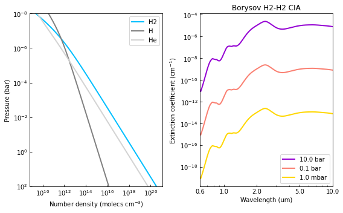
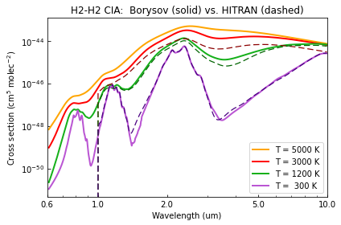

.. _opacity_cia:

Collision-induced Absorption Tutorial
=====================================

This tutorial shows how to create CIA opacity objects and compute their
extinction coefficient spectra for a given atmospheric profile.

.. Note::
    You can also find this tutorial as a `Python scrip here
    <https://github.com/pcubillos/pyratbay/blob/master/docs/cookbooks/opacity_cia.py>`_
    or as a `jupyter notebook here
    <https://github.com/pcubillos/pyratbay/blob/master/docs/cookbooks/opacity_cia.ipynb>`_.

Lets start by importing some necessary modules:

.. code:: ipython3

    import pyratbay.opacity as op
    import pyratbay.atmosphere as pa
    import pyratbay.constants as pc
    import pyratbay.spectrum as ps
    
    import numpy as np
    import matplotlib
    import matplotlib.pyplot as plt

Borysov CIA opacities
---------------------

``pyratbay`` provides the Borysov et al. CIA data. The following table
lists the available datasets and their range of validity:

+-----------------+-----------------+-----------------+-------------------------------------------+
| Species         | :math:`T`-range | :math:`\lambda` | File                                      |
|                 | (K)             | -range (um)     |                                           |
+=================+=================+=================+===========================================+
| H2-H2           | 60–7000         | 0.6–500.0       | CIA_Borysow_H2H2_0060-7000K_0.6-500um.dat |
+-----------------+-----------------+-----------------+-------------------------------------------+
| H2-He           | 50–7000         | 0.5–31.25       | CIA_Borysow_H2He_0050-7000K_0.5-031um.dat |
+-----------------+-----------------+-----------------+-------------------------------------------+

.. code:: ipython3

    # Define wavelength array where to sample the opacities
    wl_min = 0.61
    wl_max = 10.01
    resolution = 15000.0
    wl = ps.constant_resolution_spectrum(wl_min, wl_max, resolution)
    
    # Load up Borysov CIA model for H2-H2:
    cs_file = f'{pc.ROOT}pyratbay/data/CIA/CIA_Borysow_H2H2_0060-7000K_0.6-500um.dat'
    cia = op.Collision_Induced(cs_file, wn=1e4/wl)

    # A print() call shows some useful info about the object:
    print(cia)

.. parsed-literal::

    CIA file name (cia_file):
        '/Users/pato/Dropbox/IWF/projects/2014_pyratbay/pyratbay/pyratbay/data/CIA/CIA_Borysow_H2H2_0060-7000K_0.6-500um.dat'
    CIA species (species): ['H2', 'H2']
    Number of temperature samples (ntemp): 20
    Number of wavenumber samples (nwave): 41969
    Temperature array (temps, K):
    [  60.  100.  150.  200.  250.  300.  350.  400.  500.  600.  700.  800.
      900. 1000. 2000. 3000. 4000. 5000. 6000. 7000.]
    Wavenumber array (wn, cm-1):
    [16393.443 16392.350 16391.257 ... 999.148 999.082 999.015]
    Tabulated cross section (tab_cross_section, cm5 molec-2):
    [[5.00e-52 5.01e-52 5.01e-52 ... 2.93e-46 2.93e-46 2.93e-46]
     [5.59e-52 5.59e-52 5.60e-52 ... 4.36e-46 4.37e-46 4.37e-46]
     [6.72e-52 6.73e-52 6.73e-52 ... 7.18e-46 7.18e-46 7.18e-46]
     ...
     [9.63e-49 9.64e-49 9.65e-49 ... 7.81e-45 7.81e-45 7.81e-45]
     [1.99e-48 1.99e-48 1.99e-48 ... 8.84e-45 8.84e-45 8.84e-45]
     [3.28e-48 3.29e-48 3.29e-48 ... 9.83e-45 9.83e-45 9.83e-45]]
    Minimum and maximum temperatures (tmin, tmax) in K: [60.0, 7000.0]
    

.. code:: ipython3

    # Calculate cross sections:
    nlayers = 81
    temperature = np.tile(1800.0, nlayers)
    cross_section = cia.calc_cross_section(temperature)
    
    temp_hot = np.tile(3000.0, nlayers)
    cross_section_hot = cia.calc_cross_section(temp_hot)
    
    temp_cold = np.tile(500.0, nlayers)
    cross_section_cold = cia.calc_cross_section(temp_cold)
    
    
    plt.figure(1)
    plt.clf()
    ax = plt.subplot(111)
    ax.plot(wl, cross_section_hot[40], color='red', lw=2.0, label='T = 2500 K')
    ax.plot(wl, cross_section[40], color='xkcd:green', lw=2.0, label='T = 1800 K')
    ax.plot(wl, cross_section_cold[40], color='indigo', lw=2.0, label='T =  500 K')
    ax.set_xscale('log')
    ax.set_yscale('log')
    ax.set_xlabel('Wavelength (um)')
    ax.xaxis.set_major_formatter(matplotlib.ticker.ScalarFormatter())
    ax.set_xticks([0.6, 1.0, 2.0, 5.0, 10.0])
    ax.set_xlim(0.6, 10.0)
    ax.tick_params(which='both', direction='in')
    ax.set_ylabel('H2-H2 cross section (cm$^{5}$ molec$^{-2}$)')
    ax.legend(loc='lower right')
    plt.tight_layout()

.. image:: opacity_cia/output_5_0.png

.. code:: ipython3

    # Likewise, we can calculate extinction coefficient by providing a
    # temperature and number density profile:
    
    # Consider a solar-abundance isothermal atmosphere
    nlayers = 81
    pressure = pa.pressure('1e-8 bar', '1e2 bar', nlayers)
    temperature = np.tile(1800.0, nlayers)
    species = ['H2', 'H', 'He']
    # Volume mixing ratios in thermochemical equilibrium (only H2, H, and He)
    vmr = pa.abundance(pressure, temperature, species)
    # Number-density profiles under IGL (molecules per cm3)
    number_densities = pa.ideal_gas_density(vmr, pressure, temperature)
    
    # Indices for H2,H2 number density in the atmosphere:
    cia_indices = [species.index(mol) for mol in cia.species]
    densities = number_densities[:,cia_indices]
    
    
    # Compute extinction at all layers:
    extinction_coefficient = cia.calc_extinction_coefficient(
        temperature, densities,
    )
    
    # Compute extinction at a single layer:
    ec_single = cia.calc_extinction_coefficient(
        temperature[40], densities[40],
    )
    
    
    # Show profiles:
    cols = ['deepskyblue', 'gray', 'lightgray']
    plt.figure(2, (8,5))
    plt.clf()
    ax = plt.subplot(121)
    for i, spec in enumerate(species):
        ax.plot(number_densities[:,i], pressure/pc.bar, color=cols[i], lw=2.0, label=spec)
    ax.set_xscale('log')
    ax.set_yscale('log')
    ax.set_ylim(100, 1e-8)
    ax.tick_params(which='both', direction='in')
    ax.set_xlabel('Number density (molecs cm$^{-3}$)')
    ax.set_ylabel('Pressure (bar)')
    ax.legend(loc='best')
    
    ax = plt.subplot(122)
    ax.plot(wl, extinction_coefficient[72], color='darkviolet', lw=2.0, label='10.0 bar')
    ax.plot(wl, extinction_coefficient[56], color='salmon', lw=2.0, label='0.1 bar')
    ax.plot(wl, ec_single, color='gold', lw=2.0, label='1.0 mbar')
    ax.set_xscale('log')
    ax.set_yscale('log')
    ax.set_xlabel('Wavelength (um)')
    ax.xaxis.set_major_formatter(matplotlib.ticker.ScalarFormatter())
    ax.set_xticks([0.6, 1.0, 2.0, 5.0, 10.0])
    ax.set_xlim(0.6, 10.0)
    ax.tick_params(which='both', direction='in')
    ax.set_ylabel('Extinction coefficient (cm$^{-1}$)')
    ax.legend(loc='lower right')
    ax.set_title('Borysov H2-H2 CIA')
    plt.tight_layout()

HITRAN CIA opacities
~~~~~~~~~~~~~~~~~~~~

``pyratbay`` does not provide the HITRAN CIA data, but you can get and
format it with the following prompt commands:

.. code:: shell

   $ wget https://hitran.org/data/CIA/H2-H2_2011.cia
   $ pbay -cs hitran H2-H2_2011.cia

.. code:: ipython3

    # Sample at our desired wavelength array:
    cs_file = 'CIA_HITRAN_H2-H2_1.0-500.0um_0200-3000K.dat'
    hit_cia = op.Collision_Induced(cs_file, wn=1e4/wl)
    
    # Sampling in wavenumber beyond the table limits is OK,
    # out-of-bounds opacities will be extrapolated as zero

.. parsed-literal::

    
    ::::::::::::::::::::::::::::::::::::::::::::::::::::::::::::::::::::::
      Warning:
        The tabulated wavenumber range [20.00, 10000.00] cm-1 does not
    cover the whole requested wavenumber range: [999.02, 16393.44] cm-1
    for cross-section file: 'CIA_HITRAN_H2-H2_1.0-500.0um_0200-3000K.dat'
    ::::::::::::::::::::::::::::::::::::::::::::::::::::::::::::::::::::::
    

.. code:: ipython3

    # Compare HITRAN and Borysov CIA cross sections:
    hit_cs_0300 = hit_cia.calc_cross_section(temperature=300.0)
    hit_cs_1200 = hit_cia.calc_cross_section(temperature=1200.0)
    hit_cs_3000 = hit_cia.calc_cross_section(temperature=3000.0)
    
    bor_cs_0300 = cia.calc_cross_section(temperature=300.0)
    bor_cs_1200 = cia.calc_cross_section(temperature=1200.0)
    bor_cs_3000 = cia.calc_cross_section(temperature=3000.0)
    bor_cs_5000 = cia.calc_cross_section(temperature=4500.0)
    
    
    plt.figure(4)
    plt.clf()
    ax = plt.subplot(111)
    ax.plot(wl, bor_cs_5000, color='orange', lw=2.0, label='T = 5000 K')
    ax.plot(wl, bor_cs_3000, color='red', lw=2.0, label='T = 3000 K')
    ax.plot(wl, bor_cs_1200, color='xkcd:green', lw=2.0, label='T = 1200 K')
    ax.plot(wl, bor_cs_0300, color='mediumorchid', lw=2.0, label='T =  300 K')
    
    ax.plot(wl, hit_cs_3000, color='darkred', lw=1.25, dashes=(6,3))
    ax.plot(wl, hit_cs_1200, color='darkgreen', lw=1.25, dashes=(6,3))
    ax.plot(wl, hit_cs_0300, color='indigo', lw=1.25, dashes=(6,3))
    ax.set_xscale('log')
    ax.set_yscale('log')
    ax.set_xlabel('Wavelength (um)')
    ax.xaxis.set_major_formatter(matplotlib.ticker.ScalarFormatter())
    ax.set_xticks([0.6, 1.0, 2.0, 5.0, 10.0])
    ax.set_xlim(0.6, 10.0)
    ax.tick_params(which='both', direction='in')
    ax.set_ylabel('Cross section (cm$^{5}$ molec$^{-2}$)')
    ax.legend(loc='lower right')
    ax.set_title('H2-H2 CIA:  Borysov (solid) vs. HITRAN (dashed)')
    plt.tight_layout()

H2-He CIA opacities
~~~~~~~~~~~~~~~~~~~

Download and format the HITRAN H2-He CIA data with the following prompt
commands:

.. code:: shell

   $ wget https://hitran.org/data/CIA/H2-He_2011.cia
   $ pbay -cs hitran H2-He_2011.cia

.. code:: ipython3

    wl_min = 0.5
    wl_max = 10.01
    resolution = 15000.0
    new_wl = ps.constant_resolution_spectrum(wl_min, wl_max, resolution)
    
    # Load up Borysov CIA tabulated data for H2-He:
    cs_file = f'{pc.ROOT}/pyratbay/data/CIA/CIA_Borysow_H2He_0050-7000K_0.5-031um.dat'
    bor_H2He_cia = op.Collision_Induced(cs_file, wn=1e4/new_wl)
    
    # Load up HITRAN CIA tabulated data for H2-He:
    cs_file = 'CIA_HITRAN_H2-He_0.5-500.0um_0200-9900K.dat'
    hit_H2He_cia = op.Collision_Induced(cs_file, wn=1e4/new_wl)

.. code:: ipython3

    # Compare HITRAN and Borysov CIA cross sections:
    hit_cs_0300 = hit_H2He_cia.calc_cross_section(temperature=300.0)
    hit_cs_1200 = hit_H2He_cia.calc_cross_section(temperature=1200.0)
    hit_cs_3000 = hit_H2He_cia.calc_cross_section(temperature=3000.0)
    hit_cs_5000 = hit_H2He_cia.calc_cross_section(temperature=5000.0)
    
    bor_cs_0300 = bor_H2He_cia.calc_cross_section(temperature=300.0)
    bor_cs_1200 = bor_H2He_cia.calc_cross_section(temperature=1200.0)
    bor_cs_3000 = bor_H2He_cia.calc_cross_section(temperature=3000.0)
    bor_cs_5000 = bor_H2He_cia.calc_cross_section(temperature=5000.0)
    
    
    plt.figure(5)
    plt.clf()
    ax = plt.subplot(111)
    ax.plot(new_wl, bor_cs_5000, color='orange', lw=2.0, label='T = 5000 K')
    ax.plot(new_wl, bor_cs_3000, color='red', lw=2.0, label='T = 3000 K')
    ax.plot(new_wl, bor_cs_1200, color='xkcd:green', lw=2.0, label='T = 1200 K')
    ax.plot(new_wl, bor_cs_0300, color='mediumorchid', lw=2.0, label='T =  300 K')
    ax.plot(new_wl, hit_cs_5000, color='darkorange', lw=1.25, dashes=(6,3))
    ax.plot(new_wl, hit_cs_3000, color='darkred', lw=1.25, dashes=(6,3))
    ax.plot(new_wl, hit_cs_1200, color='darkgreen', lw=1.25, dashes=(6,3))
    ax.plot(new_wl, hit_cs_0300, color='indigo', lw=1.25, dashes=(6,3))
    ax.set_xscale('log')
    ax.set_yscale('log')
    ax.set_xlabel('Wavelength (um)')
    ax.xaxis.set_major_formatter(matplotlib.ticker.ScalarFormatter())
    ax.set_xticks([0.3, 0.5, 1.0, 2.0, 5.0, 10.0])
    ax.set_xlim(0.5, 10.0)
    ax.set_ylim(1e-55, 1e-43)
    ax.tick_params(which='both', direction='in')
    ax.set_ylabel('Cross section (cm$^{5}$ molec$^{-2}$)')
    ax.legend(loc='lower right')
    ax.set_title('H2-He CIA:  Borysov (solid) vs. HITRAN (dashed)')
    plt.tight_layout()

.. image:: opacity_cia/output_12_0.png

