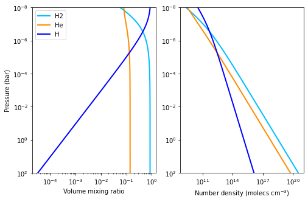
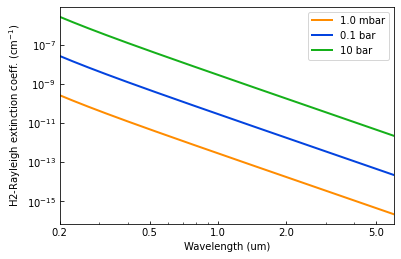
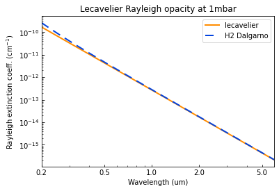
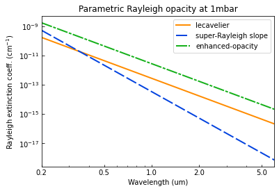

.. _opacity_rayleigh:

Rayleigh Opacities Tutorial
===========================

This tutorial shows how to create Rayleigh opacity objects and compute
their extinction coefficient spectra for a given atmospheric profile.

.. Note::
    You can also find this tutorial as a `Python scrip here
    <https://github.com/pcubillos/pyratbay/blob/master/docs/cookbooks/opacity_rayleigh.py>`_
    or as a `jupyter notebook here
    <https://github.com/pcubillos/pyratbay/blob/master/docs/cookbooks/opacity_rayleigh.ipynb>`_.

Let’s start by importing some necessary modules:

.. code:: ipython3

    import pyratbay.atmosphere as pa
    import pyratbay.constants as pc
    import pyratbay.spectrum as ps
    import pyratbay.opacity as op
    
    import matplotlib.pyplot as plt
    import matplotlib
    import numpy as np

.. code:: ipython3

    # First, let's consider a simple solar-abundance isothermal atmosphere
    nlayers = 81
    pressure = pa.pressure('1e-8 bar', '1e2 bar', nlayers)
    temperature = np.tile(1800.0, nlayers)
    species = ['H2', 'He', 'H']
    
    # Volume mixing ratios in thermochemical equilibrium (only H2, H, and He)
    vmr = pa.abundance(pressure, temperature, species)
    # Number-density profiles under IGL (molecules per cm3)
    number_densities = pa.ideal_gas_density(vmr, pressure, temperature)
    
    H2_number_density = number_densities[:,0]
    He_number_density = number_densities[:,1]
    H_number_density = number_densities[:,2]
    
    
    # Show profiles:
    cols = ['deepskyblue', 'darkorange', 'blue']
    plt.figure(1, (8,5))
    plt.clf()
    ax = plt.subplot(121)
    for i, spec in enumerate(species):
        ax.plot(vmr[:,i], pressure/pc.bar, color=cols[i], lw=2.0, label=spec)
    ax.set_xscale('log')
    ax.set_yscale('log')
    ax.set_ylim(100, 1e-8)
    ax.set_xlabel('Volume mixing ratio')
    ax.set_ylabel('Pressure (bar)')
    ax.legend(loc='best')
    
    ax = plt.subplot(122)
    for i, spec in enumerate(species):
        ax.plot(number_densities[:,i], pressure/pc.bar, color=cols[i], lw=2.0, label=spec)
    ax.set_xscale('log')
    ax.set_yscale('log')
    ax.set_ylim(100, 1e-8)
    ax.set_xlabel('Number density (molecs cm$^{-3}$)')

1. Non-parametric models (H, H2, and He)
----------------------------------------

.. code:: ipython3

    # We will sample the opacity over a constant-resolution wavelength array
    # (boundaries in micron units)
    wl_min = 0.2
    wl_max = 6.0
    resolution = 15000.0
    wl = ps.constant_resolution_spectrum(wl_min, wl_max, resolution)
    
    # Models for H, H2, and He based on Dalgarno models (from Kurucz 1970)
    H2_rayleigh = op.rayleigh.Dalgarno(wn=1e4/wl, mol='H2')

.. code:: ipython3

    # A print() call shows some useful info about the object:
    print(H2_rayleigh)

.. parsed-literal::

    Model name (name): 'dalgarno_H2'
    Model species (mol): H2
    Number of model parameters (npars): 0
    Wavenumber (wn, cm-1):
       [50000.00 49996.67 49993.33 ... 1667.00 1666.88 1666.77]
    Cross section (cross_section, cm2 molec-1):
       [7.716e-26 7.714e-26 7.711e-26 ... 6.289e-32 6.287e-32 6.285e-32]
    

.. code:: ipython3

    # Evaluate passband over a specific wavelength array (um):
    H2_ec = H2_rayleigh.calc_extinction_coefficient(H2_number_density)
    
    
    plt.figure(2)
    plt.clf()
    ax = plt.subplot(111)
    ax.plot(wl, H2_ec[40], color='darkorange', lw=2.0, label='1.0 mbar')
    ax.plot(wl, H2_ec[56], color='xkcd:blue', lw=2.0, label='0.1 bar')
    ax.plot(wl, H2_ec[72], color='xkcd:green', lw=2.0, label='10 bar')
    ax.set_xscale('log')
    ax.set_yscale('log')
    ax.set_xlim(np.amin(wl), np.amax(wl))
    ax.set_xlabel('Wavelength (um)')
    ax.xaxis.set_major_formatter(matplotlib.ticker.ScalarFormatter())
    ax.set_xticks([0.2, 0.5, 1.0, 2.0, 5.0])
    ax.tick_params(which='both', direction='in')
    ax.set_ylabel('H2-Rayleigh extinction coeff. (cm$^{-1}$)')
    ax.legend(loc='upper right')

2. Lecavelier parametric model
------------------------------

.. code:: ipython3

    # Parametric model based on Lecavelier des Etangs (2008) model for H2:
    lec_rayleigh = op.rayleigh.Lecavelier(wn=1e4/wl)
    
    print(lec_rayleigh)

.. parsed-literal::

    Model name (name): 'lecavelier'
    Model species (mol): H2
    Number of model parameters (npars): 2
    Parameter name     Value
      (pnames)         (pars)
      log_k_ray         0.000e+00
      alpha_ray        -4.000e+00
    Wavenumber (wn, cm-1):
       [50000.00 49996.67 49993.33 ... 1667.00 1666.88 1666.77]
    Cross section (cross_section, cm2 molec-1):
       [ 4.980e-26  4.979e-26  4.978e-26 ...  6.153e-32  6.152e-32  6.150e-32]
    

.. code:: ipython3

    # Evaluate extinction coefficient, with default values it
    # reproduces the H2 Rayleigh opacity:
    lec_ec = lec_rayleigh.calc_extinction_coefficient(H2_number_density)
    
    
    # Compare to Dalgarno model:
    plt.figure(2)
    plt.clf()
    ax = plt.subplot(111)
    ax.plot(wl, lec_ec[40], color='darkorange', lw=2.0, label='lecavelier')
    ax.plot(wl, H2_ec[40], color='xkcd:blue', lw=2.0, dashes=(6,4), label='H2 Dalgarno')
    ax.set_xscale('log')
    ax.set_yscale('log')
    ax.xaxis.set_major_formatter(matplotlib.ticker.ScalarFormatter())
    ax.set_xticks([0.2, 0.5, 1.0, 2.0, 5.0])
    ax.tick_params(which='both', direction='in')
    ax.set_xlim(np.amin(wl), np.amax(wl))
    ax.set_xlabel('Wavelength (um)')
    ax.set_ylabel('Rayleigh extinction coeff. (cm$^{-1}$)')
    ax.legend(loc='upper right')
    ax.set_title('Lecavelier Rayleigh opacity at 1mbar')

.. code:: ipython3

    # Evaluate extinction coefficient for different parameter values:
    super_ray_ec = lec_rayleigh.calc_extinction_coefficient(
        H2_number_density,
        pars=[0.0, -6.0],
    )
    
    enhanced_ray_ec = lec_rayleigh.calc_extinction_coefficient(
        H2_number_density,
        pars=[1.0, -4.0],
    )
    
    
    # See results:
    plt.figure(2)
    plt.clf()
    ax = plt.subplot(111)
    ax.plot(wl, lec_ec[40], color='darkorange', lw=2.0, label='lecavelier')
    ax.plot(wl, super_ray_ec[40], color='xkcd:blue', lw=2.0, dashes=(8,2), label='super-Rayleigh slope')
    ax.plot(wl, enhanced_ray_ec[40], color='xkcd:green', lw=2.0, dashes=(8,1,2,1), label='enhanced-opacity')
    ax.set_xscale('log')
    ax.set_yscale('log')
    ax.xaxis.set_major_formatter(matplotlib.ticker.ScalarFormatter())
    ax.set_xticks([0.2, 0.5, 1.0, 2.0, 5.0])
    ax.tick_params(which='both', direction='in')
    ax.set_xlim(np.amin(wl), np.amax(wl))
    ax.set_xlabel('Wavelength (um)')
    ax.set_ylabel('Rayleigh extinction coeff. (cm$^{-1}$)')
    ax.legend(loc='upper right')
    ax.set_title('Parametric Rayleigh opacity at 1mbar')

.. code:: ipython3

    # Note that once we call calc_extinction_coefficient(), the model
    # parameter are updated automatically:
    print(lec_rayleigh.pars)

.. parsed-literal::

    [1.0, -4.0]

