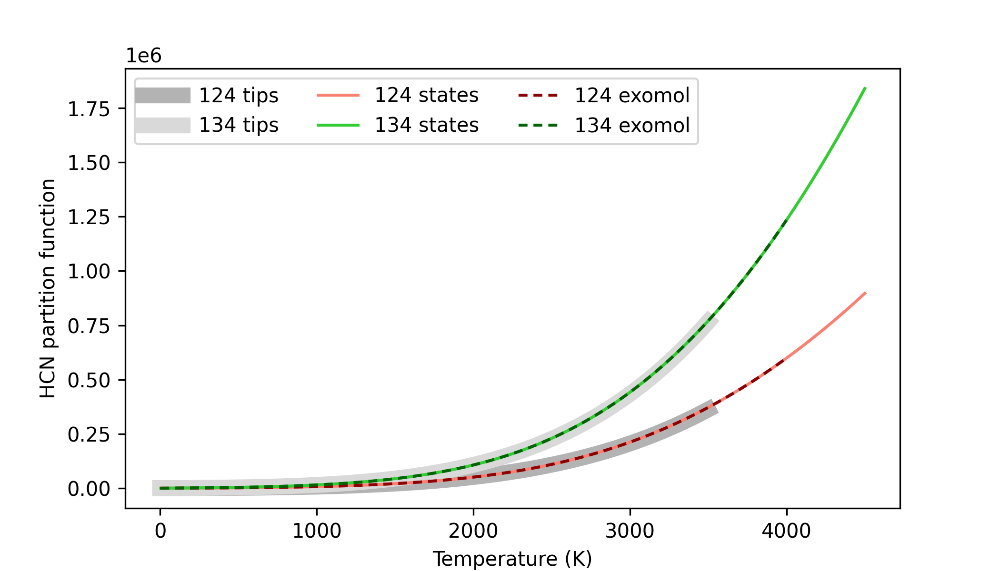

Partition Functions
===================

The partition function is a physical property required to compute
line-transition profiles. They are temperature dependent, and specific
to each isotope.

This tutorial shows how to calculate and manipulate partition functions.
Input data are taken from the HITRAN or the ExoMol databases. There are
two main ways to produce partition functions:

-  Generate PF files from the command line, which can be sourced

   - `From HITRAN TIPS data <#from-hitran-tips>`__
   - `From Exomol .pf files <#from-exomol-pf>`__
   - `From Exomol .state files <#from-exomol-states>`__

-  `Calculate PFs interactively <#interactive-pf-calculation>`__

--------------

1. Command line
---------------

From HITRAN TIPS
~~~~~~~~~~~~~~~~

The HITRAN database publised their TIPS partition functions for several
species in (Gamache et
al. `2017 <https://ui.adsabs.harvard.edu/abs/2017JQSRT.203...70G>`__,
`2021 <https://ui.adsabs.harvard.edu/abs/2021JQSRT.27107713G>`__). The
``Pyrat Bay`` packge comes with the HITRAN TIPS partition functions
included. Thus, there is no need to download input files.
To generate TIPS partition functions from the prompt, run the
``pbay -pf tips`` command followed by the molecule of interest, for
example:

.. code:: shell

   pbay -pf tips H2O

The output file is a table of the PFs over a range of temperatures for
each isotope in the TIPS database:

.. code:: shell

   Written partition-function file:
     'PF_tips_H2O.dat'
   for molecule H2O, with isotopes ['161', '181', '171', '162', '182', '172', '262', '282', '272'],
   and temperature range 1--6000 K.

Note that isotopes are labeled as in the HITRAN labeling format. If
needed, one can produce TIPS partition functions following the ExoMol
nomenclature (e.g., when TIPS data have a larget temperature coverage).
For this, append the ``as_exomol`` argument to write the isotope labels
as in the ExoMol format:

.. code:: shell

   pbay -pf tips NH3 as_exomol

.. code:: shell

   Written partition-function file:
     'PF_tips_NH3.dat'
   for molecule NH3, with isotopes ['4111', '5111'],
   and temperature range 1--6000 K.

From Exomol .pf
~~~~~~~~~~~~~~~

Partition functions files can also be generated from the ExoMol *.pf*
files. For this, one needs to download the source files from the `ExoMol
website <https://www.exomol.com/data/molecules>`__. Then to generate the
partition function files, run the ``pbay -pf exomol`` command followed
by the Exomol files. Here’s an example for the HCN molecule:

.. code:: shell

   # Download Exomol's .pf data for HCN
   wget https://www.exomol.com/db/HCN/1H-12C-14N/Harris/1H-12C-14N__Harris.pf
   wget https://www.exomol.com/db/HCN/1H-13C-14N/Larner/1H-13C-14N__Larner.pf

   # Format PF files
   pbay -pf exomol 1H-12C-14N__Harris.pf 1H-13C-14N__Larner.pf

Note that many isotopes of a given molecule can be combined into a
single PF file.

.. code:: shell

   Written partition-function file:
     'PF_exomol_HCN.dat'
   for molecule HCN, with isotopes ['124', '134'],
   and temperature range 1--4000 K.

From Exomol .states
~~~~~~~~~~~~~~~~~~~

Lastly, it is possible to compute partition function using the ExoMol
*.states* files. This method makes it possible to evaluate the PFs at
temperatures avobe the ones provided in the *.pf* files (e.g., to work
with ultra hot-Jupiter atmospheres). To do this, run the ``pbay -pf
states`` command, followed by the temperature sampling’s minimum,
maximum, and stepsize, and then followed by the Exomol states files.
Here’s an example for the HCN molecule:

.. code:: shell

   # Download Exomol .states data for HCN
   wget https://www.exomol.com/db/HCN/1H-12C-14N/Harris/1H-12C-14N__Harris.states.bz2
   wget https://www.exomol.com/db/HCN/1H-13C-14N/Larner/1H-13C-14N__Larner.states.bz2

   # Compute PF files
   pbay -pf states 5.0 6000.0 5.0 1H-12C-14N__Harris.states.bz2 1H-13C-14N__Larner.states.bz2

.. code:: shell

   Written partition-function file:
     'PF_exomol_HCN.dat'
   for molecule HCN, with isotopes ['124', '134'],
   and temperature range 5--6000 K.

.. note::

   Note that the input .states files can either remain zipped (as .bz2) or be unzippped.

--------------

2. Interactive PF calculation
-----------------------------

Here's an interactive Python sctipt to compute partition functions for the HCN molecule:

.. code:: ipython3

    import pyratbay.opacity.partitions as pf
    import numpy as np
    import matplotlib.pyplot as plt

    # Compute HCN's partitions using all 3 available methods:
    tips_pf, tips_iso, tips_temps = pf.tips('HCN')

    exomol_pf = [
        '1H-12C-14N__Harris.pf',
        '1H-13C-14N__Larner.pf',
    ]
    exomol_pf, exomol_iso, exomol_temps = pf.exomol_pf(exomol_pf)

    exomol_states = [
        '1H-12C-14N__Harris.states',
        '1H-13C-14N__Larner.states',
    ]
    states_pf, states_iso, states_temps = pf.exomol_states(
        exomol_states, tmin=5.0, tmax=4500.0, tstep=5.0,
    )

    # Plot and compare results
    fig = plt.figure(0)
    plt.clf()
    fig.set_size_inches(7, 4)
    plt.plot(tips_temps, tips_pf[0], lw=8, color='0.70', label='124 tips')
    plt.plot(tips_temps, tips_pf[1], lw=8, color='0.85', label='134 tips')

    plt.plot(states_temps, states_pf[0], color='salmon', label='124 states')
    plt.plot(states_temps, states_pf[1], color='limegreen', label='134 states')

    plt.plot(exomol_temps, exomol_pf[0], color='darkred', dashes=(3,2), label='124 exomol')
    plt.plot(exomol_temps, exomol_pf[1], color='darkgreen', dashes=(3,2), label='134 exomol')
    plt.legend(loc='upper left', ncol=3)
    plt.xlabel('Temperature (K)')
    plt.ylabel('HCN partition function')

