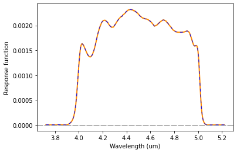
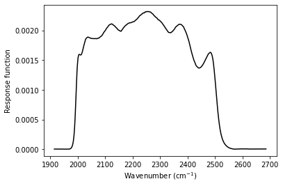
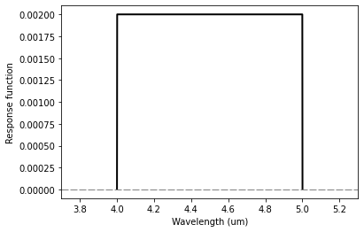

.. _passbands:

Passbands Tutorial
==================

This tutorial shows how to create and use passband objects with response
functions that can be (1) tabulated from files, or (2) have top-hat
shapes.

.. Note::
    You can also find this tutorial as a `Python scrip here
    <https://github.com/pcubillos/pyratbay/blob/master/docs/cookbooks/passbands.py>`_
    or as a `jupyter notebook here
    <https://github.com/pcubillos/pyratbay/blob/master/docs/cookbooks/passbands.pynb>`_.

Let’s start by importing some necessary modules:

.. code:: python

    import pyratbay.io as io
    import pyratbay.spectrum as ps
    import pyratbay.constants as pc

    import matplotlib.pyplot as plt
    import numpy as np

1. Passband objects
-------------------

1.1 Passband from tabulated file
~~~~~~~~~~~~~~~~~~~~~~~~~~~~~~~~

Passband objects can be created by reading from a plain text file
that tabulates the wavelength (in microns, first column) and its
response function (second column), e.g.:

.. code:: python

    filter_file = f'{pc.ROOT}pyratbay/data/filters/spitzer_irac2_sa.dat'
    band = ps.PassBand(filter_file)

Display some useful data that is contained in the object:

.. code:: python

    print(f'Filter name: {band.name}')
    print(f'Central wavelength: {band.wl0:.3f} um\n')

    print(f'Filter file: {band.filter_file}\n')
    print(f'Wavelength array (um): {band.wl}')
    print(f'Wavenumber array (cm-1): {band.wn}')
    print(f'Response function: {band.response}')

.. parsed-literal::

    Filter name: spitzer_irac2_sa
    Central wavelength: 4.471 um

    Filter file: /Users/pato/Dropbox/IWF/projects/2014_pyratbay/pyratbay/pyratbay/data/filters/spitzer_irac2_sa.dat

    Wavelength array (um): [5.222  5.2167 5.2115 ... 3.7278 3.7252 3.7225]
    Wavenumber array (cm-1): [1914.9824 1916.9133 1918.8407 ... 2682.5186 2684.4485 2686.3739]
    Response function: [0.0004 0.0004 0.0004 ... 0.0007 0.0007 0.0008]

Evaluate passband over a specific wavelength array (um):

.. code:: python

    wl = np.arange(3.5, 5.5, 0.001)
    out_wl, out_response = band(wl)

    # Show profile:
    plt.figure(1)
    plt.clf()
    plt.plot(out_wl, out_response, color='darkorange', lw=2.0)
    plt.axhline(0.0, color='gray', lw=1.0, dashes=(10,2))
    plt.xlabel('Wavelength (um)')
    plt.ylabel('Response function')
    # Note that returned values are the same as the internal variables:
    # out_wl = band.wl
    # out_response = band.response

    # The variable band.idx points to the indices in input wl
    # that overlap with the band's wavelength:
    # (Note wl differs from band.wl)
    plt.plot(wl[band.idx], band.response, color='blue', lw=1.0, dashes=(5,5))

The band response function is scaled such that the
integral over wavenumber equals one:

.. code:: python

    band_integral = np.trapz(band.response, band.wn)
    print(f'Integral of response function: {band_integral:.3f}')

.. parsed-literal::

    Integral of response function: 1.000

It is possible to evaluate the passband over a wavenumber array:

.. code:: python

    wn = 1e4 / wl
    out_wn, out_response = band(wn=wn)

    plt.figure(1)
    plt.clf()
    plt.plot(band.wn, band.response, color='black')
    plt.xlabel(r'Wavenumber (cm$^{-1}$)')
    plt.ylabel('Response function')

1.2 Top-hat passband
~~~~~~~~~~~~~~~~~~~~

Top-hat passband objects can be created by setting
their central wavelength and half-width (in micron units):

.. code:: python

    wl0 = 4.5
    half_width = 0.5
    band = ps.Tophat(wl0, half_width)

.. code:: python

    # Evaluate passband over a specific wavelength array (um):
    wl = np.arange(3.5, 5.5, 0.001)
    out_wl, out_response = band(wl)

    # Show profile:
    plt.figure(1)
    plt.clf()
    plt.plot(out_wl, out_response, color='black', lw=2.0)
    plt.xlim(3.7, 5.3)
    plt.axhline(0.0, color='gray', lw=1.0, dashes=(8,2))
    plt.xlabel('Wavelength (um)')
    plt.ylabel('Response function')

Same as with ``ps.Passband()``, a tophat response function is scaled
such that the integral over wavenumber equals one:

.. code:: python

    band_integral = np.trapz(band.response, band.wn)
    print(f'Integral of response function: {band_integral:.3f}')

.. parsed-literal::

    Integral of response function: 1.000

2. Create a set of passbands
----------------------------

If you have a set of observations for a given target, you can generate a
set of filters for these data by loading the info from a file like the
one below (not how you can combine top-hat and from filter files):

.. code:: bash

   # observations.dat file

   # Passband info could be (1) a path to a file or (2) a tophat filter
   # defined by a central wavelength, half-width, and optionally a name

   # Comment lines (like this one) and blank lines are ignored,
   # central-wavelength and half-width units are always microns

   # @DEPTH_UNITS sets the depth and uncert units (none, percent, ppt, ppm)
   # and also indicates that there's data and uncerts to read
   # as two columns before the passband info
   @DEPTH_UNITS
   ppm

   @DATA
   # depth uncert  wavelength half_width passband_name
   # depth uncert  passband_file
       200    50   0.900    0.075
       214    82   1.148    0.046  HST_WFC3
       325    83   1.240    0.046  HST_WFC3
       415    82   1.332    0.046  HST_WFC3
       621    97   1.424    0.046  HST_WFC3
       765   101   1.516    0.046  HST_WFC3
       732   107   1.608    0.046  HST_WFC3
      1148    84   {ROOT}/pyratbay/data/filters/spitzer_irac1_sa.dat
      1275    92   {ROOT}/pyratbay/data/filters/spitzer_irac2_sa.dat

Load this data and print a brief summary to screen:

.. code:: python

    # Loading:
    obs_file = 'observations.dat'
    bands, depths, uncerts = io.read_observations(obs_file)

    # Evaluate pass band over a given spectral array:
    wl = np.linspace(0.5, 5.5, 1000)
    for band in bands:
        band(wl)

    # Summary of data:
    print('band              wl (um)  depth (ppm)')
    for i,band in enumerate(bands):
        depth = depths[i] / pc.ppm
        err = uncerts[i] / pc.ppm
        print(f'{band.name:16s}  {band.wl0:.2f}  {depth:9.1f} +/- {err:5.1f}')

.. parsed-literal::

    band              wl (um)  depth (ppm)
    tophat            0.90      200.0 +/-  50.0
    HST_WFC3          1.15      214.0 +/-  82.0
    HST_WFC3          1.24      325.0 +/-  83.0
    HST_WFC3          1.33      415.0 +/-  82.0
    HST_WFC3          1.42      621.0 +/-  97.0
    HST_WFC3          1.52      765.0 +/- 101.0
    HST_WFC3          1.61      732.0 +/- 107.0
    spitzer_irac1_sa  3.52     1148.0 +/-  84.0
    spitzer_irac2_sa  4.47     1275.0 +/-  92.0

Plot the data and passbands:

.. code:: python

    nbands = len(bands)
    colors = [plt.cm.plasma_r(0.1 + 0.1*i) for i in range(nbands)]
    bands_wl = [band.wl0 for band in bands]

    plt.figure(10)
    plt.clf()
    plt.errorbar(bands_wl, depths/pc.ppm, uncerts/pc.ppm, fmt='ok', ms=4.0)
    for i,band in enumerate(bands):
        response = band.response / np.amax(band.response) * 100
        plt.plot(band.wl, response, color=colors[i])

    plt.ylim(0, 1400)
    plt.xlabel('Wavelength (um)')
    plt.ylabel('Eclipse depth (ppm)')

.. image:: passbands_files/passbands_15_1.png

