.. _temperature_profiles:

Temperature Profiles
====================

This tutorial shows how to create and use temperature-pressure profiles.
Currently, there are three temperature models: ``isothermal``,
``guillot``, and ``madhu``.

.. Note::
    You can also find this tutorial as a `Python scrip here
    <https://github.com/pcubillos/pyratbay/blob/master/docs/cookbooks/temperature_profiles.py>`_
    or as a `jupyter notebook here
    <https://github.com/pcubillos/pyratbay/blob/master/docs/cookbooks/temperature_profiles.ipynb>`_.

Lets start by importing some necessary modules:

.. code:: python

    import pyratbay.constants as pc
    import pyratbay.atmosphere as pa

    import matplotlib.pyplot as plt
    import numpy as np
    np.set_printoptions(precision=4)

    # Define a pressure profile where to evaluate the temperature models:
    nlayers = 101
    ptop = '1e-7 bar'
    pbottom = '100 bar'
    pressure_cgs = pa.pressure(ptop, pbottom, nlayers)
    # See help(pa.pressure) for alternative ways to set the boundaries/units

    # Same pressure array but in bar units:
    pressure = pressure_cgs / pc.bar

Isothermal Profile
------------------

.. code:: python

    # To initialize an isothermal TP model, provide the number of layers:
    tp_iso = pa.tmodels.Isothermal(pressure)

    # Evaluate a TP profile at a given tempperature:
    temp_iso_1500K = tp_iso(1500.0)
    # to get another profile, evaluate at a different value:
    temp_iso_1900K = tp_iso([1900.0])

    # Plot the results:
    plt.figure(10)
    plt.clf()
    ax = plt.subplot(111)
    ax.plot(temp_iso_1500K, pressure, color='mediumblue', lw=2.0, label='1500K')
    ax.plot(temp_iso_1900K, pressure, color='deepskyblue', lw=2.0, label='1900K')
    ax.set_yscale('log')
    ax.set_ylim(np.amax(pressure), np.amin(pressure))
    ax.set_xlabel('Temperature (K)')
    ax.set_ylabel('Pressure (bar)')
    ax.set_xlim(1000, 2000)
    ax.legend()
    plt.tight_layout()

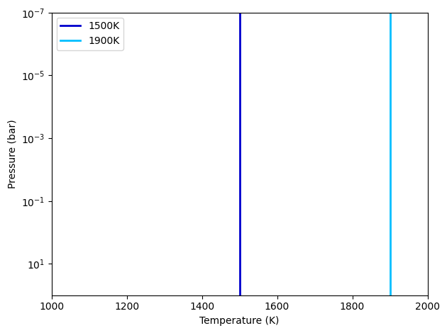

.. code:: python

    # This is some useful data contained in the object:
    print(tp_iso)

.. parsed-literal::

    Model name: isothermal
    Number of parameters (npars): 1
    Parameter names (pnames): ['T_iso']
    Parameter Latex names (texnames): ['$T\\ ({\\rm K})$']
    Pressure array (pressure, barye):
     [1.000e-07 1.230e-07 1.514e-07 1.862e-07 2.291e-07 2.818e-07 3.467e-07
     4.266e-07 5.248e-07 6.457e-07 7.943e-07 9.772e-07 1.202e-06 1.479e-06
     1.820e-06 2.239e-06 2.754e-06 3.388e-06 4.169e-06 5.129e-06 6.310e-06
     7.762e-06 9.550e-06 1.175e-05 1.445e-05 1.778e-05 2.188e-05 2.692e-05
     3.311e-05 4.074e-05 5.012e-05 6.166e-05 7.586e-05 9.333e-05 1.148e-04
     1.413e-04 1.738e-04 2.138e-04 2.630e-04 3.236e-04 3.981e-04 4.898e-04
     6.026e-04 7.413e-04 9.120e-04 1.122e-03 1.380e-03 1.698e-03 2.089e-03
     2.570e-03 3.162e-03 3.890e-03 4.786e-03 5.888e-03 7.244e-03 8.913e-03
     1.096e-02 1.349e-02 1.660e-02 2.042e-02 2.512e-02 3.090e-02 3.802e-02
     4.677e-02 5.754e-02 7.079e-02 8.710e-02 1.072e-01 1.318e-01 1.622e-01
     1.995e-01 2.455e-01 3.020e-01 3.715e-01 4.571e-01 5.623e-01 6.918e-01
     8.511e-01 1.047e+00 1.288e+00 1.585e+00 1.950e+00 2.399e+00 2.951e+00
     3.631e+00 4.467e+00 5.495e+00 6.761e+00 8.318e+00 1.023e+01 1.259e+01
     1.549e+01 1.905e+01 2.344e+01 2.884e+01 3.548e+01 4.365e+01 5.370e+01
     6.607e+01 8.128e+01 1.000e+02]
    Last evaluated profile (temperature, K):
      [1900. 1900. 1900. 1900. 1900. 1900. 1900. 1900. 1900. 1900. 1900. 1900.
     1900. 1900. 1900. 1900. 1900. 1900. 1900. 1900. 1900. 1900. 1900. 1900.
     1900. 1900. 1900. 1900. 1900. 1900. 1900. 1900. 1900. 1900. 1900. 1900.
     1900. 1900. 1900. 1900. 1900. 1900. 1900. 1900. 1900. 1900. 1900. 1900.
     1900. 1900. 1900. 1900. 1900. 1900. 1900. 1900. 1900. 1900. 1900. 1900.
     1900. 1900. 1900. 1900. 1900. 1900. 1900. 1900. 1900. 1900. 1900. 1900.
     1900. 1900. 1900. 1900. 1900. 1900. 1900. 1900. 1900. 1900. 1900. 1900.
     1900. 1900. 1900. 1900. 1900. 1900. 1900. 1900. 1900. 1900. 1900. 1900.
     1900. 1900. 1900. 1900. 1900.]

Guillot TP Profiles
-------------------

The ``guillot`` model has six parameters as defined in Line et
al. (2013): :math:`\log\kappa'`, :math:`\log\gamma_1`,
:math:`\log\gamma_2`, :math:`\alpha`, :math:`T_{\rm irr}`, and
:math:`T_{\rm int}`. The temperature profile is given as:

.. math::

    T^4(p) = \frac{3 T_{\rm int}^{4}}{4} \left(\frac{2}{3} + \tau\right)
       + (1-\alpha) \frac{3 T_{\rm irr}^{4}}{4} \xi_1(\tau)
       +    \alpha  \frac{3 T_{\rm irr}^{4}}{4} \xi_2(\tau),

with

.. math::

       \xi_i(\tau) = \frac{2}{3}
           + \frac{2}{3\gamma_i} \left[1 + \left(\frac{\gamma_i\tau}{2}-1\right)e^{-\gamma_i\tau}\right]
           + \frac{2\gamma_i}{3} \left(1-\frac{\tau^{2}}{2}\right)E_{2}(\gamma_i\tau),

where :math:`E_{2}(\gamma_{i}\tau)` is the second-order exponential
integral; :math:`T_{\rm int}` is the internal heat temperature; and
:math:`\tau(p)
= \kappa' p` (note that this parameterization differs from that of Line
et al. (2013), which are related as :math:`\kappa' \equiv \kappa/g`).
:math:`T_{\rm irr}` parametrizes the stellar irradiation absorbed by the
planet as:

.. math::

     T_{\rm irr} = \left(\frac{1-A}{f}\right)^{1/4}
                   \left( \frac{R_{\rm s}}{2a}\right)^{1/2} T_{\rm s},

.. code:: python

    # To initialize a Guillot TP model, provide the pressure array (in CGS units):
    tp_guillot = pa.tmodels.Guillot(pressure_cgs)

    # Evaluate a Guillot TP profile for a given set of parameters:
    log_kappa, log_gamma1, log_gamma2, alpha = -6.0, -0.25, 0.0, 0.0
    t_irr = 1200.0
    t_int = 100.0

    params = log_kappa, log_gamma1, log_gamma2, alpha, t_irr, t_int
    temp_guillot = tp_guillot(params)

    # Plot the profile:
    plt.figure(20)
    plt.clf()
    ax = plt.subplot(111)
    ax.plot(temp_guillot, pressure, color='darkorange', lw=2.0, label='Guillot profile')
    ax.set_yscale('log')
    ax.set_ylim(np.amax(pressure), np.amin(pressure))
    ax.set_xlabel('Temperature (K)')
    ax.set_ylabel('Pressure (bar)')
    ax.set_xlim(1000, 1500)
    ax.legend()
    plt.tight_layout()

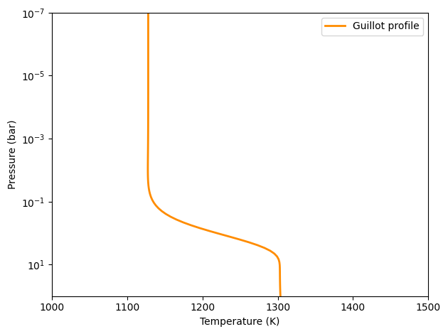

.. code:: python

    # This is some useful data contained in the object:
    print(tp_guillot)

.. parsed-literal::

    Model name: guillot
    Number of parameters (npars): 6
    Parameter names (pnames): ["log_kappa'", 'log_gamma1', 'log_gamma2', 'alpha', 'T_irr', 'T_int']
    Parameter Latex names (texnames): ["$\\log\\ \\kappa'$", '$\\log\\ \\gamma_1$', '$\\log\\ \\gamma_2$', '$\\alpha$', '$T_{\\rm irr} (K)$', '$T_{\\rm int} (K)$']
    Pressure array (pressure, barye):
     [1.000e-01 1.230e-01 1.514e-01 1.862e-01 2.291e-01 2.818e-01 3.467e-01
     4.266e-01 5.248e-01 6.457e-01 7.943e-01 9.772e-01 1.202e+00 1.479e+00
     1.820e+00 2.239e+00 2.754e+00 3.388e+00 4.169e+00 5.129e+00 6.310e+00
     7.762e+00 9.550e+00 1.175e+01 1.445e+01 1.778e+01 2.188e+01 2.692e+01
     3.311e+01 4.074e+01 5.012e+01 6.166e+01 7.586e+01 9.333e+01 1.148e+02
     1.413e+02 1.738e+02 2.138e+02 2.630e+02 3.236e+02 3.981e+02 4.898e+02
     6.026e+02 7.413e+02 9.120e+02 1.122e+03 1.380e+03 1.698e+03 2.089e+03
     2.570e+03 3.162e+03 3.890e+03 4.786e+03 5.888e+03 7.244e+03 8.913e+03
     1.096e+04 1.349e+04 1.660e+04 2.042e+04 2.512e+04 3.090e+04 3.802e+04
     4.677e+04 5.754e+04 7.079e+04 8.710e+04 1.072e+05 1.318e+05 1.622e+05
     1.995e+05 2.455e+05 3.020e+05 3.715e+05 4.571e+05 5.623e+05 6.918e+05
     8.511e+05 1.047e+06 1.288e+06 1.585e+06 1.950e+06 2.399e+06 2.951e+06
     3.631e+06 4.467e+06 5.495e+06 6.761e+06 8.318e+06 1.023e+07 1.259e+07
     1.549e+07 1.905e+07 2.344e+07 2.884e+07 3.548e+07 4.365e+07 5.370e+07
     6.607e+07 8.128e+07 1.000e+08]
    Last evaluated profile (temperature, K):
      [1128.1609 1128.1609 1128.1609 1128.1609 1128.1608 1128.1608 1128.1608
     1128.1607 1128.1607 1128.1606 1128.1605 1128.1604 1128.1603 1128.1602
     1128.16   1128.1598 1128.1596 1128.1593 1128.1589 1128.1585 1128.158
     1128.1574 1128.1567 1128.1559 1128.1549 1128.1537 1128.1523 1128.1506
     1128.1486 1128.1462 1128.1434 1128.1401 1128.1361 1128.1315 1128.1261
     1128.1197 1128.1122 1128.1036 1128.0934 1128.0817 1128.0681 1128.0526
     1128.0347 1128.0144 1127.9914 1127.9655 1127.9368 1127.9052 1127.8708
     1127.8342 1127.7961 1127.7576 1127.7206 1127.6878 1127.663  1127.6513
     1127.66   1127.6988 1127.7804 1127.9218 1128.1449 1128.478  1128.957
     1129.6274 1130.5455 1131.7802 1133.4148 1135.5474 1138.291  1141.7717
     1146.1245 1151.4863 1157.9845 1165.7219 1174.758  1185.0873 1196.6186
     1209.1572 1222.3963 1235.9214 1249.2316 1261.7809 1273.039  1282.565
     1290.0832 1295.5402 1299.1195 1301.1965 1302.2375 1302.679  1302.8396
     1302.8996 1302.9363 1302.9743 1303.0201 1303.0764 1303.1456 1303.2307
     1303.3355 1303.4643 1303.6228]

Madhu TP Profile
----------------

The madhu model has six parameters: :math:`\log p_1`, :math:`\log p_2`,
:math:`\log p_3`, :math:`a_1`, :math:`a_2`, and :math:`T_0`, as
described in Madhusudhan & Seager (2009), where the pressure values must
be given in bars. The temperature profile is given as:

.. math::

    T(p) = \left\{
     \begin{array}{lll}
     T_0 + \left[\frac{1}{a_1}\ln(p/p_0)\right]^2 & \text{for } p < p_1
        & (\rm layer\ 1) \\
     T_2 + \left[\frac{1}{a_2}\ln(p/p_2)\right]^2 & \text{for } p_1 \le p < p_3
        & (\rm layer\ 2) \\
     T_3   & \text{for } p \ge p_3 & (\rm layer\ 3)
     \end{array} \right.

A thermally inverted profile will result when :math:`p_1 < p_2`; a
non-inverted profile will result when :math:`p_2 < p_1`.

The pressure parameters must also satisfy: :math:`p_1 < p_3` (otherwise
the model will return zeros).

.. code:: python

    # To initialize a Madhu TP model, provide the pressure array (in CGS units):
    tp_madhu = pa.tmodels.Madhu(pressure_cgs)

    # A non thermally-inverted profile (p1 > p2):
    log_p1 = -3.5
    log_p2 = -4.0
    log_p3 = 0.5
    a1 = 3.0
    a2 = 0.5
    T0 = 1100.0
    temp_madhu = tp_madhu([log_p1, log_p2, log_p3, a1, a2, T0])

    # Plot the profile:
    plt.figure(30)
    plt.clf()
    ax = plt.subplot(111)
    ax.plot(temp_madhu, pressure, color='limegreen', lw=2.0, label='Madhu profile')
    ax.set_yscale('log')
    ax.set_ylim(np.amax(pressure), np.amin(pressure))
    ax.set_xlabel('Temperature (K)')
    ax.set_ylabel('Pressure (bar)')
    ax.set_xlim(1000, 2000)
    ax.legend()
    plt.tight_layout()

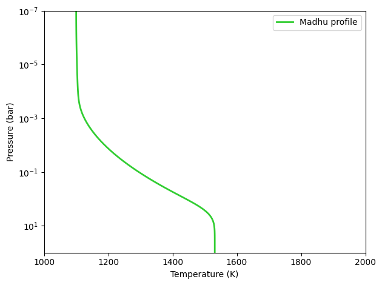

.. code:: python

    # This is some useful data contained in the object:
    print(tp_madhu)

.. parsed-literal::

    Model name: madhu
    Number of parameters (npars): 6
    Parameter names (pnames): ['log_p1', 'log_p2', 'log_p3', 'a1', 'a2', 'T0']
    Parameter Latex names (texnames): ['$\\log\\ p_1$', '$\\log\\ p_2$', '$\\log\\ p_3$', '$a_1$', '$a_2$', '$T_0$']
    Pressure array (pressure, barye):
     [1.000e-01 1.230e-01 1.514e-01 1.862e-01 2.291e-01 2.818e-01 3.467e-01
     4.266e-01 5.248e-01 6.457e-01 7.943e-01 9.772e-01 1.202e+00 1.479e+00
     1.820e+00 2.239e+00 2.754e+00 3.388e+00 4.169e+00 5.129e+00 6.310e+00
     7.762e+00 9.550e+00 1.175e+01 1.445e+01 1.778e+01 2.188e+01 2.692e+01
     3.311e+01 4.074e+01 5.012e+01 6.166e+01 7.586e+01 9.333e+01 1.148e+02
     1.413e+02 1.738e+02 2.138e+02 2.630e+02 3.236e+02 3.981e+02 4.898e+02
     6.026e+02 7.413e+02 9.120e+02 1.122e+03 1.380e+03 1.698e+03 2.089e+03
     2.570e+03 3.162e+03 3.890e+03 4.786e+03 5.888e+03 7.244e+03 8.913e+03
     1.096e+04 1.349e+04 1.660e+04 2.042e+04 2.512e+04 3.090e+04 3.802e+04
     4.677e+04 5.754e+04 7.079e+04 8.710e+04 1.072e+05 1.318e+05 1.622e+05
     1.995e+05 2.455e+05 3.020e+05 3.715e+05 4.571e+05 5.623e+05 6.918e+05
     8.511e+05 1.047e+06 1.288e+06 1.585e+06 1.950e+06 2.399e+06 2.951e+06
     3.631e+06 4.467e+06 5.495e+06 6.761e+06 8.318e+06 1.023e+07 1.259e+07
     1.549e+07 1.905e+07 2.344e+07 2.884e+07 3.548e+07 4.365e+07 5.370e+07
     6.607e+07 8.128e+07 1.000e+08]
    Last evaluated profile (temperature, K):
      [1100.0321 1100.0486 1100.0709 1100.0999 1100.1365 1100.1814 1100.2349
     1100.2975 1100.3693 1100.4505 1100.5413 1100.6415 1100.7512 1100.8705
     1100.9994 1101.1378 1101.2857 1101.4431 1101.6102 1101.7867 1101.9728
     1102.1684 1102.3736 1102.5884 1102.8126 1103.0465 1103.2901 1103.5436
     1103.8079 1104.0842 1104.3759 1104.6888 1105.0334 1105.4269 1105.8946
     1106.4717 1107.2024 1108.1374 1109.3298 1110.8288 1112.675  1114.8966
     1117.5084 1120.5139 1123.908  1127.6815 1131.8242 1136.3273 1141.1839
     1146.3896 1151.9416 1157.8385 1164.0796 1170.6644 1177.5929 1184.865
     1192.4806 1200.4398 1208.7426 1217.3889 1226.3788 1235.7123 1245.3893
     1255.4099 1265.7741 1276.4818 1287.533  1298.9279 1310.6663 1322.748
     1335.1722 1347.9372 1361.0386 1374.4663 1388.1997 1402.1982 1416.3903
     1430.6588 1444.8287 1458.6616 1471.8637 1484.1113 1495.0922 1504.556
     1512.3576 1518.4828 1523.0459 1526.2611 1528.3983 1529.7355 1530.5216
     1530.955  1531.1789 1531.2871 1531.336  1531.3565 1531.3645 1531.3673
     1531.3682 1531.3683 1531.3683]

Understanding Guillot parameters
--------------------------------

.. code:: python

    tp_guillot = pa.tmodels.Guillot(pressure_cgs)

    # log_kappa sets the pressure where the profile changes:
    # Think it as: log_P0_bars approx 6 + log_kappa
    params01 = -6.0, log_gamma1, log_gamma2, alpha, t_irr, t_int
    params02 = -4.0, log_gamma1, log_gamma2, alpha, t_irr, t_int
    temp_guillot01 = tp_guillot(params01)
    temp_guillot02 = tp_guillot(params02)

    # log_gamma sets the pressure where the profile changes:
    # Think it as: log_gamma > 0 temperature inversion, log_gamma < 0: non-inversion
    params11 = log_kappa, -0.25, log_gamma2, alpha, t_irr, t_int
    params12 = log_kappa, -0.50, log_gamma2, alpha, t_irr, t_int
    params13 = log_kappa, +0.25, log_gamma2, alpha, t_irr, t_int
    temp_guillot11 = tp_guillot(params11)
    temp_guillot12 = tp_guillot(params12)
    temp_guillot13 = tp_guillot(params13)

    # Plot the results:
    plt.figure(21, (9.0,4.0))
    plt.clf()
    ax = plt.subplot(121)
    pname = tp_guillot.texnames[0]
    ax.plot(temp_guillot01, pressure, color='darkorange', lw=2.0, label=f'{pname}$=-6$')
    ax.plot(temp_guillot02, pressure, color='red', lw=2.0, label=f'{pname}$=-4$')
    ax.set_yscale('log')
    ax.tick_params(which='both', right=True, top=True, direction='in')
    ax.set_xlim(1000, 2000)
    ax.set_ylim(np.amax(pressure), np.amin(pressure))
    ax.set_xlabel('Temperature (K)')
    ax.set_ylabel('Pressure (bar)')
    ax.legend()

    ax = plt.subplot(122)
    pname = tp_guillot.texnames[1]
    ax.plot(temp_guillot11, pressure, color='red', lw=2.0, label=f'{pname}$=-0.25$')
    ax.plot(temp_guillot12, pressure, color='darkorange', lw=2.0, label=f'{pname}$=-0.50$')
    ax.plot(temp_guillot13, pressure, color='gold', lw=2.0, label=f'{pname}$=+0.25$')
    ax.set_yscale('log')
    ax.tick_params(which='both', right=True, top=True, direction='in')
    ax.set_xlim(1000, 2000)
    ax.set_ylim(np.amax(pressure), np.amin(pressure))
    ax.set_xlabel('Temperature (K)')
    ax.legend()
    plt.tight_layout()

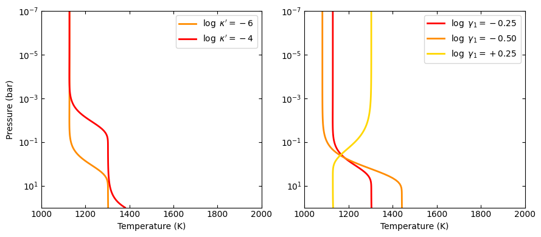

.. code:: python

    # T_irr sets how much incident flux the atmosphere receives:
    # Think it as: higher T_irr, higher overall temperature
    params21 = log_kappa, log_gamma1, log_gamma2, alpha, 1200.0, t_int
    params22 = log_kappa, log_gamma1, log_gamma2, alpha, 1400.0, t_int
    temp_guillot21 = tp_guillot(params21)
    temp_guillot22 = tp_guillot(params22)

    # T_int sets the planet internal heat from the bottom of the model:
    # Think it as: higher T_int, stronger higher overall temperature
    params31 = -3.0, log_gamma1, log_gamma2, alpha, t_irr, 0.0
    params32 = -3.0, log_gamma1, log_gamma2, alpha, t_irr, 100.0
    params33 = -3.0, log_gamma1, log_gamma2, alpha, t_irr, 300.0
    temp_guillot31 = tp_guillot(params31)
    temp_guillot32 = tp_guillot(params32)
    temp_guillot33 = tp_guillot(params33)

    plt.figure(22, (9.0,4.0))
    plt.clf()
    ax = plt.subplot(121)
    pname = tp_guillot.texnames[4]
    ax.plot(temp_guillot21, pressure, color='red', lw=2.0, label=f'{pname}$=1200$ K')
    ax.plot(temp_guillot22, pressure, color='darkorange', lw=2.0, label=f'{pname}$=1400$ K')
    ax.set_yscale('log')
    ax.tick_params(which='both', right=True, top=True, direction='in')
    ax.set_xlim(1000, 2000)
    ax.set_ylim(np.amax(pressure), np.amin(pressure))
    ax.set_xlabel('Temperature (K)')
    ax.set_ylabel('Pressure (bar)')
    ax.legend()

    ax = plt.subplot(122)
    pname = tp_guillot.texnames[5]
    ax.plot(temp_guillot31, pressure, color='red', lw=2.0, label=f'{pname}$=0.0$ K')
    ax.plot(temp_guillot32, pressure, color='darkorange', lw=2.0, label=f'{pname}$=100.0$ K')
    ax.plot(temp_guillot33, pressure, color='gold', lw=2.0, label=f'{pname}$=200.0$ K')
    ax.set_yscale('log')
    ax.tick_params(which='both', right=True, top=True, direction='in')
    ax.set_xlim(1000, 2000)
    ax.set_ylim(np.amax(pressure), np.amin(pressure))
    ax.set_xlabel('Temperature (K)')
    ax.legend()
    plt.tight_layout()

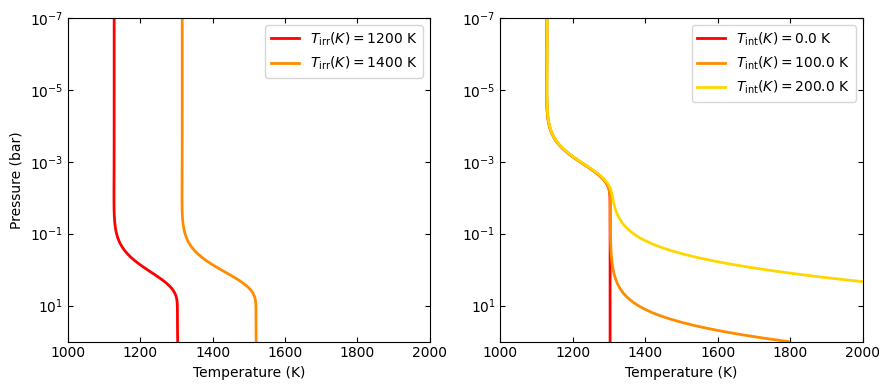

.. code:: python

    # A non-zero alpha (in combination with gamma2) enables a linear combination
    # of two profiles with different gamma values:
    temp_guillot41 = tp_guillot([log_kappa, -0.25, 0.4, 0.0, t_irr, t_int])
    temp_guillot42 = tp_guillot([log_kappa, -0.25, 0.4, 0.3, t_irr, t_int])
    temp_guillot43 = tp_guillot([log_kappa, -0.25, 0.4, 0.7, t_irr, t_int])
    temp_guillot44 = tp_guillot([log_kappa, -0.25, 0.4, 1.0, t_irr, t_int])

    plt.figure(23, (5.0,4.0))
    plt.clf()
    ax = plt.subplot(111)
    pname = tp_guillot.texnames[3]
    ax.plot(temp_guillot41, pressure, color='xkcd:red', lw=2.0, label=f'{pname}$=0.0$')
    ax.plot(temp_guillot42, pressure, color='tomato', lw=2.0, label=f'{pname}$=0.3$')
    ax.plot(temp_guillot43, pressure, color='orange', lw=2.0, label=f'{pname}$=0.7$')
    ax.plot(temp_guillot44, pressure, color='gold', lw=2.0, label=f'{pname}$=1.0$')
    ax.set_yscale('log')
    ax.tick_params(which='both', right=True, top=True, direction='in')
    ax.set_xlim(1000, 2000)
    ax.set_ylim(np.amax(pressure), np.amin(pressure))
    ax.set_ylabel('Pressure (bar)')
    ax.set_xlabel('Temperature (K)')
    ax.legend()
    plt.tight_layout()

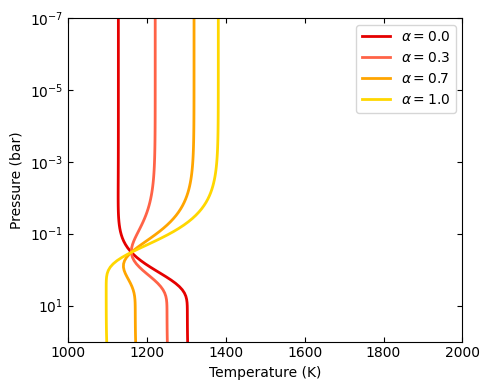

Understanding Madhu parameters
------------------------------

.. code:: python

    # Preamble:
    tp_madhu = pa.tmodels.Madhu(pressure_cgs)

    log_p2_ninv = -4.0
    log_p2_inv = 0.0
    T0_ninv = 1100.0
    T0_inv = 1500.0

    # a1 sets the gradient above the p1 pressure level:
    # a1 >> 0.0: isothermal layer, a1>0: T increases away from P0

    # Non-inverted TP profile
    temp_madhu01 = tp_madhu([log_p1, log_p2_ninv, log_p3, 3.0, a2, T0_ninv])
    temp_madhu02 = tp_madhu([log_p1, log_p2_ninv, log_p3, 1.0, a2, T0_ninv])
    temp_madhu03 = tp_madhu([log_p1, log_p2_ninv, log_p3, 0.5, a2, T0_ninv])

    # Inverted TP profile
    temp_madhu11 = tp_madhu([log_p1, log_p2_inv, log_p3, 3.0, a2, T0_inv])
    temp_madhu12 = tp_madhu([log_p1, log_p2_inv, log_p3, 1.0, a2, T0_inv])
    temp_madhu13 = tp_madhu([log_p1, log_p2_inv, log_p3, 0.5, a2, T0_inv])

    temps_madhu = [
        [temp_madhu01,temp_madhu02,temp_madhu03],
        [temp_madhu11,temp_madhu12,temp_madhu13],
    ]
    pname = tp_madhu.texnames[3]
    labels = [f'{pname}$={val}$' for val in (3.0, 1.0, 0.5)]

    plt.figure(31, (9.0,4.0))
    plt.clf()
    for i in [0,1]:
        ax = plt.subplot(1,2,1+i)
        ax.plot(temps_madhu[i][0], pressure, color='xkcd:darkgreen', lw=2.0, label=labels[0])
        ax.plot(temps_madhu[i][1], pressure, color='forestgreen', lw=2.0, label=labels[1])
        ax.plot(temps_madhu[i][2], pressure, color='limegreen', lw=2.0, label=labels[2])
        ax.axhline(10**log_p1, lw=0.75, dashes=(6,2), color='0.8')
        ax.axhline(10**log_p3, lw=0.75, dashes=(6,2), color='0.8')
        ax.set_yscale('log')
        ax.tick_params(which='both', right=True, top=True, direction='in')
        ax.set_xlim(850, 2000)
        ax.set_ylim(np.amax(pressure), np.amin(pressure))
        ax.set_xlabel('Temperature (K)')
        ax.set_ylabel('Pressure (bar)')
        ax.legend()
    plt.tight_layout()

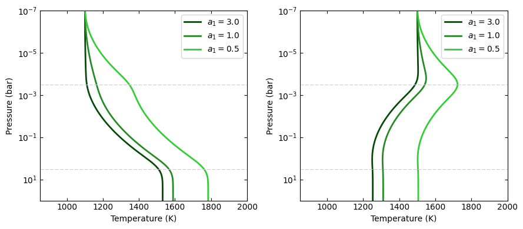

.. code:: python

    # log_p1 sets the location of the top layer:
    # Note that since this is a piece-wise constructed model, the value
    # of p1 has significant implications for the entire profile:

    # Non-inverted TP profile
    temp_madhu01 = tp_madhu([-5.5, log_p2_ninv, log_p3, a1, a2, T0_ninv])
    temp_madhu02 = tp_madhu([-4.0, log_p2_ninv, log_p3, a1, a2, T0_ninv])
    temp_madhu03 = tp_madhu([-2.5, log_p2_ninv, log_p3, a1, a2, T0_ninv])

    # Inverted TP profile
    temp_madhu11 = tp_madhu([-5.5, log_p2_inv, log_p3, a1, a2, T0_inv])
    temp_madhu12 = tp_madhu([-4.0, log_p2_inv, log_p3, a1, a2, T0_inv])
    temp_madhu13 = tp_madhu([-2.5, log_p2_inv, log_p3, a1, a2, T0_inv])

    temps_madhu = [
        [temp_madhu01,temp_madhu02,temp_madhu03],
        [temp_madhu11,temp_madhu12,temp_madhu13],
    ]
    pname = tp_madhu.texnames[0]
    labels = [f'{pname}$={val}$' for val in (-5.5, -4.0, -2.5)]

    plt.figure(32, (9.0,4.0))
    plt.clf()
    for i in [0,1]:
        ax = plt.subplot(1,2,1+i)
        ax.plot(temps_madhu[i][0], pressure, color='xkcd:darkgreen', lw=2.0, label=labels[0])
        ax.plot(temps_madhu[i][1], pressure, color='forestgreen', lw=2.0, label=labels[1])
        ax.plot(temps_madhu[i][2], pressure, color='limegreen', lw=2.0, label=labels[2])
        ax.axhline(10**log_p3, lw=0.75, dashes=(6,2), color='0.8')
        ax.set_yscale('log')
        ax.tick_params(which='both', right=True, top=True, direction='in')
        ax.set_xlim(850, 2000)
        ax.set_ylim(np.amax(pressure), np.amin(pressure))
        ax.set_xlabel('Temperature (K)')
        ax.set_ylabel('Pressure (bar)')
        ax.legend()
    plt.tight_layout()

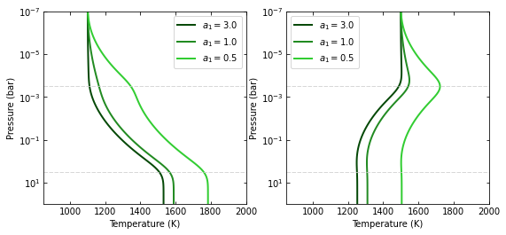

.. code:: python

    # a2 sets the temperature gradient between p3 < p < p1:
    # a2 >> 0.0: isothermal layer, a2>0: T increases away from p2

    # Non-inverted TP profile
    temp_madhu01 = tp_madhu([log_p1, log_p2_ninv, log_p3, a1, 3.0, T0_ninv])
    temp_madhu02 = tp_madhu([log_p1, log_p2_ninv, log_p3, a1, 1.0, T0_ninv])
    temp_madhu03 = tp_madhu([log_p1, log_p2_ninv, log_p3, a1, 0.6, T0_ninv])

    # Inverted TP profile
    temp_madhu11 = tp_madhu([log_p1, log_p2_inv, log_p3, a1, 3.0, T0_inv])
    temp_madhu12 = tp_madhu([log_p1, log_p2_inv, log_p3, a1, 1.0, T0_inv])
    temp_madhu13 = tp_madhu([log_p1, log_p2_inv, log_p3, a1, 0.6, T0_inv])

    temps_madhu = [
        [temp_madhu01,temp_madhu02,temp_madhu03],
        [temp_madhu11,temp_madhu12,temp_madhu13],
    ]
    pname = tp_madhu.texnames[4]
    labels = [f'{pname}$={val}$' for val in (3.0, 1.0, 0.6)]

    plt.figure(33, (9.0,4.0))
    plt.clf()
    for i in [0,1]:
        ax = plt.subplot(1,2,1+i)
        ax.plot(temps_madhu[i][0], pressure, color='xkcd:darkgreen', lw=2.0, label=labels[0])
        ax.plot(temps_madhu[i][1], pressure, color='forestgreen', lw=2.0, label=labels[1])
        ax.plot(temps_madhu[i][2], pressure, color='limegreen', lw=2.0, label=labels[2])
        ax.axhline(10**log_p1, lw=0.75, dashes=(6,2), color='0.8')
        ax.axhline(10**log_p3, lw=0.75, dashes=(6,2), color='0.8')
        ax.set_yscale('log')
        ax.tick_params(which='both', right=True, top=True, direction='in')
        ax.set_xlim(1000, 2000)
        ax.set_ylim(np.amax(pressure), np.amin(pressure))
        ax.set_xlabel('Temperature (K)')
        ax.set_ylabel('Pressure (bar)')
        ax.legend()
    plt.tight_layout()

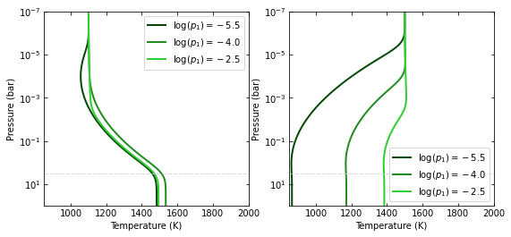

.. code:: python

    # log_p2 determines whether the atmosphere is thermally inverted
    # (p1 < p2) or not (p1 > p2).

    # Non-inverted TP profile
    temp_madhu01 = tp_madhu([log_p1, -6.0, log_p3, a1, a2, T0_ninv])
    temp_madhu02 = tp_madhu([log_p1, -4.0, log_p3, a1, a2, T0_ninv])
    temp_madhu03 = tp_madhu([log_p1, -3.0, log_p3, a1, a2, T0_ninv])
    # Note that p2 values impact the profile even if p2 < p1
    # temp_madhu03 is technically an inverted profile, but a tiny inv.

    # Inverted TP profile
    temp_madhu11 = tp_madhu([log_p1, -2.0, log_p3, a1, a2, T0_inv])
    temp_madhu12 = tp_madhu([log_p1, -0.5, log_p3, a1, a2, T0_inv])
    temp_madhu13 = tp_madhu([log_p1, 1.0, log_p3, a1, a2, T0_inv])
    # Note that p2 can have values larger than p3

    temps_madhu = [
        [temp_madhu01,temp_madhu02,temp_madhu03],
        [temp_madhu11,temp_madhu12,temp_madhu13],
    ]
    pname = tp_madhu.texnames[1]
    labels = [f'{pname}$={val}$' for val in (3.0, 1.0, 0.6)]

    plt.figure(34, (9.0,4.0))
    plt.clf()
    for i in [0,1]:
        ax = plt.subplot(1,2,1+i)
        ax.plot(temps_madhu[i][0], pressure, color='xkcd:darkgreen', lw=2.0, label=labels[0])
        ax.plot(temps_madhu[i][1], pressure, color='forestgreen', lw=2.0, label=labels[1])
        ax.plot(temps_madhu[i][2], pressure, color='limegreen', lw=2.0, label=labels[2])
        ax.axhline(10**log_p1, lw=0.75, dashes=(6,2), color='0.8')
        ax.axhline(10**log_p3, lw=0.75, dashes=(6,2), color='0.8')
        ax.set_yscale('log')
        ax.tick_params(which='both', right=True, top=True, direction='in')
        ax.set_xlim(1000, 2000)
        ax.set_ylim(np.amax(pressure), np.amin(pressure))
        ax.set_xlabel('Temperature (K)')
        ax.set_ylabel('Pressure (bar)')
        ax.legend()
    plt.tight_layout()

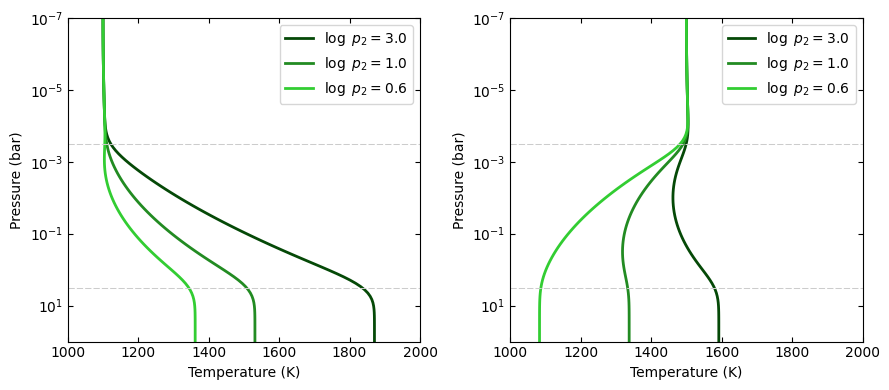

.. code:: python

    # logp3 sets the pressure of the isothermal lower layer:
    # Note that p2 is allowed to be at a deeper location than p3

    # Non-inverted TP profile
    temp_madhu01 = tp_madhu([log_p1, log_p2_ninv, -2.0, a1, a2, T0_ninv])
    temp_madhu02 = tp_madhu([log_p1, log_p2_ninv, 0.0, a1, a2, T0_ninv])
    temp_madhu03 = tp_madhu([log_p1, log_p2_ninv, 1.5, a1, a2, T0_ninv])

    # Inverted TP profile
    temp_madhu11 = tp_madhu([log_p1, log_p2_inv, -2.0, a1, a2, T0_inv])
    temp_madhu12 = tp_madhu([log_p1, log_p2_inv, 0.0, a1, a2, T0_inv])
    temp_madhu13 = tp_madhu([log_p1, log_p2_inv, 1.5, a1, a2, T0_inv])

    temps_madhu = [
        [temp_madhu01,temp_madhu02,temp_madhu03],
        [temp_madhu11,temp_madhu12,temp_madhu13],
    ]
    pname = tp_madhu.texnames[2]
    labels = [f'{pname}$={val}$' for val in (-2.0, 0.0, 1.5)]

    plt.figure(35, (9.0,4.0))
    plt.clf()
    for i in [0,1]:
        ax = plt.subplot(1,2,1+i)
        ax.plot(temps_madhu[i][0], pressure, color='xkcd:darkgreen', lw=2.0, label=labels[0])
        ax.plot(temps_madhu[i][1], pressure, color='forestgreen', lw=2.0, label=labels[1])
        ax.plot(temps_madhu[i][2], pressure, color='limegreen', lw=2.0, label=labels[2])
        ax.axhline(10**log_p1, lw=0.75, dashes=(6,2), color='0.8')
        ax.set_yscale('log')
        ax.tick_params(which='both', right=True, top=True, direction='in')
        ax.set_xlim(1000, 2000)
        ax.set_ylim(np.amax(pressure), np.amin(pressure))
        ax.set_xlabel('Temperature (K)')
        ax.set_ylabel('Pressure (bar)')
        ax.legend()
    plt.tight_layout()

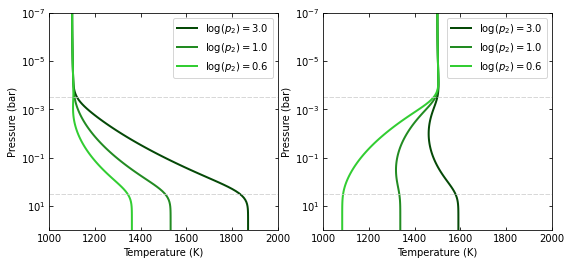

.. code:: python

    # T0 sets the temperature at the top of the profile:
    # This shifts the entire profile

    # Non-inverted TP profile
    temp_madhu01 = tp_madhu([log_p1, log_p2_ninv, log_p3, a1, a2, 1100.0])
    temp_madhu02 = tp_madhu([log_p1, log_p2_ninv, log_p3, a1, a2, 1200.0])
    temp_madhu03 = tp_madhu([log_p1, log_p2_ninv, log_p3, a1, a2, 1300.0])

    # Inverted TP profile
    temp_madhu11 = tp_madhu([log_p1, log_p2_inv, log_p3, a1, a2, 1500.0])
    temp_madhu12 = tp_madhu([log_p1, log_p2_inv, log_p3, a1, a2, 1600.0])
    temp_madhu13 = tp_madhu([log_p1, log_p2_inv, log_p3, a1, a2, 1700.0])

    temps_madhu = [
        [temp_madhu01,temp_madhu02,temp_madhu03],
        [temp_madhu11,temp_madhu12,temp_madhu13],
    ]
    pname = tp_madhu.texnames[5]
    labels = [
        f'{pname}$={val}$ K'
        for val in (1100, 1200, 1300, 1500, 1600, 1700)
    ]

    plt.figure(36, (9.0,4.0))
    plt.clf()
    for i in [0,1]:
        ax = plt.subplot(1,2,1+i)
        ax.plot(temps_madhu[i][0], pressure, color='xkcd:darkgreen', lw=2.0, label=labels[3*i+0])
        ax.plot(temps_madhu[i][1], pressure, color='forestgreen', lw=2.0, label=labels[3*i+1])
        ax.plot(temps_madhu[i][2], pressure, color='limegreen', lw=2.0, label=labels[3*i+2])
        ax.axhline(10**log_p1, lw=0.75, dashes=(6,2), color='0.8')
        ax.axhline(10**log_p3, lw=0.75, dashes=(6,2), color='0.8')
        ax.set_yscale('log')
        ax.tick_params(which='both', right=True, top=True, direction='in')
        ax.set_xlim(1000, 2000)
        ax.set_ylim(np.amax(pressure), np.amin(pressure))
        ax.set_xlabel('Temperature (K)')
        ax.set_ylabel('Pressure (bar)')
        ax.legend()
    plt.tight_layout()

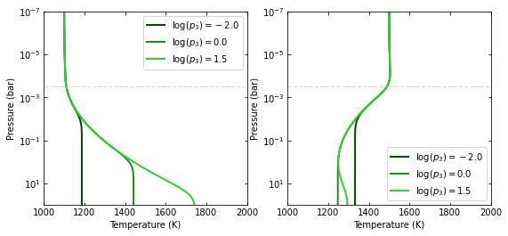

