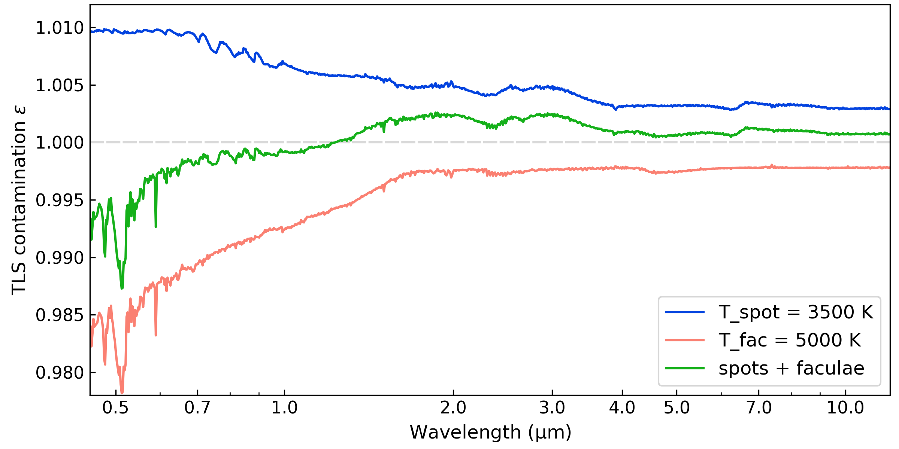

.. _tls:

Transit Light Source
====================

This tutorial shows how to model the Transit Light Source (TLS) effect
[Rackham2018]_.  This is a wavelenght-dependent correction to a
transit depth when the host star presents spots and/or faculae.  The
correction is modeled as:

.. math::
   \epsilon(\lambda) = \frac{1}{ 1
       - f_{\rm spot} \left( 1 - F_{\rm spot} / F_* \right)
       - f_{\rm fac} \left( 1 - F_{\rm fac} / F_* \right)

   }

where :math:`F_*`, :math:`F_{\rm spot}`, and :math:`F_{\rm fac}` are
the flux spectra from the host star (without contamination), from
spots, and from faculae.  These fluxes can be modeled using stellar
energy distribution models. :math:`f_{\rm spot}` and :math:`f_{\rm
fac}` are the spot and faculae coverage of the stellar surface
(projected area) as seen from Earth at the moment of the observation.

Below are the steps to model TLS effect:

- `Setup: Input files <#setup>`__

  - `PHOENIX New-ERA models <#fetch-phoenix-seds>`__

- `Transit-light-source modeling <#transit-light-source-modeling>`__

  - `TLS spots <#tls-spots>`__
  - `TLS spots and faculae <#tls-spots-and-faculae>`__

.. note:: For a application of the TLS effect into atmospheric retrievals see these docs: :ref:`wasp107b_tls`

--------------

Setup
-----

Fetch PHOENIX SEDs
~~~~~~~~~~~~~~~~~~

The only input for the TLS model is a library of SED models covering
the expected range of stellar, spot, and faculae temperatures.
``Pyrat Bay`` works with the PHOENIX New-Era SED models
[Hauschildt2025]_, which span from :math:`T_{\rm eff} \approx` 2300 K to
12000 K (min/max values may vary depending on the metallicity and
surface gravity).

The PHOENIX New-Era SEDs can be downloaded with the following Python script.

.. code:: ipython3

    import pyratbay.spectrum as ps

    # Leave teff as None to select all Teff models
    # Find models with closest log_g and metallicity
    teff = None
    logg = 4.57
    metal = 0.35

    # Make sure that the output folder already exists
    folder = 'phoenix/'

    ps.fetch_phoenix(teff, logg, metal, folder)

.. note:: For the TLS model, it's important that this folder contains
    no other SED except the sample of Teff dependent models.

--------------

Transit Light Source Modeling
-----------------------------

TLS spots
~~~~~~~~~

``Pyrat Bay`` models the TLS effect assuming that each component's
spectra by interpolating the PHOENIX SEDs at their respective
temperatures: :math:`F_* = F (T_{\rm eff})`, :math:`F_{\rm spot} = F
(T_{\rm spot})`, and :math:`F_{\rm fac} = F (T_{\rm fac})`.

Thus, :math:`T_{\rm eff}` is fixed at initialization.
:math:`T_{\rm spot}` and :math:`f_{\rm spot}` are model parameters for the spots. :math:`T_{\rm fac}` and :math:`f_{\rm fac}` are model parameters for the faculae.

To define the output spectral sampling, users can provide a wavelength
array at initialization, as shown below.  There are two alternatives
to sample from SED to the desired wavelength, binning or
interpolating.  Lastly, it's possible to adopt the wavelenght sampling
from the PHOENIX models.

.. tab-set::

  .. tab-item:: bin
    :selected:

    For coarse output spectra (resolution < ~5000), binning is
    recommended.  This scripts create a TLS model for a :math:`T_{\rm
    eff} = 4800` K star over the VIS-NIR spectral range:

    .. code:: ipython3

       import pyratbay.spectrum as ps
       import numpy as np
       import matplotlib
       import matplotlib.pyplot as plt
       plt.ion()

       # Folder containing a list of phoenix new-era models
       sed_folder = 'phoenix/'

       # Initialize TLS model
       teff = 4800.0
       wl = ps.constant_resolution_spectrum(0.3, 12.0, resolution=250.0)
       tls = ps.TransitLightSource(sed_folder, teff, wl, sampling='bin')

       # Evaluate TLS effect for a spot covering 1% of the projected stellar surface
       f_spot = 0.01
       t_spot = 3500.0
       epsilon = tls.epsilon(t_spot, f_spot)

       # Show TLS contamination spectrum
       fig = plt.figure(1)
       plt.clf()
       fig.set_size_inches(8,4)
       ax = plt.axes([0.1, 0.12, 0.89, 0.87])
       label = f'TLS Tspot = {t_spot:.0f} K'
       plt.plot(tls.wl, epsilon, color='royalblue', label=label)
       plt.legend(loc='lower left', fontsize=12)
       ax.set_xlim(0.45, 12)
       ax.set_xlabel(r"Wavelength ($\mathrm{\mu}$m)", fontsize=12)
       ax.set_ylabel(r"TLS contamination $\epsilon$", fontsize=12)
       ax.set_xscale('log')
       ax.tick_params(which='both', direction='in', labelsize=11)
       ax.get_xaxis().set_major_formatter(matplotlib.ticker.ScalarFormatter())
       ax.set_xticks([0.5, 0.7, 1.0, 2.0, 3.0, 4.0, 5.0, 7.0, 10.0])
       plt.savefig('tls_3500K_spot_low_resolution.png', dpi=300)

    .. image:: ../figures/tls_3500K_spot_low_resolution.png
      :width: 90%
      :align: center

    .. note:: Note that ``tls.epsilon()`` does not impose limits on
              the temperature of the heterogeneity, so one can also
              simulate faculae (:math:`T_{\rm spot}> T_{\rm eff}`)
              with it if desired.  This script computes and shows the
              TLS contamination spectra for a range of heterogeneity
              temperatures.

    .. code:: ipython3

       # Evaluate TLS effect for a range of star spot/faculae temperatures
       f_spot = 0.01
       t_spots = teff + np.linspace(-1600, 1600, 9)
       epsilon = [tls.epsilon(t_spot, f_spot) for t_spot in t_spots]

       fig = plt.figure(1)
       plt.clf()
       fig.set_size_inches(8,4)
       ax = plt.axes([0.1, 0.12, 0.89, 0.87])
       for i,t in enumerate(t_spots):
           col = 'red' if t==teff else plt.cm.viridis(i/8)
           label = f'Tspot = {t_spots[i]:.0f} K'
           plt.plot(tls.wl, epsilon[i], color=col, label=label, alpha=0.75)
       plt.legend(loc='lower right', fontsize=9, framealpha=0.75)
       ax.set_xlim(0.45, 12)
       ax.set_ylim(0.98, 1.011)
       ax.set_xlabel(r"Wavelength ($\mathrm{\mu}$m)", fontsize=12)
       ax.set_ylabel(r"TLS contamination $\epsilon$", fontsize=12)
       ax.set_xscale('log')
       ax.tick_params(which='both', direction='in', labelsize=11)
       ax.get_xaxis().set_major_formatter(matplotlib.ticker.ScalarFormatter())
       ax.set_xticks([0.5, 0.7, 1.0, 2.0, 3.0, 4.0, 5.0, 7.0, 10.0])
       plt.savefig('tls_spot_range_low_resolution.png', dpi=300)

    .. image:: ../figures/tls_spot_range_low_resolution.png
      :width: 90%
      :align: center

  .. tab-item:: interpolate

    For high-resolution spectra (resolution > ~5000), interpolating
    from the SED array is recommended.  This scripts create a TLS
    model for a :math:`T_{\rm eff} = 4800` K star over the VIS-NIR
    spectral range:

    .. code:: ipython3

       import pyratbay.spectrum as ps
       import numpy as np
       import matplotlib
       import matplotlib.pyplot as plt
       plt.ion()

       # Folder containing a list of phoenix new-era models
       sed_folder = 'phoenix/'

       # Initialize TLS model
       teff = 4800.0
       wl = ps.constant_resolution_spectrum(0.3, 12.0, resolution=15000.0)
       tls = ps.TransitLightSource(sed_folder, teff, wl, sampling='interpolate')

       # Evaluate TLS effect for a spot covering 1% of the projected stellar surface
       f_spot = 0.01
       t_spot = 3500.0
       epsilon = tls.epsilon(t_spot, f_spot)

       # Show TLS contamination spectrum
       fig = plt.figure(1)
       plt.clf()
       fig.set_size_inches(8,4)
       ax = plt.axes([0.1, 0.12, 0.89, 0.87])
       label = f'TLS Tspot = {t_spot:.0f} K'
       plt.plot(tls.wl, epsilon, color='royalblue', label=label)
       plt.legend(loc='lower left', fontsize=12)
       ax.set_xlim(0.45, 12)
       ax.set_xlabel(r"Wavelength ($\mathrm{\mu}$m)", fontsize=12)
       ax.set_ylabel(r"TLS contamination $\epsilon$", fontsize=12)
       ax.set_xscale('log')
       ax.tick_params(which='both', direction='in', labelsize=11)
       ax.get_xaxis().set_major_formatter(matplotlib.ticker.ScalarFormatter())
       ax.set_xticks([0.5, 0.7, 1.0, 2.0, 3.0, 4.0, 5.0, 7.0, 10.0])
       plt.savefig('tls_3500K_spot_high_resolution.png', dpi=300)

    .. image:: ../figures/tls_3500K_spot_high_resolution.png
      :width: 90%
      :align: center

    .. note:: Note that ``tls.epsilon()`` does not impose limits on
              the temperature of the heterogeneity, so one can also
              simulate faculae (:math:`T_{\rm spot}> T_{\rm eff}`)
              with it if desired.  This script computes and shows the
              TLS contamination spectra for a range of heterogeneity
              temperatures.

    .. code:: ipython3

       # Evaluate TLS effect for a range of star spot/faculae temperatures
       f_spot = 0.01
       t_spots = teff + np.linspace(-1600, 1600, 5)
       epsilon = [tls.epsilon(t_spot, f_spot) for t_spot in t_spots]

       fig = plt.figure(1)
       plt.clf()
       fig.set_size_inches(8,4)
       ax = plt.axes([0.1, 0.12, 0.89, 0.87])
       for i,t in enumerate(t_spots):
           col = 'red' if t==teff else plt.cm.viridis(i/4)
           label = f'Tspot = {t_spots[i]:.0f} K'
           plt.plot(tls.wl, epsilon[i], color=col, label=label, alpha=0.8)
       plt.legend(loc='lower right', fontsize=9, framealpha=0.75)
       ax.set_xlim(0.45, 12)
       ax.set_ylim(0.98, 1.011)
       ax.set_xlabel(r"Wavelength ($\mathrm{\mu}$m)", fontsize=12)
       ax.set_ylabel(r"TLS contamination $\epsilon$", fontsize=12)
       ax.set_xscale('log')
       ax.tick_params(which='both', direction='in', labelsize=11)
       ax.get_xaxis().set_major_formatter(matplotlib.ticker.ScalarFormatter())
       ax.set_xticks([0.5, 0.7, 1.0, 2.0, 3.0, 4.0, 5.0, 7.0, 10.0])
       plt.savefig('tls_spot_range_high_resolution.png', dpi=300)

    .. image:: ../figures/tls_spot_range_high_resolution.png
      :width: 90%
      :align: center

  .. tab-item:: PHOENIX sampling

    TLS spectra is computed at the PHOENIX resolution when the
    ``wl`` argument is not specified at initialization.  This scripts
    create a TLS model for a :math:`T_{\rm eff} = 4800` K star over
    the VIS-NIR spectral range:

    .. code:: ipython3

       import pyratbay.spectrum as ps
       import numpy as np
       import matplotlib
       import matplotlib.pyplot as plt
       plt.ion()

       # Folder containing a list of phoenix new-era models
       sed_folder = 'phoenix/'

       # Initialize TLS model
       teff = 4800.0
       tls = ps.TransitLightSource(sed_folder, teff)

       # Evaluate TLS effect for a spot covering 1% of the projected stellar surface
       f_spot = 0.01
       t_spot = 3500.0
       epsilon = tls.epsilon(t_spot, f_spot)

       # Show TLS contamination spectrum
       fig = plt.figure(1)
       plt.clf()
       fig.set_size_inches(8,4)
       ax = plt.axes([0.1, 0.12, 0.89, 0.87])
       label = f'TLS Tspot = {t_spot:.0f} K'
       plt.plot(tls.wl, epsilon, color='royalblue', label=label)
       plt.legend(loc='lower left', fontsize=12)
       ax.set_xlim(0.45, 12)
       ax.set_ylim(bottom=1.0)
       ax.set_xlabel(r"Wavelength ($\mathrm{\mu}$m)", fontsize=12)
       ax.set_ylabel(r"TLS contamination $\epsilon$", fontsize=12)
       ax.set_xscale('log')
       ax.tick_params(which='both', direction='in', labelsize=11)
       ax.get_xaxis().set_major_formatter(matplotlib.ticker.ScalarFormatter())
       ax.set_xticks([0.5, 0.7, 1.0, 2.0, 3.0, 4.0, 5.0, 7.0, 10.0])
       plt.savefig('tls_3500K_spot_phoenix_resolution.png', dpi=300)

    .. image:: ../figures/tls_3500K_spot_phoenix_resolution.png
      :width: 90%
      :align: center

TLS spots and faculae
~~~~~~~~~~~~~~~~~~~~~

To simulate both spot and faculae at the same time, simply call the
``tls.epsilon()`` method with the four parameters defining the spot and
faculae temperature and covering fraction:

.. code:: ipython3

   import pyratbay.spectrum as ps
   import numpy as np
   import matplotlib
   import matplotlib.pyplot as plt
   plt.ion()

   # Initialize TLS model
   sed_folder = 'phoenix/'
   teff = 4800.0
   wl = ps.constant_resolution_spectrum(0.3, 12.0, resolution=250.0)
   tls = ps.TransitLightSource(sed_folder, teff, wl, sampling='bin')

   # Evaluate TLS for 3500K a spot covering 1% of projected stellar surface
   # and 5000K faculae covering 5% of projected stellar surface
   f_spot = 0.01
   t_spot = 3500.0
   f_fac = 0.05
   t_fac = 5000.0

   e_spot_fac = tls.epsilon(t_spot, f_spot, t_fac, f_fac)
   e_spot = tls.epsilon(t_spot, f_spot)
   e_fac = tls.epsilon(t_fac, f_fac)

   # Show TLS contamination spectra
   fig = plt.figure(1)
   plt.clf()
   fig.set_size_inches(8,4)
   ax = plt.axes([0.1, 0.12, 0.89, 0.87])
   ax.axhline(1.0, color='0.85', dashes=(6,1))
   plt.plot(tls.wl, e_spot, color='xkcd:blue', label=f'T_spot = {t_spot:.0f} K')
   plt.plot(tls.wl, e_fac, color='salmon', label=f'T_fac = {t_fac:.0f} K')
   plt.plot(tls.wl, e_spot_fac, color='xkcd:green', label='spots + faculae')
   plt.legend(loc='lower right', fontsize=12)
   ax.set_xlim(0.45, 12)
   ax.set_ylim(0.978, 1.012)
   ax.set_xlabel(r"Wavelength ($\mathrm{\mu}$m)", fontsize=12)
   ax.set_ylabel(r"TLS contamination $\epsilon$", fontsize=12)
   ax.set_xscale('log')
   ax.tick_params(which='both', direction='in', labelsize=11)
   ax.get_xaxis().set_major_formatter(matplotlib.ticker.ScalarFormatter())
   ax.set_xticks([0.5, 0.7, 1.0, 2.0, 3.0, 4.0, 5.0, 7.0, 10.0])
   plt.savefig('tls_3500K_spot_5000K_fac.png', dpi=300)

