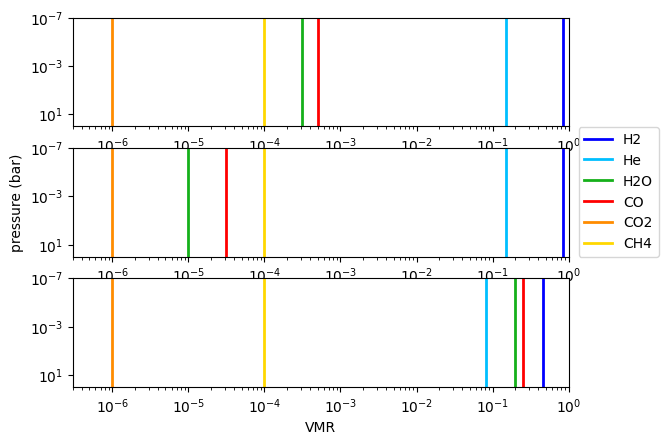
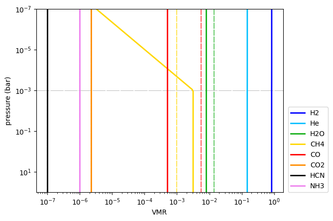

.. _vmr_free_profiles:

VMR free profiles
=================

This tutorial shows how to create and volume-mixing ratio (VMR) profiles
for *free-chemistry* models.

.. Note::
    You can also find this tutorial as a `Python scrip here
    <https://github.com/pcubillos/pyratbay/blob/master/docs/cookbooks/vmr_free_profiles.py>`_
    or as a `jupyter notebook here
    <https://github.com/pcubillos/pyratbay/blob/master/docs/cookbooks/vmr_free_profiles.ipynb>`_.

Let’s start by importing some necessary modules:

.. code:: python

    import pyratbay.constants as pc
    import pyratbay.atmosphere as pa
    
    import matplotlib.pyplot as plt
    import numpy as np

1. Isobaric VMR models
----------------------

This is the standard constant-with-altitude VMR model. These models have
a single parameter (``log_X``, where ``X`` is named after the species’
name), which defines the :math:`\log_{10}({\rm VMR})` for the given
species.

.. code:: python

    # Define a pressure profile where to evaluate the VMR models:
    nlayers = 101
    ptop = '1e-7 bar'
    pbottom = '100 bar'
    # See help(pa.pressure) for alternative ways to set the boundaries/units
    pressure_cgs = pa.pressure(ptop, pbottom, nlayers)
    # Same pressure array but in bar units:
    pressure = pressure_cgs / pc.bar
    
    # Create a simple atmosphere used as a base VMR
    tmodel = pa.tmodels.Isothermal(pressure)
    species = ["H2", "He", "H2O", "CO", "CO2", "CH4"]
    abundances = [0.85, 0.15, 1e-4, 1e-4, 1e-6, 1e-4]
    vmr = pa.uniform(abundances, nlayers)
    
    # Define free VMR models
    vmr_models = [
        pa.vmr_models.IsoVMR('H2O', pressure),
        pa.vmr_models.IsoVMR('CO', pressure),
    ]
    # Define 'bulk' species, these will self-adjust such that sum(VMR)=1 at each layer:
    bulk = ['H2', 'He']

.. code:: python

    # The vmr_scale() function evaluates the VMR models over an input atmosphere
    vmr_pars1 = [-3.5, -3.3]
    vmr_pars2 = [-5.0, -4.5]
    vmr_pars3 = [-0.7, -0.6]
    vmr1 = pa.vmr_scale(vmr, species, vmr_models, vmr_pars1, bulk)
    vmr2 = pa.vmr_scale(vmr, species, vmr_models, vmr_pars2, bulk)
    vmr3 = pa.vmr_scale(vmr, species, vmr_models, vmr_pars3, bulk)
    
    vmrs = [vmr1, vmr2, vmr3]
    cols = {
        'H2': 'blue',
        'He': 'deepskyblue',
        'H2O': 'xkcd:green',
        'CO': 'red',
        'CO2': 'darkorange',
        'CH4': 'gold',
        'HCN': 'black',
        'NH3': 'violet',
    }
    fig = plt.figure(0)
    plt.clf()
    for i in range(3):
        ax = plt.subplot(3,1,1+i)
        ax.set_xscale('log')
        ax.set_yscale('log')
        for j,spec in enumerate(species):
            col = cols[spec]
            ax.plot(vmrs[i][:,j], pressure, label=spec, lw=2, c=col)
        if i == 1:
            ax.legend(loc=(1.02, 0.0))
            ax.set_ylabel('pressure (bar)')
        ax.set_ylim(1e2, 1e-7)
        ax.set_xlim(3e-7, 1)
    ax.set_xlabel('VMR')

2 Non-isobaric VMR models
-------------------------

This model implements a slanted (or slanted + isobaric) VMR profile.
These models have five parameters (where ``X`` is named after the
species’ name):

+-----------------------------------+-----------------------------------+
| Parameter name                    | Description                       |
+===================================+===================================+
| ``slope_X``                       | Slope of VMR profile, defined as: |
|                                   | :math:`{\rm d}(\                  |
|                                   | log {\rm VMR}) / {\rm d}(\log p)` |
+-----------------------------------+-----------------------------------+
| ``log_VMR0_X``                    | Reference VMR value at pressure   |
|                                   | defined by ``log_p0_X``           |
+-----------------------------------+-----------------------------------+
| ``log_p0_X``                      | Reference pressure level where    |
|                                   | VMR is defined by ``log_p0_X``    |
+-----------------------------------+-----------------------------------+
| ``max_log_X``                     | Minimum VMR value (at whcih the   |
|                                   | slanted VMR profile will be       |
|                                   | capped)                           |
+-----------------------------------+-----------------------------------+
| ``min_log_X``                     | Maximum VMR value (at which the   |
|                                   | slanted VMR profile will be       |
|                                   | capped)                           |
+-----------------------------------+-----------------------------------+

In this way, this model can simulate a wide variety of profiles seen in
equilibrium or disequilibrium chemistry calculations. Note that ``VMR0``
and ``p0`` are a redundant pair of parameters, typically you want to
keep one fixed and fit for the other.

Also, note that for retrieval approaches, one does not need to have all
five parameters free. As little as two are sufficient for a slanted
profile (e.g., ``log_VMR0_X`` and ``slope_X``). To simulate vertical
quenching it would be sufficient, e.g., to let ``min_log_X`` free to
create a quencing VMR value.

.. code:: python

    # Setup a base VMR atmosphere
    species = 'H2 He H2O CH4  CO CO2 HCN NH3'.split()
    abundances = [
        0.850,  0.150,  1.4e-2, 1.0e-3,
        5.5e-3, 2.2e-6, 1.0e-7, 1.0e-6,
    ]
    vmr = pa.uniform(abundances, nlayers)
    bulk = ['H2', 'He']
    
    # Setup constant VMR models for H2O, CO, and CO2, non-isobaric for CH4
    vmr_models = [
        pa.vmr_models.IsoVMR('H2O', pressure_cgs),
        pa.vmr_models.IsoVMR('CO', pressure_cgs),
        pa.vmr_models.SlantVMR('CH4', pressure_cgs),
    ]
    
    # A print() call shows some basic info about these models
    for model in vmr_models:
        print(model)

This will output:

.. parsed-literal::

    VMR model name: log_H2O
    Number of parameters: 1
    Parameters: ['log_H2O']
    
    VMR model name: log_CO
    Number of parameters: 1
    Parameters: ['log_CO']
    
    VMR model name: slant_CH4
    Number of parameters: 5
    Parameters: ['slope_CH4', 'log_VMR0_CH4', 'log_p0_CH4', 'min_log_CH4', 'max_log_CH4']
    

.. code:: python

    # Define list of VMR parameters for each VMR model, note SlantVMR() requires 5 parameters):
    vmr_pars = [
        -2.1, 
        -3.3,
        # m    VMR0   p0    min      max
        [0.75, -2.5, -3.0, -np.inf, -2.5],
    ]
    vmr4 = pa.vmr_scale(vmr, species, vmr_models, vmr_pars, bulk)
    
    fig = plt.figure(1)
    plt.clf()
    ax = plt.subplot(111)
    ax.set_xscale('log')
    ax.set_yscale('log')
    plt.axhline(10**-3, color='0.75', dashes=(25,2), lw=0.75)
    for j,spec in enumerate(species):
        col = cols[spec]
        ax.plot(vmr4[:,j], pressure, label=spec, lw=2, c=col)
        ax.plot(vmr[:,j], pressure, lw=1.25, c=col, alpha=0.75, zorder=-1, dashes=(7,1))
    ax.legend(loc=(1.02, 0.0))
    ax.set_ylabel('pressure (bar)')
    ax.set_ylim(1e2, 1e-7)
    ax.set_xlabel('VMR')

