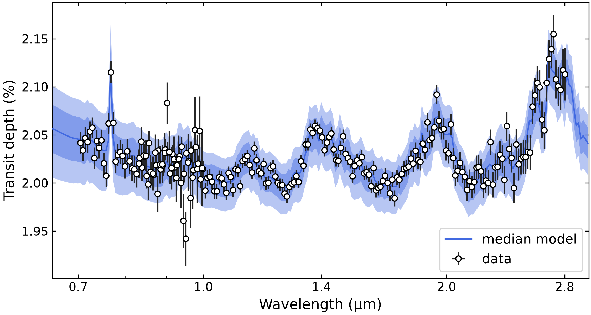
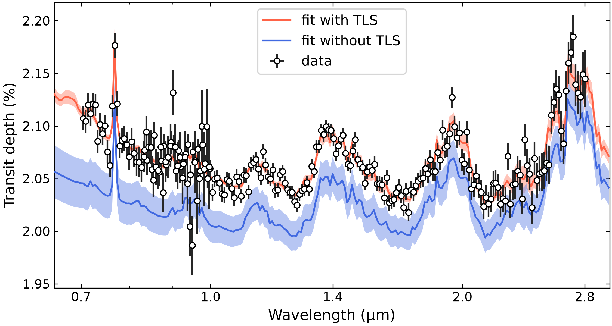
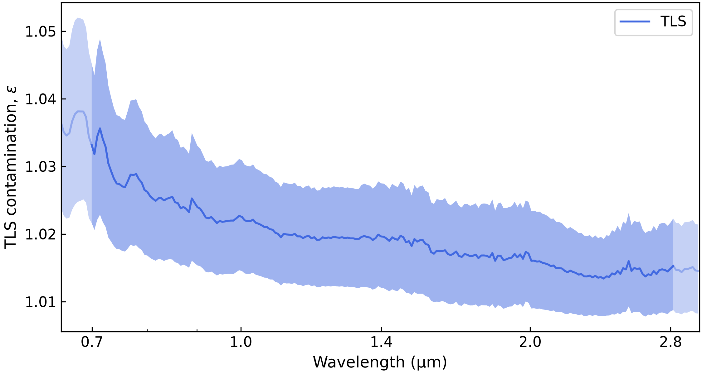

.. include:: ../../_substitutions.rst

.. _wasp107b_tls:

Transmission retrieval: TLS modeling
====================================

This tutorial uses a simulated JWST transmission spectrum to show how
to perform atmospheric retrievals including the **transit light source (TLS) effect**.  ``Pyrat Bay`` implements the TLS model of [Rackham2018]_, a wavelenght-dependent correction to a transit depth when the host star presents spots and/or faculae.  The correction is modeled as:

.. math::
   \epsilon(\lambda) = \frac{1}{ 1
       - f_{\rm spot} \left( 1 - F_{\rm spot} / F_* \right)
       - f_{\rm fac} \left( 1 - F_{\rm fac} / F_* \right)

   }

where :math:`F_*`, :math:`F_{\rm spot}`, and :math:`F_{\rm fac}` are
the flux spectra from the host star (without contamination), from
spots, and from faculae. :math:`f_{\rm spot}` and :math:`f_{\rm
fac}` are the spot and faculae coverage of the stellar surface
(projected area) as seen from Earth at the moment of the observation.

For this we will use synthetic JWST simulations of WASP-107b.  We can break the
analysis into the following steps:

- :ref:`wasp107b_dataset`
    - :ref:`wasp107b_obs_file`
    - :ref:`wasp107b_cross_sec`
    - :ref:`wasp107b_setup_tls`

- :ref:`wasp107b_retrievals`
    - :ref:`wasp107b_config`
    - :ref:`wasp107b_run`
    - :ref:`wasp107b_post`

.. note:: For a application of TLS as an independent module see these docs: :ref:`tls`

----------------------------------------------------------------------

.. _wasp107b_dataset:

File inputs
-----------

For the setup we will need three ingredients:

#. A **configuration file** to define the system parameters, atmospheric model, posterior sampling, etc.

#. An **observation file** defining the data points: depths, uncertainties, and bin wavelengths

#. **Cross-section files** for the atmospheric species

#. **Stellar spectral energy distribution (SED) files** to model the stellar flux and TLS effect

Lets start with the required input files, and then go over the
configuration file.

----------------------------------------------------------------------

.. _wasp107b_obs_file:

Observation data
~~~~~~~~~~~~~~~~

Here we will work on a synthetic dataset of JWST transit observations of a WASP-107b-like target affected by the TLS effect.  We will retrieve from two scenarios:

- (1) A single JWST/SOSS observation
- (2) A multi-epoch SOSS + BOTS + LRS observation

.. tab-set::

  .. tab-item:: SOSS observation
     :selected:

     A ``Pyrat Bay`` observation file contains the information of the
     data-points to fit.  These contain the transit depth, uncertainty,
     central wavelength (um), bin half-width (um), and label.
     Below there is the simulated JWST/SOSS observation file, click the link to see/download the entire file.

     .. literalinclude:: ../../_static/data/sim_obs_wasp107b_transit_soss.dat
        :caption: Extract from: `sim_obs_wasp107b_transit_soss.dat <../../_static/data/sim_obs_wasp107b_transit_soss.dat>`__
        :language: ini
        :lines: 1-12

     Here is the transmission spectrum (see Python script). The upward slope toward shorter wavelengths is an indication of TLS effect by unocculted spots:

     .. raw:: html

         

         
Click here to show/hide python script

     .. code:: ipython3

        import pyratbay.io as io
        import pyratbay.constants as pc
        import numpy as np
        import matplotlib
        import matplotlib.pyplot as plt

        obs_file = f'sim_obs_wasp107b_transit_soss.dat'
        bands, obs_wl, hw, obs_depths, obs_errors = io.read_observations(obs_file)

        fig = plt.figure(10)
        plt.clf()
        plt.subplots_adjust(0.075, 0.11, 0.99, 0.99)
        fig.set_size_inches(8.5, 4.0)
        ax = plt.subplot(111)
        plt.errorbar(
            obs_wl, obs_depths/pc.percent, yerr=obs_errors/pc.percent,
            lw=1.15, mfc='w', label='JWST SOSS',
            fmt='o', ms=4.5, c='xkcd:blue', mew=1.15,
        )
        ax.set_xscale('log')
        ax.xaxis.set_minor_formatter(matplotlib.ticker.NullFormatter())
        ax.xaxis.set_major_formatter(matplotlib.ticker.ScalarFormatter())
        ax.set_xticks([0.7, 1, 1.4, 2.0, 2.8])
        ax.legend(loc='lower right')
        ax.tick_params(which='both', right=True, direction='in', labelsize=11)
        plt.ylabel(r'Transit depth (%)', fontsize=12)
        ax.set_xlabel(r'Wavelength ($\mathrm{\mu}$m)', fontsize=12)
        ax.set_xlim(0.69, 2.9)
        ax.set_ylim(1.97, 2.21)

     .. raw:: html

         

     .. image:: ./../../figures/fig_obs_WASP107b_transit_tls_soss.png
       :width: 80%
       :align: center

  .. tab-item:: Multi-epoch observation

     A ``Pyrat Bay`` observation file contains the information of the
     data-points to fit.  These contain the transit depth, uncertainty,
     central wavelength (um), bin half-width (um), and label.
     Below there is the simulated JWST (SOSS, BOTS, and LRS) observation file, click the link to see/download the entire file.

     .. Note::
	Note that here the *instrument names* will be important to define observation-specific TLS models.

     .. code:: ini
        :caption: Extract from: `sim_obs_wasp107b_transit_jwst.dat <../../_static/data/sim_obs_wasp107b_transit_jwst.dat>`__

        # Simulated JWST transit observation of WASP-107b like planet
        # with NIRISS/SOSS + NIRSpec/BOTS G395H + MIRI/LRS

        @DEPTH_UNITS
        percent

        #     depth    depth_err   wavelength  half_width    instrument
        @DATA
            2.07687      0.01495     0.833679    0.002779    soss_order1
            2.06726      0.01398     0.839255    0.002798    soss_order1
            2.07929      0.01343     0.844869    0.002816    soss_order1
            ...
	    2.16862      0.00987     2.876297    0.005753    bots
            2.15072      0.01013     2.887825    0.005776    bots
            2.10883      0.01002     2.899399    0.005799    bots
            ...
            2.04815      0.06303    11.386969    0.071169    lrs
            2.03650      0.07101    11.530202    0.072064    lrs
            1.99208      0.07887    11.675236    0.072970    lrs

     Here is the transmission spectrum (see Python script). Note (a) the depth-offsets between observations and (b) the upward slope toward shorter wavelengths, both indications of TLS effect by unocculted spots:

     .. raw:: html

         

         
Click here to show/hide python script

     .. code:: ipython3

        import pyratbay.io as io
        import pyratbay.constants as pc
        import numpy as np
        import matplotlib
        import matplotlib.pyplot as plt

        obs_file = f'sim_obs_wasp107b_transit_jwst.dat'
        bands, obs_wl, hw, obs_depths, obs_errors = io.read_observations(obs_file)
        inst = [band.name for band in bands]

	# Use instrument names to color code outputs
        colors = {
            'soss': 'xkcd:blue',
            'bots': 'tomato',
            'lrs': 'xkcd:green',
        }

        fig = plt.figure(10)
        plt.clf()
        plt.subplots_adjust(0.075, 0.11, 0.99, 0.99)
        fig.set_size_inches(8.5, 4.0)
        ax = plt.subplot(111)
        for label,color in colors.items():
            mask = [label in det for det in inst]
            lab = f'JWST {label.upper()}'
            plt.errorbar(
                obs_wl[mask], obs_depths[mask]/pc.percent,
                yerr=obs_errors[mask]/pc.percent,
                lw=1.15, mfc='w', label=lab,
                fmt='o', ms=4.5, c=color, mew=1.15,
            )
        ax.set_xscale('log')
        ax.xaxis.set_minor_formatter(matplotlib.ticker.NullFormatter())
        ax.xaxis.set_major_formatter(matplotlib.ticker.ScalarFormatter())
        ax.set_xticks([0.7, 1, 2, 3, 4, 5, 7, 10])
        ax.legend(loc='upper right')
        ax.tick_params(which='both', right=True, direction='in', labelsize=11)
        plt.ylabel(r'Transit depth (%)', fontsize=12)
        ax.set_xlabel(r'Wavelength ($\mathrm{\mu}$m)', fontsize=12)
        ax.set_xlim(0.69, 12.0)
        ax.set_ylim(1.95, 2.24)

     .. raw:: html

         

     .. image:: ./../../figures/fig_obs_WASP107b_transit_tls_jwst.png
       :width: 80%
       :align: center

.. _wasp107b_cross_sec:

Cross section files
~~~~~~~~~~~~~~~~~~~

We will include line-sampled cross sections for these molecules: |H2O|, CO, |CO2|, |CH4|, |SO2|, |H2S|, K, and |NH3|, using the latests opacity sources for these species from ExoMol HITEMP, and VALD.

This Zenodo repository `doi.org/10.5281/zenodo.16965390
<https://zenodo.org/records/16965390>`__ contains the cross-section
files to use.  See the list below for direct links to the files for
each molecule.
These cross sections have been computed assuming an |H2|/He-dominated
atmosphere, and terrestrial isotopic ratios. The lines have Voigt
profiles with a wing cut-off at 300 HWHM and at 25 |kayser|.  The
grids sampling are:

- Wavelength: :math:`0.15-33` μm, at a constant resolution of :math:`R=25.000`
- Temperature: :math:`200-5000` K, with :math:`\Delta T = 150` K
- Pressure: :math:`1.0^{-9}-1.0^{3}` bar, equally sampled in log(`p`) with 4 samples per dex.

.. list-table:: Tabulated cross section files
  :header-rows: 1

  * - Species (source)
    - References
  * - `H2O <https://zenodo.org/records/16965391/files/cross_section_0.15-33.0um_0200-5000K_R025K_H2O_exomol_pokazatel.npz>`__ (exomol, pokazatel)
    -  [Polyansky2018]_
  * - `CO <https://zenodo.org/records/16965391/files/cross_section_0.15-33.0um_0200-5000K_R025K_CO_hitemp_2019.npz>`__ (HITEMP, li)
    - [Li2015]_
  * - `CO2 <https://zenodo.org/records/16965391/files/cross_section_0.15-33.0um_0200-5000K_R025K_CO2_ames_ai3000k.npz>`__ (ames, ai3000k)
    - [Huang2023]_
  * - `CH4 <https://zenodo.org/records/16965391/files/cross_section_0.15-33.0um_0200-5000K_R025K_CH4_exomol_mm.npz>`__ (exomol, mm)
    - [Yurchenko2024a]_
  * - `SO2 <https://zenodo.org/records/16965391/files/cross_section_0.15-33.0um_0200-5000K_R025K_SO2_exomol_exoames.npz>`__ (exomol, exoames)
    - [Underwood2016]_
  * - `H2S <https://zenodo.org/records/16965391/files/cross_section_0.15-33.0um_0200-5000K_R025K_H2S_exomol_ayt2.npz>`__ (exomol, ayt2)
    - [Azzam2016]_ [Chubb2018]_
  * - `K <https://zenodo.org/records/21645198/files/cross_section_0.15-33.0um_0200-5000K_R025K_K_vald.npz>`__ (vald)
    - [Piskunov1995]_
  * - `NH3 <https://zenodo.org/records/16965391/files/cross_section_0.15-33.0um_0200-5000K_R025K_NH3_exomol_coyute.npz>`__ (exomol, coyute)
    - [Coles2019]_ [Yurchenko2024b]_

----------------------------------------------------------------------

.. _wasp107b_setup_tls:

PHOENIX SED files
~~~~~~~~~~~~~~~~~

To model the TLS effect users need to fetch a library of SED models
covering the expected range of stellar, spot, and faculae
temperatures.  ``Pyrat Bay`` works with the PHOENIX New-Era SED models
[Hauschildt2025]_, which span from :math:`T_{\rm eff} \approx` 2300 K
to 12000 K (min/max values may vary depending on the metallicity and
surface gravity).

For this example we assume the host is a K5V star with :math:`T_{\rm eff} = 4430` K, solar metallicity, and :math:`\log g = 4.5`.  PHOENIX New-Era SEDs can be downloaded with the following Python script.  First make a folder called ``phoenix/`` and then run this script:

.. code:: ipython3

    import pyratbay.spectrum as ps

    # Leave teff as None to select all Teff models
    # Find models with closest log_g and metallicity
    teff = None
    logg = 4.5
    metal = 0.0

    # Make sure that the output folder already exists
    folder = 'phoenix/'

    ps.fetch_phoenix(teff, logg, metal, folder)

.. note:: For the TLS model, it's important that this folder contains
    no other SED except the list of Teff models (all at the same logg and metallicity).

.. _wasp107b_retrievals:

Retrieval analysis
------------------

.. _wasp107b_config:

Configuration file
~~~~~~~~~~~~~~~~~~

A ``Pyrat Bay`` configuration file puts all the inputs together and defines the retrieval setup.  Below are the configuration files for a single SOSS observation and for a multi-epoch JWST observation:

.. tab-set::

  .. tab-item:: SOSS observation
      :selected:

      .. raw:: html

         

         
Click here to show/hide SOSS-retrieval config file: <a href="../../_static/data/ret_wasp107b_transmission_tls_soss.cfg">ret_wasp107b_transmission_tls_soss.cfg</a>

      .. literalinclude:: ../../_static/data/ret_wasp107b_transmission_tls_soss.cfg
          :caption: File: `ret_wasp107b_transmission_tls_soss.cfg <../../_static/data/ret_wasp107b_transmission_tls_soss.cfg>`__
          :language: ini

      .. raw:: html

         

      Lets focus on the **TLS setup**:

      .. literalinclude:: ../../_static/data/ret_wasp107b_transmission_tls_soss.cfg
         :caption: Extract from: `ret_wasp107b_transmission_tls_soss.cfg <../../_static/data/ret_wasp107b_transmission_tls_soss.cfg>`__
         :language: ini
         :lines: 23, 26-27, 98-108, 117-118
         :emphasize-lines: 2, 5-7, 15-16

      There are four inputs required to define a TLS model:

      - 1. ``tstar`` sets the stellar effective temperature
      - 2. ``tls_folder`` sets the folder from where to read the PHOENIX models
      - 3. ``tls_model`` sets the TLS model(s) to use.  If a ``tls`` model is set, it will apply to **all** data points (see the *Multi-epoch observation* tab for epoch-specific TLS models)
      - 4. in ``retrieval_params`` the TLS parameters can be set.  For a ``tls`` model, there are four free parameters: ``T_spot`` and  ``f_spot`` set a spot temperature and covering fraction.  Two optional parameters ``T_fac`` and  ``f_fac`` can set faculae temperature and covering fraction

  .. tab-item:: Multi-epoch observation

      .. raw:: html

         

         
Click here to show/hide multi-epoch retrieval config file: <a href="../../_static/data/ret_wasp107b_transmission_tls_jwst.cfg">ret_wasp107b_transmission_tls_jwst.cfg</a>

      .. literalinclude:: ../../_static/data/ret_wasp107b_transmission_tls_jwst.cfg
          :caption: File: `ret_wasp107b_transmission_tls_jwst.cfg <../../_static/data/ret_wasp107b_transmission_tls_jwst.cfg>`__
          :language: ini

      .. raw:: html

         

      Lets focus on the **TLS setup**:

      .. literalinclude:: ../../_static/data/ret_wasp107b_transmission_tls_jwst.cfg
         :caption: Extract from: `ret_wasp107b_transmission_tls_jwst.cfg <../../_static/data/ret_wasp107b_transmission_tls_jwst.cfg>`__
         :language: ini
         :lines: 23, 26-27, 100-110, 121-124
         :emphasize-lines: 2, 5-8, 15-18

      There are four inputs required to define a TLS model:

      - 1. ``tstar`` sets the stellar effective temperature
      - 2. ``tls_folder`` sets the folder from where to read the PHOENIX models
      - 3. ``tls_model`` sets the TLS model(s) to use.  When working
           with multi-epoch observations, users can define
           **epoch-specific** TLS models by appending instrument names
           into the TLS model name. E.g., a ``tls_soss`` model will
           apply *only* to the data points whose instrument name
           contains ``soss`` in their name (see :ref:`observation file <wasp107b_obs_file>` section)
      - 4. in ``retrieval_params`` the TLS parameters can be set for each model.  For a model named ``tls_inst``, there are four free parameters: ``T_spot_inst`` and  ``f_spot_inst`` set a spot temperature and covering fraction.  Two optional parameters ``T_fac_inst`` and  ``f_fac_inst`` can set faculae temperature and covering fraction

For an explanation of the rest of the configuration file, see for example the docs for :ref:`WASP-39b configuration file <wasp39b_config>`.

.. _wasp107b_run:

Retrieval run
~~~~~~~~~~~~~

To launch the retrieval run, we use the following command from the
prompt.  Since we are using multinest, we will make use of its MPI
parallel-computing capability (thus, the prefix ``mpirun -n 16``):

.. code-block:: shell

    # Launch SOSS retrieval with 16 parallel CPUs
    mpirun -n 16 pbay -c ret_wasp107b_transmission_tls_soss.cfg

    # Launch multi-epoch retrieval with 16 parallel CPUs
    mpirun -n 16 pbay -c ret_wasp107b_transmission_tls_jwst.cfg

You can adjust the number of CPUs according to your machine/cluster
limitations.  ``Pyrat Bay`` internally uses shared memory to optimize
the memory demand.  That's it.  Now we wait until the run is over. This should take from a few hours to a few days depending on your machine.

.. _wasp107b_post:

Retrieval outputs
~~~~~~~~~~~~~~~~~

A retrieval including TLS models will produce a set of diagnostic figures.
The posterior transmission spectrum will display:

- the observed **data corrected by TLS effect** (black)
- the posterior spectrum as the purely planetary signal (blue, posterior median and span of the central 68% percentile)

A second figure will display:

- the **original data** points (black, as in the input observation file)
- the TLS affected planetary spectrum (one curve for each TLS model)
- and a TLS-corrected spectrum (blue)

A third figure will display the TLS correction factor :math:`\epsilon(\lambda)` as defined in Equation (3) of [Rackham2018]_.  If the TLS model(s) are epoch-specific, the constraining wavelength will be highlighted:

