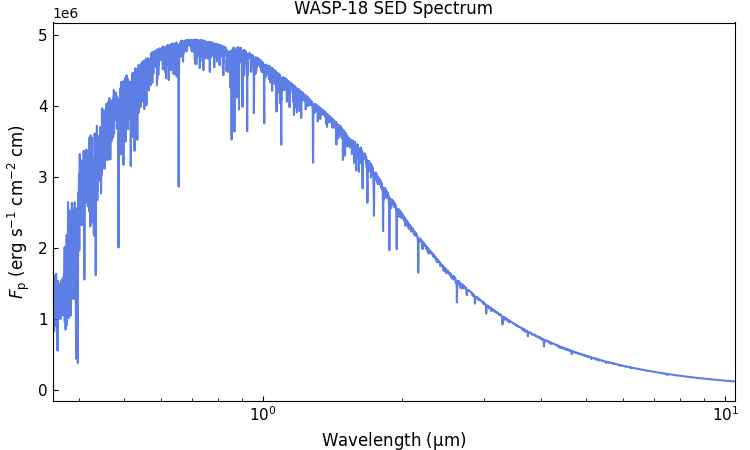

.. include:: ../../_substitutions.rst

Eclipse retrieval: WASP-18b SOSS
================================

This tutorial shows how perform an atmospheric retrieval of the
secondary-eclipse spectra of WASP-18b, constrained by the JWST/SOSS
observations.  We will replicate the analysis presented in
[Deline2025]_, that is, a retrieval of:

- the combined JWST, Spitzer, TESS, and CHEOPS observations
- 1D atmosphere assuming thermochemical-equilibrium VMRs
- a Madhu temperature profile, *T(p)*
- a Rayleigh opacity model
- a gray, patchy cloud-deck model

We can break the analysis into the following steps:

1. :ref:`wasp18b_obs`

   - :ref:`wasp18b_obs_file`
   - :ref:`wasp18b_sed`
   - :ref:`wasp18b_cross_sec`
   - :ref:`wasp18b_config`
2. :ref:`wasp18b_run`
3. :ref:`wasp18b_stats`

----------------------------------------------------------------------

.. _wasp18b_obs:

Setup
-----

For the setup we will need three ingredients:

#. A **configuration file** to define the system parameters, atmospheric model, posterior sampling, etc.

#. An **observation file** defining the data points: depths, uncertainties, and bin wavelengths

#. **Cross-section files** for the atmospheric species

Lets start with the required input files, and then go over the
configuration file.

.. _wasp18b_obs_file:

Observation file
~~~~~~~~~~~~~~~~

``Pyrat Bay`` observation files tell the code what data is being fit.
These are a plain text files containing the transit depth,
uncertainty, and the band (which can be either a tophat or a broadband
passband).  There is always one data point per row.

Below you can find an extract of the WASP-18b eclipse data.  Click the
link to see/download the entire file. Altenatively, you can see the
script to make observation files in the right format.

.. tab-set::

  .. tab-item:: Download observation file
     :selected:

     Here's the observation file containing the CHEOPS, TESS, JWST,
     and Spitzer data.

     Note in the header that comments are allowed, and there are two
     special flags that let users define the depth units and where the
     data starts.

     Important to note is that:

     - the first two columns provide the eclipse depth and
       uncertainties (in the units specified by ``@DEPTH_UNITS``)

     - the JWST data is modeled as narrow tophat passbands, defined
       by: the central wavelength, the bin half-width, and (optional)
       a name for the instrument

     - the CHEOPS, TESS, and Spitzer data come from broad-band
       photometry.  These we specify as paths to plain files that
       tabulate the wavelength and response of the band.  ``Pyrat
       Bay`` provides the passbands for these instruments, indicated
       by the ``{FILTERS}`` path, for other bands one should type the
       path to the file.

     .. literalinclude:: ../../_static/data/obs_wasp18b_eclipse_all.dat
        :caption: File: `obs_wasp18b_eclipse_all.dat <../../_static/data/obs_wasp18b_eclipse_all.dat>`__
        :language: ini
        :lines: 1-21

  .. tab-item:: Compute observation file

     **TBD**

     We will constrain this retrieval to the JWST, Spitzer, CHEOPS,
     and TESS emission observations. So we need to collect that
     data. For the JWST spectroscopic observations we will use the
     NAMELESS spectral reduction (available on Zenodo
     https://zenodo.org/records/7907569), which we will model as a
     series of top-hat narrow passbands.

     The CHEOPS [Deline2025]_, TESS [Coulombe2023]_, and Spitzer
     [Sheppard2017]_ observations consist of broad photometric
     passbands. For these we will use the passband filter files.

     ``Pyrat Bay`` contains all of this information into an observation
     file input. These scripts below show how to create observation
     files for (1) the JWST observations, and (2) all photometric and
     spectroscopic observations combined.

     .. code-block:: python
         
         # Save JWST data
         import numpy as np
         import pyratbay.io as io
         
         jwst_data = np.loadtxt('NAMELESS_W18b_spectrum.txt', unpack=True)
         jwst_wl, jwst_depths, jwst_depth_uncerts, jwst_half_widths = jwst_data
         njwst = len(jwst_wl)
         
         # Save JWST data:
         obs_file = 'obs_wasp18b_emission_jwst.dat'
         jwst_inst_names = ['NIRISS' for _ in jwst_wl]
         io.write_observations(
             obs_file,
             jwst_inst_names,
             jwst_wl, jwst_half_widths,
             jwst_depths, jwst_depth_uncerts, depth_units='ppm',
         )
     
     
         # Save JWST + Spitzer + CHEOPS + TESS data:
         sheppard2017_spitzer = [2973, 3858, 3700, 4100]
         sheppard2017_spitzer_uncerts = [70.0, 113, 300, 200]
         
         coulombe2023_tess = 357.0
         coulombe2023_tess_uncert = 14.0
         
         ndata = 2 + njwst + 4
         depths = np.zeros(ndata)
         depth_uncerts = np.zeros(ndata)
         
         depths[0] = coulombe2023_tess
         depths[1] = coulombe2023_tess
         depths[2:2+njwst] = jwst_depths
         depths[-4:] = sheppard2017_spitzer
         
         depth_uncerts[0] = coulombe2023_tess_uncert
         depth_uncerts[1] = coulombe2023_tess_uncert
         depth_uncerts[2:2+njwst] = jwst_depth_uncerts
         depth_uncerts[-4:] = sheppard2017_spitzer_uncerts
         
         # Leaving the wavelenght values at zero signals to use the instrument
         # name as a path to a passband file (for broadband photometry)
         wl = np.zeros(ndata)
         half_widths = np.zeros(ndata)
         wl[2:2+njwst] = jwst_wl
         half_widths[2:2+njwst] = jwst_half_widths
         
         spitzer_inst_names = [
             f'{{ROOT}}/pyratbay/data/filters/spitzer_irac{i+1}_sa.dat'
             for i in range(4)
         ]
         inst_names = [
             'CHEOPS.dat',
             'TESS.dat',
         ]
         inst_names += jwst_inst_names + spitzer_inst_names
         
         obs_file = 'obs_wasp18b_emission_all.dat'
         io.write_observations(
             obs_file,
             inst_names,
             wl, half_widths,
             depths, depth_uncerts, depth_units='ppm',
         )

.. _wasp18b_cross_sec:

Cross sections
~~~~~~~~~~~~~~

Following the analysis of [Deline2025]_, we will include
line-sampled cross sections for these molecules: |H2O|, CO, |CO2|,
|CH4|, TiO, VO, HCN, |NH3|, and |C2H2|.  Here we will work with
the latests opacity sources for these species from ExoMol and HITEMP.

The current recommendation for sampled cross sections for JWST
retrievals is to adopt a resolution :math:`R>20.000`.  So, here we will use a
cross section grid at :math:`R=25.000`, sampling from :math:`0.35-10.5`
μm in wavelength (to cover the spectral range of the data), from
:math:`500-4000` K in temperature, and from :math:`100-1.0^{-9}` bar
in pressure.

Now, beware that cross section files have many assumptions baked into
them.  In addition, one might need to adjust the ranges or sampling
resolution of the grid for specific project.  Thus, below there are
two options, (a) download and use already made the cross-section
files (b) compute your own cross sections starting from the line-list
files (where you can customize at will).

.. tab-set::

  .. tab-item:: Download cross sections
     :selected:

     The Zenodo repository `doi.org/10.5281/zenodo.16965391
     <https://zenodo.org/records/16965391>`__ contains the
     cross-section files that we will use for this JWST atmospheric
     retrieval. See the list below for direct links to the files for
     each molecule.

     These cross sections have been computed assuming an
     |H2|/He-dominated atmosphere, and terrestrial isotopic
     ratios. The lines have Voigt profiles with a wing cut-off at 300
     HWHM and at 25 |kayser|.  The grids sampling are:

     - Wavelength: :math:`0.15-33` μm, at a constant resolution of :math:`R=25.000`
     - Temperature: :math:`200-5000` K, with :math:`\Delta T = 150` K
     - Pressure: :math:`1.0^{-9}-1.0^{3}` bar, equally sampled in log(`p`) with 4 samples per dex.

     .. list-table:: Tabulated cross section files
       :header-rows: 1

       * - Species (source)
         - References
       * - `H2O <https://zenodo.org/records/16965391/files/cross_section_0.15-33.0um_0200-5000K_R025K_H2O_exomol_pokazatel.npz>`__ (exomol, pokazatel)
         -  [Polyansky2018]_
       * - `CO <https://zenodo.org/records/16965391/files/cross_section_0.15-33.0um_0200-5000K_R025K_CO_hitemp_2019.npz>`__ (HITEMP, li)
         - [Li2015]_
       * - `CO2 <https://zenodo.org/records/16965391/files/cross_section_0.15-33.0um_0200-5000K_R025K_CO2_ames_ai3000k.npz>`__ (ames, ai3000k)
         - [Huang2023]_
       * - `CH4 <https://zenodo.org/records/16965391/files/cross_section_0.15-33.0um_0200-5000K_R025K_CH4_exomol_mm.npz>`__ (exomol, mm)
         - [Yurchenko2024a]_

       * - `TiO <https://zenodo.org/records/16965391/files/cross_section_0.15-33.0um_0200-5000K_R025K_TiO_exomol_toto.npz>`__ (exomol, toto)
         - [McKemmish2019]_
       * - `VO <https://zenodo.org/records/16965391/files/cross_section_0.15-33.0um_0200-5000K_R025K_VO_exomol_hyvo.npz>`__ (exomol, hyvo)
         - [Bowesman2024]_

       * - `HCN <https://zenodo.org/records/16965391/files/cross_section_0.15-33.0um_0200-5000K_R025K_HCN_exomol_harris_larner.npz>`__ (exomol, harris larner)
         - [Harris2008]_ [Barber2014]_
       * - `NH3 <https://zenodo.org/records/16965391/files/cross_section_0.15-33.0um_0200-5000K_R025K_NH3_exomol_coyute.npz>`__ (exomol, coyute)
         - [Coles2019]_ [Yurchenko2024b]_
       * - `C2H2 <https://zenodo.org/records/16965391/files/cross_section_0.15-33.0um_0200-5000K_R025K_C2H2_exomol_acety.npz>`__ (exomol, acety)
         - [Chubb2020]_

     .. Note:: If you want to see the source script or need to
         customize the cross sections (e.g., broader temperature
         ranges, finer resolution, different line profiles), follow
         the steps in the `'Compute cross sections'` tab.

  .. tab-item:: Compute cross sections

     TBD

.. _wasp18b_sed:

Stellar SED spectrum
~~~~~~~~~~~~~~~~~~~~

The stellar SED is required to calculate the planet-to-star flux
ratio. Here we will use a stellar SED for WASP-18 from the PHOENIX
models [Husser2013]_, which we will get using the ``Gen TSO``
package. If you haven’t already, install this package with this
shell command:

.. code-block:: shell

    pip install gen_tso

Now, we can create the stellar SED spectrum with this Python script:

.. code-block:: python
    
    import gen_tso.pandeia_io as pandeia
    import pyratbay.constants as pc
    import pyratbay.spectrum as ps
    import matplotlib.pyplot as plt
    
    
    # Use the Gen TSO package to get a PHOENIX SED model for WASP-18 (teff=6430.0, logg=4.31)
    # Closest SED to WASP-18 is an F5V model (Teff=6500K, logg=4.0)
    scene = pandeia.make_scene(
        sed_type='phoenix',
        sed_model='f5v',
    )
    sed_wl, flux = pandeia.extract_sed(scene, wl_range=(0.35,12.0))
    # Convert flux from mJy to erg s-1 cm-2 cm-1
    sed_flux = flux * pc.c / 1e26
    
    # Lower the resolution to something closer to NIRISS
    bin_wl = ps.constant_resolution_spectrum(0.35, 12.0, resolution=1500.0)
    bin_sed_flux = ps.bin_spectrum(bin_wl, sed_wl, sed_flux, gaps='interpolate')
    
    # Save to file
    starspec_file = 'phoenix_F5V_6500K_WASP18.dat'
    io.write_spectrum(
        bin_wl,
        bin_sed_flux,
        starspec_file,
        type='emission',
    )

    # Take a look
    plt.figure(0, (7.5,4.5))
    plt.clf()
    plt.subplots_adjust(0.07, 0.11, 0.98, 0.95)
    ax = plt.subplot(111)
    ax.plot(bin_wl, bin_sed_flux, color='royalblue', alpha=0.85)
    ax.set_title('WASP-18 SED Spectrum')
    ax.set_xscale('log')
    ax.set_xlim(0.35, 10.5)
    ax.set_xlabel(r'Wavelength ($\mathrm{\mu}$m)', fontsize=12)
    ax.set_ylabel(r'$F_{\rm p}$ (erg s$^{-1}$ cm$^{-2}$ cm)', fontsize=12)
    ax.tick_params(direction='in', which='both', labelsize=11)

.. plt.savefig('../../figures/phoenix_sed_wasp18.png')

----------------------------------------------------------------------

.. _wasp18b_config:

Configuration file
~~~~~~~~~~~~~~~~~~

Lastly, the configuration file will put together the inputs, define
the atmospheric model, and configure the retrieval options.  Here
below is the file we will use for the JWST observation of WASP-39b.

.. wasp18b_retrieval_eclipse_jwst.cfg

.. raw:: html

   

   
Click here to show/hide: <a href="../../_static/data/wasp18b_retrieval_eclipse_jwst.cfg">wasp18b_retrieval_eclipse_jwst.cfg</a>

.. literalinclude:: ../../_static/data/wasp18b_retrieval_eclipse_jwst.cfg
    :caption: File: wasp18b_retrieval_eclipse_jwst.cfg
    :language: ini

.. raw:: html

   

Lets break this down:

.. tab-set::

  .. tab-item:: General
     :selected:

     .. literalinclude:: ../../_static/data/wasp18b_retrieval_eclipse_jwst.cfg
        :language: ini
        :lines: 3-10

     This first section defines what we want to run. ``runmode``
     indicates that we want a retrieval.  ``logfile`` sets the path to
     the output files.  Note that ``logfile`` can contain a folder,
     which will be created if needed.  Finally, ``verb`` sets the
     screen-output verbosity.

  .. tab-item:: Target

     .. literalinclude:: ../../_static/data/wasp18b_retrieval_eclipse_jwst.cfg
        :language: ini
        :lines: 12-21

     Here we define the observing path of the observation (in this
     case we have a secondary eclipse), the path to the observation file
     discussed above (and the desired output units for plots)

     ``wllow`` and ``wlhigh`` set the and the spectral range to model.
     Note that the wavelenght sampling is partly set by the
     line-sampled opacity files (resolution and maximum wavelength
     coverage).  One can trim the wavelength ranges (as shown here) to
     extract only the region covered by the observations.  One can
     also lower the resolution via a ``wl_thinning = n`` parameter,
     which will take every n-th sample of the opacity files (with
     ``n`` an integer).

     .. literalinclude:: ../../_static/data/wasp18b_retrieval_eclipse_jwst.cfg
        :language: ini
        :lines: 24-35

     And this section defines the system parameters. For an eclipse
     run, the relevant properties will be the stellar radius and SED,
     as well as the planetary mass and radius.

     Note that this ``rplanet`` value is the reference altitute
     situated at the ``refpressure`` pressure (this is the constrain
     to compute the layer's :math:`r(p)` profile under hydrostatic
     equilibrium).  Also note that ``refpressure`` does not need to be
     at one of the sampled layers (it can be anywhere in between the
     atmosphere pressure range).

     ``starspec`` defines the stellar SED: :math:`F_{\rm
     star}(\lambda)`.  This is a plain-text file with two columns: the
     wavelength (μm) and the surface flux (erg s-1 cm-2 cm).  The
     eclipse depth is ultimately computed as:

     .. math::

         d(\lambda) = F_{\rm star}(\lambda)/F_{\rm planet}(\lambda) *
         (R_{\rm star}/R_{\rm planet})^2,

     with the ``rstar`` and ``rplanet`` parameters defining the stellar
     and planet radii.

  .. tab-item:: Atmosphere

     .. literalinclude:: ../../_static/data/wasp18b_retrieval_eclipse_jwst.cfg
        :language: ini
        :lines: 38-56

     These parameters define the atmospheric-profile models.  The pressure
     parameters are clear, the only constraint is that the bottom pressure
     must be covered by the opacity files.  That is, it's only possible to
     extrapolate to lower pressures (because then the opacities are in the
     Doppler broadening regime, i.e., not dependent on pressure).

     For the temperature profile we will use the [Madhusudhan2009]_
     model.  The parameters will be set below when discussing the
     retrieval parameters.

     For the composition we will adopt VMR profiles in thermochemical
     equilibrium.  We must then define the species to include in the
     atmosphere.  It's very *important* to include not only the
     species that are expected to show up in the spectrum, but also
     the species that are expected to chemically interact with our
     species of interest.  For example, if we expect to model H-
     opacity, we must include electron donors like Na+, K+, Fe+, etc.,
     since the electron density is fundamental to estimate the
     contribution from H-.

     Finally we set the radius-profile model, this is a
     hydrostatic-equilibrium model assuming a variable gravity depending on
     the mass of the planet :math:`g(r) = GM/r^2`.

  .. tab-item:: Absorbers

     .. literalinclude:: ../../_static/data/wasp18b_retrieval_eclipse_jwst.cfg
        :language: ini
        :lines: 59-88

     Now we define the atmospheric absorbers. Make sure that all
     absorber species are included in the atmospheric composition.
     Note that these files impose constraints on the domain that can
     be explored.  The ``sampled_cross_sec`` files determine the maximum
     resolution, spectral range, temperature range, and pressure
     range.  The ``continuum_cross_sec`` files define temperature range
     constraints, but their wavelength ranges can be exceeded.

     In addition to the line-sampled opacities, we add Na and K
     opacity models from [Burrows2000]_, CIA, Rayleigh opacities for
     |H2| and He, and the H- continuum opacity.

  .. tab-item:: Parameters

     .. literalinclude:: ../../_static/data/wasp18b_retrieval_eclipse_jwst.cfg
        :language: ini
        :lines: 90-106

     Here we define the free parameters to modify the elemental
     abundances.  In this case we fit for specific elemental
     metallicities for C an O.  Then we define a catch-all parameter
     for all other metals: [M/H].  These metallicity factors are in
     log10 scale, relative to solar. Thus, values of ``[X/H] = 0`` or
     ``[X/H] = 1`` correspond to 1x and 10x solar respectively.

     .. note:: It is also possible to directly fit ratios between
               species.  This can be set by a parameter named ``X/Y``
               with ``X`` and ``Y`` the elements of interest.  For
               example, a common parameterization is to have a pair of
               parameters for the metallicity and the carbon to oxygen
               ratio: ``[M/H]`` a ``C/O``.

     And then we define the retrievals parameters, their initial values,
     boundaries, and priors.  Since here we will sample the posterior using
     pymultinest [Feroz2009]_ [Buchner2014]_, the most important values are
     the lower and upper boundaries (the initial value is irrelevant for
     the retrieval). The ``step`` value determine which parameters are left
     free to fit (``step>0``) and which are kept fixed at their initial
     value (``step=0``, thus making it trivial to try runs with different
     configurations).

     If desired, one can also set **Gaussian priors** by specifiying the prior
     value and uncertainty after the parameter's ``step``.

     Thus, in summary, this retrieval will fit for the:

     - temperature profile: ``log_p1`` to ``T0`` parameters.
     - composition: ``[M/H]``, ``[C/H]``, and ``[O/H]`` metallicity
       scale factors.

  .. tab-item:: Sampler

     .. literalinclude:: ../../_static/data/wasp18b_retrieval_eclipse_jwst.cfg
        :language: ini
        :lines: 108-121

     Finally, we configure the posterior sampler. In this case we use
     pymultinest [Feroz2009]_ [Buchner2014]_, with 1500 live points.
     ``resume=True`` allows you to pick up a previous run and continue
     from there.

     ``tlow`` and ``thigh`` allow the code to set additional
     temperature-range constraints (beyond those set by the
     temperature-model parameters).

     ``theme`` and ``data_color`` allow you to customize the color of
     the models and data points, respectively, in the output plots.
     Any valid `matplotlib color
     <https://matplotlib.org/stable/users/explain/colors/colors.html#colors-def>`_
     is a valid color.

     The ``wl_ticks`` parameter has two effects: if set, it indicates
     the code to plot wavelengths axes in log scale with the given
     ticks (otherwise defaults to a linear scale).

     The ``post_processing = True`` parameter indicates to compute median
     +/-1sigma, and +/-2sigma statistics out of the posterior distribution.
     Note that this is a post-process step done *after* the posterior
     sampling is finished.  These statistics are computed for the spectra,
     the temperature profiles, contribution functions, and VMRs (along with
     plots of them).  All these data will be neatly packed into a picke
     file.

.. _wasp18b_run:

Retrieval run
-------------

To launch the retrieval run, we use the following command from the
prompt.  Since we are using multinest, we will make use of its MPI
parallel-computing capability (thus, the prefix ``mpirun -n 64``):

.. code-block:: shell

    # Launch the retrieval with 64 parallel CPUs
    mpirun -n 64 pbay -c wasp39b_retrieval_transit_jwst.cfg

You can adjust the number of CPUs according to your machine/cluster
limitations.  ``Pyrat Bay`` internally uses shared memory to optimize
the memory demand.

That's it. Now we wait until the run is over. This should take from
one to a few days depending on your machine.

.. note:: Before starting this retrieval, make sure to install
          multinest and MPI on your machine.  This can be quite
          specific for each machine, so I cannot help much there.
          `Here
          <https://johannesbuchner.github.io/PyMultiNest/index.html>`__
          and `here
          <https://www.astrobetter.com/wiki/MultiNest%2bInstallation%2bNotes>`__
          are some installation guides that may help.

          Then install their Python wrappers, e.g., with these
          commands:

          .. code-block:: shell

              pip install pymultinest
              pip install mpi4py

Retrieval outputs
~~~~~~~~~~~~~~~~~

TBD

.. _wasp18b_stats:

Detection statistics
--------------------

OK, we have now a posterior distribution for species on WASP-39b based
on the JWST observations, for some there are well constrained VMRs,
for others there are upper limits.  We want now to assess the
siginificance of each detection. For this we will run a series of
leave-one-out retrievals with the same configuration as before, but
removing opacity from one species at a time.

Here's an extract of what changed in the cofiguration for the run without |H2O|:

.. code-block:: ini
    :emphasize-lines: 5,19

    # Pyrat Bay run mode [tli pt atmosphere spectrum radeq opacity mcmc]
    runmode = retrieval

    # Output file names
    logfile = ret_wasp39b_no_H2O/WASP39b_jwst_no_H2O.log

    ...

    # Param name    value  lo_bound  hi_bound  step   prior  prior_sigma
    retrieval_params =
        log_p1        -4.0     -9.0       2.0   0.3
        log_p2        -7.2     -9.0       2.0   0.3
        log_p3        -1.0     -2.0       2.0   0.3
        a1            1.50     0.02       2.0   0.02
        a2            0.35     0.02       2.0   0.02
        T0           850.0    800.0    1300.0   30.0
        M_planet     0.266      0.1       0.43  0.05  0.266  0.033
        log_p_ref    -1.0      -9.0       2.0   0.3
        log_H2O      -10.0    -12.0      -0.3   0.0
        log_CO2      -3.00    -12.0      -0.3   0.3

    ...

As you see, we only change two lines:

- edit ``logfile`` to set the proper name for the outputs
- fix the |H2O| free parameter (``step=0``) and set the initial value to a
  negligible VMR (``-10.0``)

And then, there are two more optimizations for a better efficiency:

- to remove the |H2O| file from ``sampled_cross_sec`` to consume less
  resources
- set ``post_processing = False``, this will prevent the code from
  running the post processing after the retrieval.  We will do that in
  a separate call in a background process.

Here are sample config files for leave-one-out runs for |H2O|, |CO2|, and |SO2|:

- `wasp39b_retrieval_transit_jwst_no_H2O.cfg <../../_static/data/wasp39b_retrieval_transit_jwst_no_H2O.cfg>`__
- `wasp39b_retrieval_transit_jwst_no_CO2.cfg <../../_static/data/wasp39b_retrieval_transit_jwst_no_CO2.cfg>`__
- `wasp39b_retrieval_transit_jwst_no_SO2.cfg <../../_static/data/wasp39b_retrieval_transit_jwst_no_SO2.cfg>`__

The recommendation is, since we want to run a series of retrievals, we
write a script like the one below to concatenate one run after the
other.

Note that we added the ``pbay --post ...`` calls after each
posterior sampling, with an ampersand at the end to rnu it in the
background. This is useful since the post-processing uses only a
single CPU and might take a few hours to complete.  Putting it in
background allow us to launch each retrival right after the previous
one.

.. code-block:: shell
   :caption: File: wasp39b_loo_retrievals.sh

    # Launch the retrievals, and then the post-processing in the background
    mpirun -n 64 pbay -c wasp39b_retrieval_transit_jwst_no_H2O.cfg
    pbay --post wasp39b_retrieval_transit_jwst_no_H2O.cfg &

    mpirun -n 64 pbay -c wasp39b_retrieval_transit_jwst_no_CO2.cfg
    pbay --post wasp39b_retrieval_transit_jwst_no_CO2.cfg &

    mpirun -n 64 pbay -c wasp39b_retrieval_transit_jwst_no_SO2.cfg
    pbay --post wasp39b_retrieval_transit_jwst_no_SO2.cfg &

Then to start the retrievals, run this command from the prompt:

.. code-block:: shell

    # Launch leave-one-out retrievals
    sh wasp39b_loo_retrievals.sh
