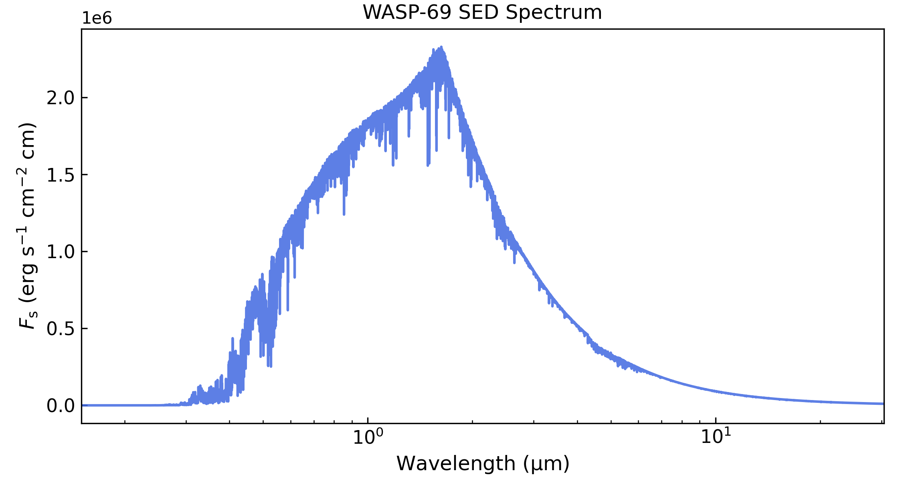
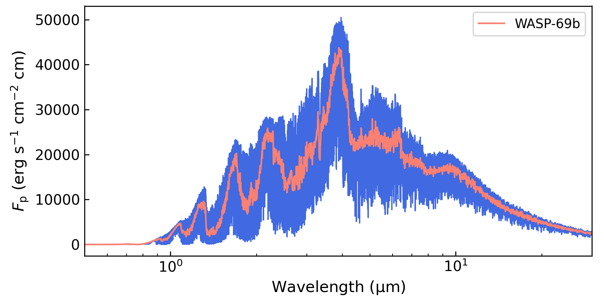

.. include:: ../../_substitutions.rst

.. _wasp69b:

Radiative equilibrium: WASP-69b
===============================

This tutorial shows how perform a radiative-equilibrium calculation to
compute an exoplanet temperature profile.  We will use WASP-69b as a
test case.

Radiative-equilibrium estimations balance the incoming stellar
irradiation from the host star and the outgoing planetary thermal
emission.  Thus, It's important that the radiative-transfer
calculation spans all the way from optical to infrared wavelengths,
such that all relevant optical and infrared absorbers are included.

We can break the analysis into the following steps:

- :ref:`wasp69b_cross_sec`
- :ref:`wasp69b_stellar_sed`
- :ref:`wasp69b_config`
- :ref:`wasp69b_run`

----------------------------------------------------------------------

.. _wasp69b_cross_sec:

Cross sections
~~~~~~~~~~~~~~

In this example we will include line-sampled cross sections for these
molecules: |H2O|, CO, |CO2|, |CH4|, SiO, |H2S|, HCN, and |NH3|.
We will work with the latests opacity sources for these species
from ExoMol, HITEMP, and Ames.

The Zenodo repository `doi.org/10.5281/zenodo.16965391
<https://zenodo.org/records/16965391>`__ provides the required
cross-section files, ready to use. See the list below for direct links
to the files for each molecule.  These cross sections have been
computed assuming an |H2|/He-dominated atmosphere, and terrestrial
isotopic ratios.  The lines have Voigt profiles with a wing cut-off at
300 HWHM and at 25 |kayser|.  The grid sampling are:

- Wavelength: :math:`0.15-33` μm, at a constant resolution of :math:`R=25.000`
- Temperature: :math:`200-5000` K, with :math:`\Delta T = 150` K
- Pressure: :math:`1.0^{-9}-1.0^{3}` bar, equally sampled in log(`p`) with 4 samples per dex.

.. list-table:: Tabulated cross-section files
  :header-rows: 1

  * - Species (source)
    - References
  * - `H2O <https://zenodo.org/records/16965391/files/cross_section_0.15-33.0um_0200-5000K_R025K_H2O_exomol_pokazatel.npz>`__ (exomol, pokazatel)
    -  [Polyansky2018]_
  * - `CO <https://zenodo.org/records/16965391/files/cross_section_0.15-33.0um_0200-5000K_R025K_CO_hitemp_2019.npz>`__ (HITEMP, li)
    - [Li2015]_
  * - `CO2 <https://zenodo.org/records/16965391/files/cross_section_0.15-33.0um_0200-5000K_R025K_CO2_ames_ai3000k.npz>`__ (ames, ai3000k)
    - [Huang2023]_
  * - `CH4 <https://zenodo.org/records/16965391/files/cross_section_0.15-33.0um_0200-5000K_R025K_CH4_exomol_mm.npz>`__ (exomol, mm)
    - [Yurchenko2024a]_
  * - `H2S <https://zenodo.org/records/16965391/files/cross_section_0.15-33.0um_0200-5000K_R025K_H2S_exomol_ayt2.npz>`__ (exomol, ayt2)
    - [Azzam2016]_ [Chubb2018]_
  * - `HCN <https://zenodo.org/records/16965391/files/cross_section_0.15-33.0um_0200-5000K_R025K_HCN_exomol_harris_larner.npz>`__ (exomol, harris larner)
    - [Harris2008]_ [Barber2014]_
  * - `NH3 <https://zenodo.org/records/16965391/files/cross_section_0.15-33.0um_0200-5000K_R025K_NH3_exomol_coyute.npz>`__ (exomol, coyute)
    - [Coles2019]_ [Yurchenko2024b]_
  * - `SiO <https://zenodo.org/records/16965391/files/cross_section_0.15-33.0um_0200-5000K_R025K_SiO_exomol_siouvenir.npz>`__ (exomol, siouvenir)
    - [Yurchenko2022]_

Note that these are mainly infrared abosrbers.  Optical absorbers
(e.g., Na, K, Rayleigh) will be defined later in the configuration
file.

.. _wasp69b_stellar_sed:

Stellar SED spectrum
~~~~~~~~~~~~~~~~~~~~

The stellar spectral energy distribution (SED) sets the incident
irradiation at the top of the atmosphere, as a function of pressure.
Here we will make a stellar SED for WASP-69 from PHOENIX models
[Husser2013]_ using the ``Gen TSO`` package. If you haven’t already,
install this package with this shell command:

.. code-block:: shell

    pip install gen_tso

Now, we can create the stellar SED spectrum with this Python script:

.. code-block:: python

    import gen_tso.pandeia_io as pandeia
    import pyratbay.constants as pc
    import pyratbay.spectrum as ps
    import pyratbay.io as io
    import matplotlib.pyplot as plt

    # Use the Gen TSO package to get closest PHOENIX SED model for WASP-69
    sed = pandeia.find_closest_sed(teff=4700, logg=4.5)
    scene = pandeia.make_scene(
        sed_type='phoenix',
        sed_model=sed,
    )
    sed_wl, flux = pandeia.extract_sed(scene, wl_range=(0.15,35.0))

    # Now convert flux from mJy to erg s-1 cm-2 cm
    sed_flux = flux * pc.c / 1e26
    # and lower the resolution
    bin_wl = ps.constant_resolution_spectrum(0.15, 35.0, resolution=1500.0)
    bin_sed_flux = ps.bin_spectrum(bin_wl, sed_wl, sed_flux, gaps='interpolate')

    # Save to file
    starspec_file = 'phoenix_WASP69b_4700K_logg4.5.dat'
    io.write_spectrum(
        bin_wl,
        bin_sed_flux,
        starspec_file,
        type='emission',
    )

    # Lower the resolution to something more manageable
    bin_wl = ps.constant_resolution_spectrum(0.15, 33.0, resolution=1500.0)
    bin_sed_flux = ps.bin_spectrum(bin_wl, sed_wl, sed_flux, gaps='interpolate')

    # Take a look
    plt.figure(0, (7.5, 4.0))
    plt.clf()
    plt.subplots_adjust(0.09, 0.12, 0.98, 0.94)
    ax = plt.subplot(111)
    ax.plot(bin_wl, bin_sed_flux, color='royalblue', alpha=0.85)
    ax.set_title('WASP-69 SED Spectrum')
    ax.set_xscale('log')
    ax.set_xlim(0.15, 30.5)
    ax.set_xlabel(r'Wavelength ($\mathrm{\mu}$m)', fontsize=12)
    ax.set_ylabel(r'$F_{\rm s}$ (erg s$^{-1}$ cm$^{-2}$ cm)', fontsize=12)
    ax.tick_params(direction='in', which='both', labelsize=11)

----------------------------------------------------------------------

.. _wasp69b_config:

Configuration file
~~~~~~~~~~~~~~~~~~

Lastly, the configuration file will put together the inputs, define
system and atmospheric properties, and set the radiative-equilibrium
configuration.  Here is the file we will use for the WASP-69b
simulation.

.. raw:: html

   

   
Click here to show/hide: <a href="../../_static/data/wasp69b_radeq_1x_solar_metallicity.cfg">wasp69b_radeq_1x_solar_metallicity.cfg</a>

.. literalinclude:: ../../_static/data/wasp69b_radeq_1x_solar_metallicity.cfg
    :caption: File: wasp69b_radeq_1x_solar_metallicity.cfg
    :language: ini

.. raw:: html

   

Lets break this down:

.. tab-set::

  .. tab-item:: General
     :selected:

     .. literalinclude:: ../../_static/data/wasp69b_radeq_1x_solar_metallicity.cfg
        :language: ini
        :lines: 3-12

     This first section defines what we want to run. ``runmode =
     radeq`` indicates that we want a radiative-equilibrium
     calculation.  ``nsamples`` set the number of
     radiative-equilibrium iterations to run.  ``logfile`` sets the
     path to the output files (logs, temperature profile, and emission
     spectrum).  Finally, ``verb`` sets the screen-output verbosity.

  .. tab-item:: Target

     .. literalinclude:: ../../_static/data/wasp69b_radeq_1x_solar_metallicity.cfg
        :language: ini
        :lines: 14-21

     Here we define the observing path and radiative-transfer scheme.
     For radiative-equilibrium runs set ``rt_path =
     emission_two_stream`` to compute the upward/downward emission
     through the atmosphere.

     The wavelength sampling rate and coverage is set by the
     ``sampled_cross_section`` files.  The ``wl_low`` and ``wl_high``
     variables help to trim down the wavelength range (though in this
     case we keep the wavelength range as wide as possible).  Setting
     a ``wl_thinning = n`` parameter lowers the resolution by taking
     every n-th spectral sample (with ``n`` an integer).  Here we
     reduce the sampling resolution by a factor of two to speed up the
     runs.

     .. literalinclude:: ../../_static/data/wasp69b_radeq_1x_solar_metallicity.cfg
        :language: ini
        :lines: 22-30

     And this next section defines the system parameters.  For a
     radiative-equilibrium run, the most relevant properties will be
     the stellar radius, the orbital semi-major axis, and the stellar
     SED.  These parameters set the incident irradiation at the top of
     the atmosphere.
 
     The other relevant planetary parameters set the planet mass, the
     planet radius, and the pressure at the given planet radius
     (``refpressure``).

  .. tab-item:: Atmosphere

     .. literalinclude:: ../../_static/data/wasp69b_radeq_1x_solar_metallicity.cfg
        :language: ini
        :lines: 32-55

     These parameters define the atmospheric profile models.  For the
     pressure range, the only constraint is that the bottom boundary
     (i.e., max pressure) must be covered by the
     ``sampled_cross_section`` files.
     
     Note that the temperature profile parameters define 
     the *starting point* for the radiative-equilibrium
     calculation.  The recommendation is to start with an isothermal
     profile at the equilibrium temperature.

     For the composition, thermochemical equilibrium is the
     recommendation.  Here it's important to include all species that
     can be chemically relevant across the range of temperatures and
     pressures.  ``vmr_vars`` allows one to customize elemental
     composition and ratios that differ from the solar values if
     needed.

     ``radmodel`` tells the code to compute the atmospheric layers'
     altitude under hydrostatic equilibrium assuming :math:`g(r) =
     GM/r^2` and boundary condition from ``rplanet`` and
     ``refpressure`` (:math:`r(p_{\rm ref}) = r_{\rm p}`).

     .. literalinclude:: ../../_static/data/wasp69b_radeq_1x_solar_metallicity.cfg
        :language: ini
        :lines: 56-62

     Finally, these pair of variables define the radiative boundary
     conditions at the top of the atmosphere.  ``tint`` is the
     internal heat from the planet at the bottom of the
     atmosphere. ``beta_irr`` sets how much stellar irradiation is
     absorbed at the top of the atmosphere:

     .. math::
         F_{\rm inc}(\lambda) = \beta_{\rm irr} \left(\frac{R_*}{a}\right)^2F_{*}(\lambda)

     where :math:`a` is the semi-major axis, :math:`R_*` the stellar
     radius, and :math:`F_*` the stellar SED.

  .. tab-item:: Absorbers

     .. literalinclude:: ../../_static/data/wasp69b_radeq_1x_solar_metallicity.cfg
        :language: ini
        :lines: 63-91

     This section defines the atmospheric absorbers.  Make sure that
     all absorber species are defined in the atmospheric composition.
     Note that some of these set constraints to the domain to be
     explored.  The ``sampled_cross_sec`` files set the maximum
     resolution, spectral range, temperature range, and pressure.  The
     ``continuum_cross_sec`` files set temperature range constraints,
     but one can span beyond their wavelength ranges.

     On top of the line-sampled opacities, we add Na and K alkali
     models from [Burrows2000]_; |H2|-|H2| and |H2|-He CIA; and H,
     |H2|, and He Rayleigh opacities.

.. _wasp69b_run:

Radiative-equilibrium run
~~~~~~~~~~~~~~~~~~~~~~~~~

To launch the radiative-equilibrium run, use the following prompt
command:

.. code-block:: shell

    # Run radiative-equilibrium calculation
    pbay -c wasp69b_radeq_1x_solar_metallicity.cfg

That's it. This should take a couple of minutes to complete the
iterations.  The progress will be displayed on screen.  
Once finished,
this run will produce four files:

- ``radeq_WASP69b_1x_solar_metallicity.atm``: Atmospheric profile at last iteration (*p*, *T*, VMRs)
- ``radeq_WASP69b_1x_solar_metallicity.dat``: Planetary emission spectrum at final iteration
- ``radeq_WASP69b_1x_solar_metallicity.npz``: Temperature profile at each iteration
- ``radeq_WASP69b_1x_solar_metallicity.log``: Screen-output log

Radiative equilibrium profiles will typically settle after a couple
hundred iterations.  These Python scripts show how the temperature
converges toward radiative equilibrium (purple to yellow to green
profiles), and the resulting abundances corresponding to the final
iteration:

.. code-block:: python

    import pyratbay.io as io
    import pyratbay.plots as pp
    import numpy as np
    import matplotlib.pyplot as plt
    plt.ion()

    # Temperature profiles
    file = 'radeq_WASP69b_1x_solar_metallicity.npz'
    data = np.load(file)
    press = data['pressure']
    temps = data['temps']
    niter, nlay = np.shape(temps)

    # Abundances
    a_file = 'radeq_WASP69b_1x_solar_metallicity.atm'
    units, species, press, temp, vmr, rad = io.read_atm(a_file)

    fig = plt.figure(1)
    plt.clf()
    fig.set_size_inches(5.25, 4)
    ax = plt.subplots_adjust(0.13, 0.12, 0.98, 0.97)
    ax = plt.subplot(111)
    for i in range(0, niter, 3):
        c = i / niter
        ax.plot(temps[i], press, c=plt.cm.plasma(c), alpha=0.75)
    ax.plot(temps[niter-1], press, label='WASP-69b', c='xkcd:green', lw=2)
    ax.set_xlabel('Temperature (K)', fontsize=12)
    ax.set_ylabel('Pressure (bar)', fontsize=12)
    ax.legend(loc='upper right')
    ax.tick_params(direction='in', which='both', labelsize=11)
    ax.set_yscale('log')
    ax.set_ylim(100, 1e-9)
    ax.set_xlim(600, 1750)

    # Only show molecules of interest
    mol_show = ['H2', 'He', 'H', 'H2O', 'CO', 'CO2', 'CH4', 'H2S', 'HCN', 'NH3', 'SiO']
    imol = np.isin(species, mol_show)
    fig = plt.figure(2)
    plt.clf()
    fig.set_size_inches(6, 4)
    ax = plt.subplot(111)
    plt.subplots_adjust(0.13, 0.12, 0.98, 0.97)
    ax = pp.abundance(
        vmr[:,imol], press, species[imol],
        colors='default', xlim=[1e-14, 2.0], ax=ax,
    )

.. list-table::
   :widths: 50 50
   :align: center

   * - .. image:: ./../../figures/WASP69b_radiative_equilibrium_temperature.png
         :width: 100%
     - .. image:: ./../../figures/WASP69b_radiative_equilibrium_vmr.png
         :width: 100%

And we also have the planetary emission spectrum from the top of the
atmosphere:

.. code-block:: python

    import numpy as np
    import pyratbay.spectrum as ps
    import matplotlib.pyplot as plt
    plt.ion()

    s_file = 'radeq_WASP69b_1x_solar_metallicity.dat'
    wl, p_flux = np.loadtxt(s_file, unpack=True)
    bin_wl = ps.constant_resolution_spectrum(0.5, 30.0, resolution=500.0)
    bin_pflux = ps.bin_spectrum(bin_wl, wl, p_flux)

    fig = plt.figure(3)
    plt.clf()
    fig.set_size_inches(6.5, 3.25)
    ax = plt.subplots_adjust(0.14, 0.15, 0.98, 0.98)
    ax = plt.subplot(111)
    ax.plot(wl, p_flux, label='WASP-69b', c='royalblue', lw=1.0)
    ax.plot(bin_wl, bin_pflux, c='salmon', lw=1.25)
    ax.legend(loc='upper right')
    ax.set_xscale('log')
    ax.set_xlim(0.5, 30.0)
    ax.set_xlabel(r'Wavelength ($\mathrm{\mu}$m)', fontsize=12)
    ax.set_ylabel(r'$F_{\rm p}$ (erg s$^{-1}$ cm$^{-2}$ cm)', fontsize=12)
    ax.tick_params(direction='in', which='both', labelsize=11)

