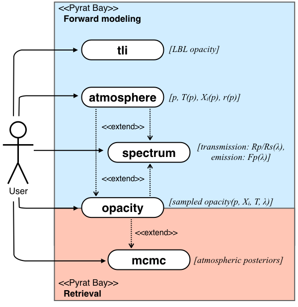
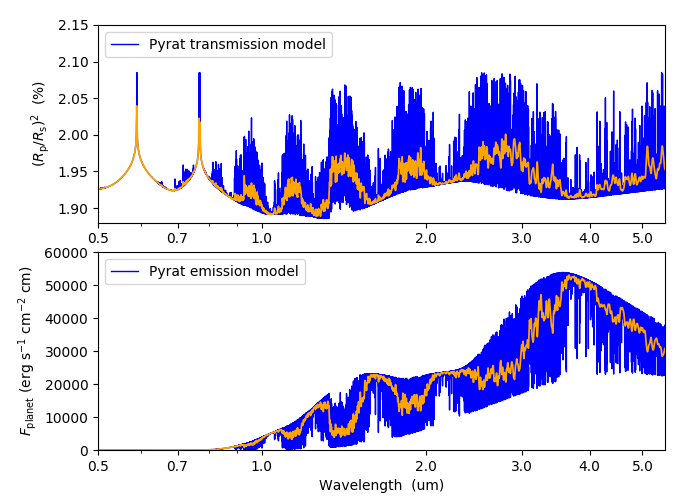

.. _getstarted:

Getting Started
===============

The main goal of the ``Pyrat Bay`` package is to enable modeling of
exoplanet atmospheres and their spectra.  Since this involves several
different physical processes, ``Pyrat Bay`` adopts a modular approach
allowing the user to execute particular steps or
concatenate multiple steps in a single run (see figure below).

   ``Pyrat Bay`` use-case diagram and the main outputs from each case
   (italics).  Solid arrows indicate steps that can be directly
   executed by the user. Dotted arrows indicate steps that can be
   linked in a single run.

The following table details what each of these steps do.

+----------------+------------------------------------------------------------+
|  Run mode      | Description                                                |
+================+============================================================+
| ``tli``        | Format line-by-line (LBL) opacity databases into a         |
|                | transition-line-information file (TLI, the format used by  |
|                | ``Pyrat Bay`` for spectral computations)                   |
+----------------+------------------------------------------------------------+
| ``atmosphere`` | Generate a 1D atmospheric model (pressure, temperature,    |
|                | abundances, and altitude profiles)                         |
+----------------+------------------------------------------------------------+
| ``opacity``    | Generate a cross-section table as function of wavenumber,  |
|                | temperature, pressure, and species                         |
+----------------+------------------------------------------------------------+
| ``spectrum``   | Compute forward-modeling spectra (transmission or          |
|                | emission)                                                  |
+----------------+------------------------------------------------------------+
| ``mcmc``       | Run an atmospheric retrieval                               |
+----------------+------------------------------------------------------------+

Any of these steps can be run either interactively though the Python
Interpreter, or from the command line.  To streamline execution,
``Pyrat Bay`` provides a single command to execute any of these runs.
To set up any of these runs, ``Pyrat Bay`` uses configuration files
following the standard `INI format
<https://docs.python.org/3.6/library/configparser.html#supported-ini-file-structure>`_.

The :ref:`qexample` section below demonstrates a simple
forward-modeling spectrum run, while the next sections give a thorough
detail for each of the running modes.  Finally, most of the low- and
mid-level routines used for these calculations are available
through the ``Pyrat Bay`` sub modules (see :ref:`API`).

.. The ``pyrat`` package is the main package that provides the
   radiative-transfer code that computes an emission or transmission
   spectrum for a given atmospheric model.  The ``lineread`` package
   formats online-available line-by-line opacity databases, used later
   by ``pyrat``.  The ``pbay`` package provides the retrieval
   framework (using a Markov-chain Monte Carlo algorithm, MCMC) to
   model and constrain exoplanet atmospheres.

.. Additional packages provide specific function to read stellar
   spectra (``starspec``); generate, read, and write 1D atmospheric
   models (``atmosphere``), provide universal and astrophysical constants
   (``constants``), plotting (``plots``) and additional tools
   (``tools``).

---------------------------------------------------------------------

System Requirements
-------------------

Pyrat-Bay (version 2.0+) has been extensively tested to work on
Unix/Linux and OS X machines and is available for Python 3.9+.

.. _install:

---------------------------------------------------------------------

Install and Compile
-------------------

To install ``Pyrat Bay`` run the following command from the terminal:

.. code-block:: shell

    pip install pyratbay

Or if you prefer conda:

.. code-block:: shell

    conda install -c conda-forge pyratbay

Alternatively (e.g., for developers), clone the repository to your local machine with the following terminal commands:

.. code-block:: shell

    git clone --recursive https://github.com/pcubillos/pyratbay
    cd pyratbay
    python setup.py develop

---------------------------------------------------------------------

.. _qexample:

Quick Example
-------------

The following script quickly you calculate a water transmission
spectrum between 0.5 and 5.5 um.  These instructions are meant to be
executed from a Shell terminal.  After you installed the package,
create a working directory to place the files and execute the
programs, e.g.:

.. code-block:: shell

   mkdir run_demo
   cd run_demo

Download the water line-transition database from the HITRAN server and unzip it:

.. code-block:: shell

   # Using wget:
   wget https://www.cfa.harvard.edu/HITRAN/HITRAN2012/HITRAN2012/By-Molecule/Compressed-files/01_hit12.zip
   # Or alternatively: curl https://www.cfa.harvard.edu/HITRAN/HITRAN2012/HITRAN2012/By-Molecule/Compressed-files/01_hit12.zip -o 01_hit12.zip
   unzip 01_hit12.zip

Copy the input and configuration files for the demo from the `examples
folder
<https://github.com/pcubillos/pyratbay/tree/master/examples/demo>`_ to
your working directory.  For example, use the following shell commands:

.. code-block:: shell

    demo_path=https://raw.githubusercontent.com/pcubillos/pyratbay/master/examples/demo
    wget $demo_path/demo_spectrum-emission.cfg
    wget $demo_path/demo_spectrum-transmission.cfg
    wget $demo_path/demo_tli-hitran.cfg
    wget $demo_path/uniform.atm

Execute these commands from the shell to create a
Transition-Line-Information (TLI) file, and then to use it to compute
transmission and emission spectra:

.. code-block:: shell

   # Format line-by-line opacity:
   pbay -c demo_tli-hitran.cfg

   # Compute transmission and emission spectra:
   pbay -c demo_spectrum-transmission.cfg
   pbay -c demo_spectrum-emission.cfg

.. Outputs
   ^^^^^^^

------------------------------------------------------------------------

That's it, now let's see the results.  The screen outputs and any
warnings raised are saved into log files.  The output spectrum is
saved to a separate file, to see it, run this Python script (on
interactive mode, I suggest starting the session with ``ipython
--pylab``):

.. code-block:: python

  import matplotlib
  from scipy.ndimage.filters import gaussian_filter1d as gaussf
  import matplotlib.pyplot as plt
  plt.ion()

  import pyratbay as pb
  import pyratbay.io as io

  wl, transmission = io.read_spectrum("./transmission_spectrum_demo.dat", wn=False)
  wl, emission     = io.read_spectrum("./emission_spectrum_demo.dat", wn=False)

  plt.figure(0, figsize=(7,5))
  plt.clf()
  plt.subplots_adjust(0.14, 0.1, 0.95, 0.95, hspace=0.15)
  ax = plt.subplot(211)
  plt.plot(wl, 100*transmission, "b", label="pyrat transmission model", lw=1.0)
  plt.plot(wl, gaussf(100*transmission, sigma=5.0), "orange", lw=1.25)
  plt.xscale('log')
  plt.ylabel(r"$(R_{\rm p}/R_{\rm s})^2}$  (%)")
  ax.get_xaxis().set_major_formatter(matplotlib.ticker.ScalarFormatter())
  ax.set_xticks([0.5, 0.7, 1.0, 2.0, 3.0, 4.0, 5.0])
  plt.xlim(0.5, 5.5)
  plt.ylim(1.88, 2.15)
  plt.legend(loc="upper left")

  ax = plt.subplot(212)
  plt.plot(wl, emission, "b", label="pyrat emission model", lw=1.0)
  plt.plot(wl, gaussf(emission, sigma=5.0), "orange", lw=1.25)
  plt.xscale('log')
  plt.xlabel(r"Wavelength  (um)")
  plt.ylabel(r"$F_{\rm planet}$ (erg s$^{-1}$ cm$^{-2}$ cm)")
  ax.get_xaxis().set_major_formatter(matplotlib.ticker.ScalarFormatter())
  ax.set_xticks([0.5, 0.7, 1.0, 2.0, 3.0, 4.0, 5.0])
  plt.ylim(0, 60000)
  plt.xlim(0.5, 5.5)
  plt.legend(loc="upper left")
  plt.draw()
  plt.savefig("pyrat_spectrum_demo.pdf")

The output figure should look like this:

Command-line Run
----------------

As shown above, ``Pyrat Bay`` enables a command-line entry point to
execute any of the runs listed above:

.. code-block:: shell

    pbay -c config_file.cfg

The configuration file determines what run mode to execute by setting
the ``runmode`` key.  Each of these modes have different
required/optional keys, which are detailed in further sections.

This same entry point offers a couple of secondary processes (display
version, re-format files). To display these options, run:

.. code-block:: shell

    pbay -h

Interactive Run
---------------

The same process can be executed from the Python Interpreter, after
importing the ``Pyrat Bay`` package:

.. code-block:: python

    import pyratbay as pb
    pyrat = pb.run('demo_spectrum-transmission.cfg')
    ax = pyrat.plot_spectrum()

The output vary depending on the selected run mode.  Additional low-
and mid-level routines are also available through this package (see
the :ref:`API`).

------------------------------------------------------------------------

In the following sections you can find a more detailed description and
examples of how to run ``Pyrat Bay`` for each available configuration.
