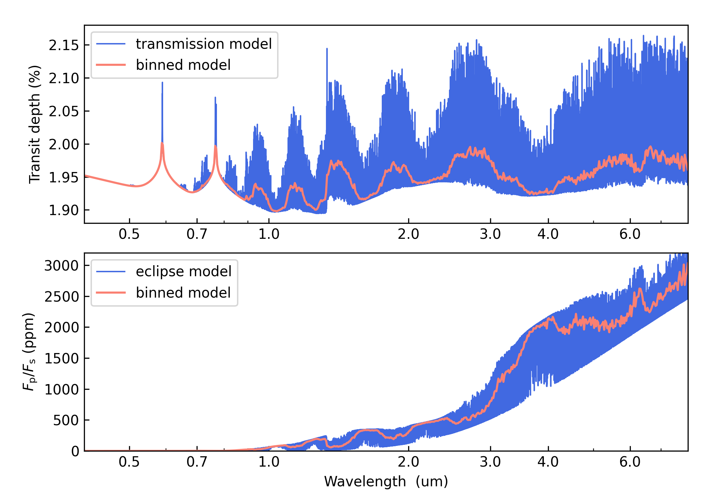

.. _getstarted:

Getting Started
===============

``Pyrat Bay`` is a modular package
that offers a sequence of running modes (``runmode``):

+----------------+------------------------------------------------------------+
|  Run mode      | Description                                                |
+================+============================================================+
| ``tli``        | Generate a transition-line-information file (used for      |
|                | spectral computation)                                      |
+----------------+------------------------------------------------------------+
| ``pt``         | Compute a temperature-pressure profile                     |
+----------------+------------------------------------------------------------+
| ``atmosphere`` | Generate a 1D atmospheric model (pressure, temperature,    |
|                | and abundances)                                            |
+----------------+------------------------------------------------------------+
| ``spectrum``   | Compute forwad-modeling spectra (transmission or emission) |
+----------------+------------------------------------------------------------+
| ``opacity``    | Generate an extinction-coefficient table (to speed up      |
|                | spectra computation)                                       |
+----------------+------------------------------------------------------------+
| ``mcmc``       | Run an atmospheric retrieval                               |
+----------------+------------------------------------------------------------+

The Pyrat Bay package provides multiple sub packages to compute
radiative-transfer calculations for exoplanets:

The ``pyrat`` is the main package that provides the radiative-transfer
code that computes an emission or transmission spectrum for a given
atmospheric model.  The ``lineread`` package formats online-available
line-by-line opacity databases, used later by ``pyrat``.  The ``pbay``
package provides the retrieval framework (using a Markov-chain Monte
Carlo algorithm, MCMC) to model and constrain exoplanet atmospheres.

Additional packages provide specific function to read stellar spectra
(``starspec``); generate, read, and write 1D atmospheric models
(``atmosphere``), read and process waveband filters (``wine``),
provide universal and astrophysical constants (``constants``),
plotting (``plots``) and additional tools (``tools``).

Each one of these can be run either from the shell prompt (through the
executable file ``pyratbay/pbay.py``) or in an interactive session
through the Python interpreter.

System Requirements
-------------------

Pyrat-Bay (version 0.0) is known to work (at least) on Unix/Linux
and OS X machines, with the following software:

* Python (version 2.7)
* Numpy (version 1.8.2+)
* Scipy (version 0.13.3+)
* Matplotlib (version 1.3.1+)
* Sympy (suggested version 0.7.1.rc1)
* Sphinx (version 1.3.3+)

``Pyrat Bay`` may work with previous versions of these software.
However we do not guarantee it nor provide support for that.

.. _install:

Install
-------

To obtain the current stable ``Pyrat Bay`` code, clone the repository
to your local machine with the following terminal commands:

.. code-block:: shell

  topdir=`pwd`
  git clone --recursive https://github.com/pcubillos/pyratbay

Compile
-------

Compile the C programs:

.. code-block:: shell

  cd $topdir/pyratbay
  make

.. To remove the program binaries, execute (from the respective directories):
   code-block:: shell
   make clean

.. _qexample:

Quick Example: pyrat forward modeling
-------------------------------------

The following script quickly you calculate a water transmission
spectrum between 0.5 and 5.5 um.  These instructions are meant to be
executed from a Shell terminal.  After you installed and compiled the
package, create a working directory to place the files and execute the
programs, e.g.:

.. code-block:: shell

   cd $topdir
   mkdir run_demo
   cd run_demo

Download the water line-transition database from the HITRAN server:

.. code-block:: shell

   # Using wget:
   wget --user=HITRAN --password=getdata -N \
    https://www.cfa.harvard.edu/HITRAN/HITRAN2012/HITRAN2012/By-Molecule/Compressed-files/01_hit12.zip
   # Or alternatively, curl:
   curl -u HITRAN:getdata \
    https://www.cfa.harvard.edu/HITRAN/HITRAN2012/HITRAN2012/By-Molecule/Compressed-files/01_hit12.zip\
    -o 01_hit12.zip

Unzip the file:

.. code-block:: shell

   unzip 01_hit12.zip

Copy the input and configuration files for the demo from the examples
folder to your working directory:

.. code-block:: shell

   cp $topdir/pyratbay/examples/demo/* .

Execute these commands from the shell to create a
Transition-Line-Information (TLI) file, and then to use it to compute
transmission and emission spectra:

.. code-block:: shell

   $topdir/pyratbay/pbay.py -c demo_tli-hitran.cfg

   $topdir/pyratbay/pbay.py -c demo_spectrum-transmission.cfg
   $topdir/pyratbay/pbay.py -c demo_spectrum-emission.cfg

Outputs
^^^^^^^

That's it, now let's see the results.  The screen outputs and any
warnings raisedare are saved into log files.  The output spectrum is
saved to a separate file, to see it, run this Python script (on
interactive mode, I suggest starting the session with ``ipython
--pylab``):

.. code-block:: python

  import sys
  import matplotlib
  from scipy.ndimage.filters import gaussian_filter1d as gaussf
  import matplotlib.pyplot as plt
  plt.ion()

  sys.path.append("../pyratbay/")
  import pyratbay as pb
  import pyratbay.io as io

  wl, transmission = io.read_pyrat("./transmission_spectrum_demo.dat", wn=False)
  wl, emission     = io.read_pyrat("./emission_spectrum_demo.dat", wn=False)
  
  plt.figure(0, figsize=(7,5))
  plt.clf()
  plt.subplots_adjust(0.14, 0.1, 0.95, 0.95, hspace=0.15)
  ax = plt.subplot(211)
  plt.plot(wl, 100*transmission, "b", label="Pyrat transmission model", lw=1.0)
  plt.plot(wl, gaussf(100*transmission, sigma=5), "orange", lw=1.25)
  plt.xscale('log')
  plt.ylabel(r"$(R_{\rm p}/R_{\rm s})^2}$  (%)")
  ax.get_xaxis().set_major_formatter(matplotlib.ticker.ScalarFormatter())
  ax.set_xticks([0.5, 0.7, 1.0, 2.0, 3.0, 4.0, 5.0])
  plt.xlim(0.5, 5.5)
  plt.ylim(1.88, 2.15)
  plt.legend(loc="upper left")

  ax = plt.subplot(212)
  plt.plot(wl, emission, "b", label="Pyrat emission model", lw=1.0)
  plt.plot(wl, gaussf(emission, sigma=5), "orange", lw=1.25)
  plt.xscale('log')
  plt.xlabel(r"Wavelength  (um)")
  plt.ylabel(r"$F_{\rm planet}$ (erg s$^{-1}$ cm$^{-2}$ cm)")
  ax.get_xaxis().set_major_formatter(matplotlib.ticker.ScalarFormatter())
  ax.set_xticks([0.5, 0.7, 1.0, 2.0, 3.0, 4.0, 5.0])
  plt.ylim(0, 60000)
  plt.xlim(0.5, 5.5)
  plt.legend(loc="upper left")
  plt.draw()
  plt.savefig("pyrat_spectrum_demo.pdf")

The output figure should look like this:

Configuration Files
-------------------

``Pyrat Bay`` configuration files follow the `ConfigParser <https://docs.python.org/2/library/configparser.html>`_ format.
Whether you are executing the call from shell or from the interpreted,
the configuration file defines all the settings of your run.

All of the running settings, inputs, and outputs are set in the
configuration file.  For example, here is the configuration file for the transmission spectrum demo: `demo_spectrum-transmission.cfg <https://github.com/pcubillos/pyratbay/blob/master/examples/demo/demo_spectrum-transmission.cfg>`_.

Input files can either have absolute or relative paths.

The configuration file include variables to define the default units
of some physical variables (mass, length, pressure), e.g.:

.. code-block:: python

  # Default units:
  radunits = km
  # System parameters:
  rstar   = 6.995e5    ; Stellar radius (default units: radunits)

Equivalently, a variable can explicitly include the units (overriding
the default units):

.. code-block:: python

  # Default units:
  radunits = km
  # System parameters:
  rstar   = 1.0 rsun    ; Stellar radius (default units: radunits)

This Link contains the list of available units:  :ref:`units`.

.. _sscripts:

Scripts
-------

The `scripts
<https://github.com/pcubillos/pyratbay/tree/master/scripts>`_ folder
provide Python executable files (from shell) that reformat
cross-section data from the given online format (Borysow, EXOMOL,
HITRAN) into the ``Pyrat Bay`` format.

Additionally, there are executable files that reformat the
partition-function files from the given online format (Partridge &
Schwenke's |H2O|, Schwenke's TiO, and Barklem's) into the ``Pyrat
Bay`` format.

More explicit details are TBD. For the moment read the file's
docstrings for use.

