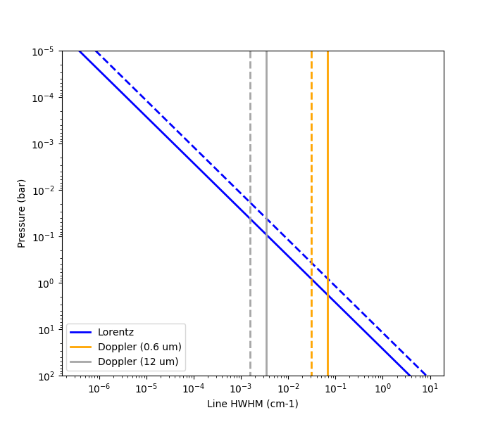
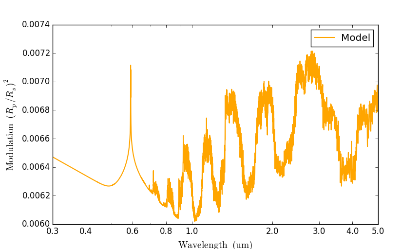

.. |H2O| replace:: H\ :sub:`2`\ O
.. |CO2| replace:: CO\ :sub:`2`
.. |CH4| replace:: CH\ :sub:`4`
.. |H2|  replace:: H\ :sub:`2`
.. |Rp|  replace:: :math:`R_{\rm p}`
.. |Rs|  replace:: :math:`R_{\rm s}`
.. |Fp|  replace:: :math:`F_{\rm p}`
.. |Fs|  replace:: :math:`F_{\rm s}`
.. |kayser| replace:: cm\ :sup:`-1`
.. |ptop| replace:: :math:`\log(p_{\rm top})`
.. |pt|   replace:: :math:`\log(p_{\rm t})`
.. |pb|   replace:: :math:`\log(p_{\rm b})`
.. |f|    replace:: :math:`\log(f)`
.. |nu|   replace:: :math:`\nu`

.. _spectutorial:

Spectrum Tutorial
=================

This run mode computes a transmission or emission spectrum, for a
given atmospheric model.

Sample Configuration File
-------------------------

Here is a sample configuration file to compute a transmission spectrum (`spectrum_transmission.cfg
<https://github.com/pcubillos/pyratbay/blob/master/examples/tutorial/spectrum_transmission.cfg>`_):

.. literalinclude:: ../examples/tutorial/spectrum_transmission.cfg

Observing Geometry
------------------

The ``rt_path`` key determines the radiative-transfer scheme and
observing geometry.  The following table list the available options:

=========== ===================== ===================== ===========
``rt_path`` Observing geometry    Output spectrum       Units
=========== ===================== ===================== ===========
transit     Transmission geometry (|Rp|/|Rs|)\ :sup:`2` ---
emission    Emission geometry     |Fp|                  erg s\ :sup:`-1` cm\ :sup:`-2` cm
=========== ===================== ===================== ===========

For transmission geometry ``Pyrat Bay`` computes the transit depth,
assuming parallel rays that travel from the star to the observer
across the planetary atmosphere, which is composed of spherically
symmetric shell layers.
For emission geometry, ``Pyrat Bay`` computes the planetary flux
emission spectrum, adopting the plane-parallel approximation,
evaluating the emergent intensity at multiple angles with respect to
the normal, and integrating the intensities over the planetary
hemisphere.  For more details, see [CubillosBlecic2021]_.

Atmospheric Model
-----------------

The ``atmfile`` key sets the input atmospheric model from which to
compute the spectrum.  If the file pointed by ``atmfile`` does not
exist, the codel will attempt to produce it (provided all necessary
input parameters are set in the configuration file).  The atmospheric
model can be produced with ``Pyrat Bay`` or be a custom input from the
user (as long as it follows the right format, see the `API <file:///home/pcubillos/Dropbox/IWF/projects/2014_pyratbay/sphinxdoc-pyratbay/html/api.html#pyratbay.io.write_atm>`_).

Spectrum Sampling
-----------------

The ``wllow`` and ``wlhigh`` keys set the wavelength boundaries for
the output spectrum (values must contain units; otherwise, set the
units with the ``wlunits`` key).  Alternatively, the user can set the
spectrum boundaries by wavenumber using the ``wnlow`` and ``wnhigh``
keys (wavenumber keys are always in |kayser|; thus, the user should
not provide units for them).

By default, the code produces an output spectrum at
constant-wavenumber sampling rate.  The ``wnstep`` sets the sampling
rate in |kayser|.  Note that this will be the output sampling rate.
Internally, ``Pyrat Bay`` must compute line profiles at a higher
resolution to ensure not to undersample the line profiles.  The
``wnosamp`` key (an integer) sets the oversampling factor of the
high-resolution sampling relative to ``wnstep`` (that is, the
high-resolution sampling rate is ``wnstep/wnosamp``).  Typical values
for the optical/IR are ``wnstep = 1.0`` and ``wnosamp = 2000``.

.. https://en.wikipedia.org/wiki/Highly_composite_number

Alternatively, the user can request a constant-resolution output by
setting the ``resolution`` key (where the resolution is
:math:`R=\lambda/\Delta\lambda`).  Note that in this case, the
configuration file must still define ``wnstep`` and ``wnosamp``.

Voigt Profiles
--------------

To speed up calculations, ``Pyrat Bay`` pre-computes a grid of Voigt
profiles at a fixed grid of Doppler and Lorentz half-width at half
maximum (HWHM).  When computing the LBL opacities, the code selects
the closest profile to a given line, depending on the line properties.

The grid properties are set automatically by the code (based on the
input atmosphere properties), so the user does not need to set them.
However, these values can be set configuration file.
The user can thus set the ``dmin``, ``dmax``, and ``ndop`` keys to set
the ranges and number of samples for the Doppler HWHM array (in
|kayser| units).  Similarly, the ``lmin``, ``lmax``, and ``nlor`` keys
set the ranges and number of samples for the Lorentz HWHM array (in
|kayser| units).

Finally, the ``vextent`` and ``vcutoff`` keys set the Voigt profiles
extent from the center of the line.  ``vextent`` defines the maximum
extent in units of HWHM (default is 100 HWHM), whereas ``vcutoff``
defines the maximum extent in units of |kayser| (default is 25.0 |kayser|).
For any given profile, the code truncates the line wing at the minimum
value defined by ``vextent`` and ``vcutoff``.  A ``vcutoff`` value of
zero results in no cutoff (``vextent`` still applies though).
Note that there are no known physical grounds that set the extent of a
line profile.  Typical (arbitrary) values found in the literature are
on the order of ~100 HWHM and 25 |kayser|.

The range of HWHM values can vary strongly with pressure, temperature,
or wavelength, in particular the Lorentz HWHM as it is inversely
proportional to pressure.  The following Figure, gives you an idea to
set these values:

   HCN HWHM variation with pressure, temperature, and wavelength in a
   |H2|-dominated atmosphere (see legend).  Solid and dashed lines
   denote the HWHM at 2500 and 500 K, respectively ([Cubillos2017b]_).

.. dlratio

System Parameters
-----------------

The system parameters have multiple uses.

Hill radius
^^^^^^^^^^^

The ``mstar``, ``mplanet``, and ``smaxis`` keys set the stellar mass,
planetary mass, and orbital semi-major axis.  If these keys are set in
the configuration file, the code will compute the planetary Hill
radius (:math:`R_{\rm H} = a \sqrt[3]{M_{\rm p}/3M_{\rm s}}`).  In
such case, ``Pyrat Bay`` will neglect atmospheric layers at altitudes
larger than :math:`R_{\rm H}`, since they should not be
gravitationally bound to the planet.

Stellar spectrum
^^^^^^^^^^^^^^^^

The ``tstar`` key sets the stellar effective temperature, which can be
used to define a stellar blackbody spectrum (|Fs|, see :ref:`starspec`).

Radius Ratio
^^^^^^^^^^^^

To compute eclipse depths from the emission spectra (|Fp|), the user
needs to set the ``rstar`` and ``rplanet`` keys, which define the
stellar and planetary radius.  The eclipse depths can then be computed as:

.. math::
    {\rm Eclipse\ depth} = \frac{F_{\rm p}}{F_{\rm s}}
                  \left(\frac{R_{\rm p}}{R_{\rm s}}\right)^2

Line-by-line Opacities
----------------------

Use the ``tlifile`` key to include TLI file(s) containing LBL
opacities (to create a TLI file, see :ref:`tlitutorial`).  The user
can include zero, one, or multiple TLI files if desired.

Note that the ``tlifile`` opacities will be neglected if the
configuration file sets input LBL opacities through the ``extfile``
(see the rules in :ref:`opacity_io`).

.. _cia_opacity:

Cross-section Opacities
-----------------------

Use the ``csfile`` key to include opacities from cross-section files.
A cross-section file contains opacity (in |kayser| amagat\ :sup:`-2`
units) tabulated as a function of temperature and wavenumber.  Since
this format is tabulated in wavenumber, it is best suited for
opacities that vary smoothly with wavenumber, like collision-induced
absorption (CIA).  However, the code can also process LBL opacities,
as long as the files follow the right format (more on this later).

The following table list the most-commonly used CIA opacity sources:

========== ========== ========== ===================== =====================
Sources    Species    T range    |nu| range (|kayser|) References
========== ========== ========== ===================== =====================
`HITRAN`_  |H2|--|H2|  200--3000 1.0--500.0            [Richard2012]_ [Karman2019]_
`HITRAN`_  |H2|--H    1000--2500 1.0--100.0            [Richard2012]_ [Karman2019]_
`HITRAN`_  |H2|--He    200--9900 0.5--500.0            [Richard2012]_ [Karman2019]_
`Borysow`_ |H2|--|H2|   60--7000 0.6--500.0            [Borysow2001]_ [Borysow2002]_
`Borysow`_ |H2|--He     50--7000 0.5--31.25            [Borysow1988]_ [Borysow1989a]_ [Borysow1989b]_ [Jorgensen2000]_
========== ========== ========== ===================== =====================

.. _Borysow: https://www.astro.ku.dk/~aborysow/programs/index.html
.. _HITRAN: https://hitran.org/cia

For the **HITRAN** CIA database, ``Pyrat Bay`` provides these shell commands to re-format the downloaded CIA files

.. code-block:: shell

    # Download and format HITRAN H2-H2 CIA file for Pyrat Bay:
    $ wget https://hitran.org/data/CIA/H2-H2_2011.cia
    $ pbay -cs hitran H2-H2_2011.cia

    # And for HITRAN H2-He CIA
    $ wget https://hitran.org/data/CIA/H2-H2_2011.cia
    $ pbay -cs hitran H2-He_2011.cia

For the **Borysow** CIA database, the code provides already-formatted
files for |H2|-|H2| in the 60--7000K and 0.6--500 um range \[`here
<https://github.com/pcubillos/pyratbay/blob/master/pyratbay/data/CIA/CIA_Borysow_H2H2_0060-7000K_0.6-500um.dat>`_\]
(this file pieces together the tabulated |H2|-|H2| files described in
the references above); and for |H2|-He in the 50--7000K and 0.5--31.25
um range \[`here
<https://github.com/pcubillos/pyratbay/blob/master/pyratbay/data/CIA/CIA_Borysow_H2He_0050-7000K_0.5-031um.dat>`_\]
(this file was created using a re-implementation of the code described
in the references above).  The user can access these files via the
``{ROOT}`` shortcut, as in the example below:

.. code-block:: python

    csfile =
        {ROOT}pyratbay/data/CIA/CIA_Borysow_H2H2_0060-7000K_0.6-500um.dat
        {ROOT}pyratbay/data/CIA/CIA_Borysow_H2He_0050-7000K_0.5-031um.dat

Radius-profile Models
---------------------

The ``radmodel`` key sets the model to compute the atmospheric
layers's altitude assuming hydrostatic equilibrium.  This table shows
the currently available models:

=====================  =========================
Models (``radmodel``)  Comments
=====================  =========================
hydro_m                Hydrostatic equilibrium with :math:`g(r)=GM/r^2`
hydro_g                Hydrostatic equilibrium with constant gravity
[undefined]            Take radius profile from input atmospheric file if exists
=====================  =========================

See the :ref:`altitude_profile` section for details.
The ``refpressure``, ``rplanet``, ``mplanet`` and ``gplanet`` keys set
the planetary reference pressure and radius level (:math:`p_0` and
:math:`R_0`), the planetary mass (:math:`M_p`) and planetary surface
gravity (:math:`g`), respectively.

.. Note:: Note that the user can supply its own atmospheric altitude
          profile (through the input atmospheric model), possibly not
          in hydrostatic equilibrium.  In this case, do not set the
          ``radmodel`` key.

Alkali Opacity Models
---------------------

Use the ``alkali`` key to include opacities from alkali species.
Currently, the code provides the [Burrows2000]_ models for the sodium
and potassium resonant lines, based on van der Waals and statistical
theory.  The following table lists the available alkali model names:

====================  ========= =========================
Models (``alkali``)   Species   References
====================  ========= =========================
sodium_vdw            Na        [Burrows2000]_
potassium_vdw         K         [Burrows2000]_
====================  ========= =========================

This implementation adopts the line parameters from the VALD database
[Piskunov1995]_ and collisional-broadening half-width from [Iro2005]_.

.. _rayleigh_opacity:

Rayleigh Opacity Models
-----------------------

The ``rayleigh`` key sets Rayleigh opacity models.  The following
table lists the available Rayleigh model names:

===================== ======= ============================  ===
Models (``rayleigh``) Species Parameter names               References
===================== ======= ============================  ===
lecavelier            ---     ``log_k_ray``, ``alpha_ray``  [Lecavelier2008]_
dalgarno_H            H       ---                           [Dalgarno1962]_
dalgarno_He           He      ---                           [Kurucz1970]_
dalgarno_H2           |H2|    ---                           [Kurucz1970]_
===================== ======= ============================  ===

The Dalgarno Rayleigh models are tailored for H, He, and |H2| species,
and thus are not parametric.  The Lecavelier Rayleigh model is more flexible
and allows the user to modify the absorption strength and wavelength
dependency according to:

.. math::
    k(\lambda) = \kappa_{\rm ray} \kappa_0 \left(\frac{\lambda}{\lambda_0}\right)^{\alpha_{\rm ray}},

where :math:`\lambda_0=0.35` um and :math:`\kappa_0=5.31 \times
10^{-27}` cm\ :sup:`2` molecule\ :sup:`-1` are constants, and
:math:`\log(\kappa_{\rm ray})` and :math:`\alpha_{\rm ray}` are
fitting parameters that can be set through the ``rpars`` key.
Adopting values of :math:`\log(\kappa_{\rm ray})=0.0` and
:math:`\alpha_{\rm ray}=-4` reduces the Rayleigh opacity to that
expected for the |H2| molecule.

.. note:: Be aware that the implementation of the Lecavelier model
          uses the |H2| number-density profile (:math:`n_{\rm H2}`, in
          molecules cm\ :sup:`-3`) to compute the extinction
          coefficient (in |kayser| units) for a given atmospheric
          model: :math:`e(\lambda) = k(\lambda)\ n_{\rm H2}`.  We do
          this, because we are mostly interested in |H2|-dominated
          atmospheres, and most people consider a nearly constant |H2|
          profile.  Obviously, this needs to be fixed at some point in
          the future for a more general use.

.. _cloud_opacity:

Cloud Opacity Models
--------------------

Use the ``clouds`` key to include aerosol/haze/cloud opacities.
Currently, the code provides simple gray cloud models (listed below),
but soon we will include more complex Mie-scattering clouds for use in
forward- and retrieval modeling.  The following table lists the
currently available cloud model names:

And these are the available haze/cloud models (``clouds`` parameter):

=================== ============================================ =============================
Models (``clouds``) Parameter names                              Description
=================== ============================================ =============================
deck                ``log_p_cl``                                 Opaque gray cloud deck
ccsgray             ``log_k_gray``, ``log_p_top``, ``log_p_bot`` Constant gray cross-section
=================== ============================================ =============================

Use the ``cpars`` key to set the cloud model parameters.  The '*deck*'
model makes the atmosphere instantly opaque at the :math:`\log(p_{\rm cl})` pressure
(in bar units).

The '*ccsgray*' model creates a constant cross-section opacity between
the :math:`p_{\rm t}` and :math:`p_{\rm b}` pressures (in bar units),
and the |f| parameter scaling the opacity as: :math:`k = \kappa_{\rm gray}\ \kappa_0`, with
:math:`\kappa_0=5.31 \times 10^{-27}` cm\ :sup:`2` molecule\
:sup:`-1`.  This model uses the |H2| number-density profile to compute
the extinction coefficient as: :math:`e(\lambda) = k\ n_{\rm H2}` (in
|kayser| units).  Since the |H2| mixing ratio is generally constant,
the '*ccsgray*' opacity will scale linearly with pressure over the
atmosphere.

.. For any of these type of models, the user can include multiple
   models, simply by concatenating multiple models (and parameters)
   one after the other in the config file.

Patchy Cloud/Hazes
------------------

Set the ``fpatchy`` argument to compute transmission spectra from a
linear combination of a clear and cloudy/hazy spectra.  The
cloudy/hazy component will include the opacity defined by the
:ref:`cloud_opacity` and the ``lecavelier`` :ref:`rayleigh_opacity`.
For example, for a 45% cloudy / 55% clear atmosphere, set:

.. code-block:: python

  # Patchy fraction, value between [0--1]:
  fpatchy = 0.45

Flux dilution factor
--------------------

Set the ``f_dilution`` argument to set an flux dilution factor
[Taylor2020]_, with values between 0--1, which compensates for
emission from an inhomogeneous atmosphere.  The dilution factor
represents the fractional area of the hottest region on the planet
(assuming that the colder regions flux is negligible in comparison).

.. code-block:: python

  # Flux dilution factor, value between [0--1]:
  f_dilution = 0.85

Temperature Models
------------------

The user can re-compute the temperature profile of the atmosphere by
specifying the ``tmodel`` and ``tpars`` keys (see :ref:`temp_profile`).

Abundances Scaling
------------------

Use the ``molvars`` and ``molpars`` keys to modify the abundance of
certain atmospheric species.  There are two sets of options depending
on whether the atmosphere is modeled in chemical equilibrium or not.
The following tables describe the available models (when the
corresponding ``molpars`` is :math:`x`).

For runs with free abundances:

============= =========================================== =====
``molvars``   Scaling                                     Description
============= =========================================== =====
``log_mol``   :math:`\log_{10}{\rm VMR} = x`              Set log(VMR) of species 'mol' to given value (constant with altitude)
``scale_mol`` :math:`{\rm VMR}(p) = {\rm VMR}_0(p)\ 10^x` Scale existing VMR of species 'mol' abundance by given value
============= =========================================== =====

In this case the parameters modify directly the VMR of specific
species.  To preserve the sum of the VMR at 1.0 at each layer, the
code will adjust the values of custom '*bulk*' species defined using
the ``bulk`` key.  A good practice is to set here the dominant species
in an atmosphere (e.g., ``bulk = H2 He`` for primary atmospheres).  If there
is more than one '*bulk*' species, the code preserves the relative
VMRs ratios between the bulk species.

For example, the following configuration will set uniform mole mixing
fractions for |H2O| and CO of :math:`10^{-3}` and :math:`10^{-4}`,
respectively; and adjust the abundances of |H2| and He to
preserve a total mixing fraction of 1.0 at each layer:

.. code-block:: python

  molvars = log_H2O log_CO
  molpars = -3.0    -4.0
  bulk = H2 He

For runs in thermochemical equilibrium (``chemistry = tea``):

================ ================================= =====
``molvars``      Scaling                           Description
================ ================================= =====
``metal``        :math:`{\rm [M/H]} = x`           Set metallicity (dex units) of all metal species (everything except H and He)
``[X/H]``        :math:`{\rm [X/H]} = x`           Set metallicity (dex units) of element 'X' relative to solar (overrided metal)
``X/Y``          ...                               Set abundance of element 'X' relative to that of element 'Y' (note not in dex units)
================ ================================= =====

key, whereas :math:`Q_0` is the abundance of the given species taken
from the atmospheric file ``atmfile``.
Note that the user can specify as many scaling parameters as wished,
as long as there are corresponding values for these three keys
(``molvars``, ``molpars``).

For example, the following configuration will compute abundances in
thermochemical equilibrium assuming 30x solar abundances for carbon
and oxygen, and 10x solar for all other metals:

.. code-block:: python

  chemistry = tea
  molvars = metal [C/H] [O/H]
  molpars = 1.0   1.5    1.5

.. _starspec:

Stellar Spectrum
----------------

``Pyrat Bay`` provides several options to set a stellar spectrum.  The
stellar spectrum is required to compute eclipse depths as the
planet-to-star flux spectrum.  In order of precedence:

The ``starspec`` key sets the path to a custom spectrum file
containing a spectrum. This file should contain in the first column
the wavelength array in microns, and in the second column the flux
spectrum in erg s\ :sup:`-1` cm\ :sup:`-2` cm units.

Alternatively, the user can use a Kurucz stellar model
([Castelli2003]_) by setting the ``kurucz`` key to the path to a
Kurucz model.  These models can be downloaded from this link:
http://kurucz.harvard.edu/grids/ In this case, the code selects the
correct Kurucz model based on the stellar temperature (``tstar`` key)
and surface gravity (``log_gstar`` key).

Finally, the user can set a blackbody stellar spectrum by setting the
``tstar`` key with the stellar effective temperature (in Kelvin
units).

(MARCS and PHOENIX are TBI upon popular demand)

Filter Pass-bands
-----------------

Use the ``filters`` key to set the path to instrument filter
pass-bands (see [link to formats?]).  These can be used to compute
band-integrated values for the transmission or eclipse-depth spectra.

Observed Data
-------------

Use the ``data`` and ``uncert`` keys to set values for observed
transit- or eclipse-depth values and their uncertainties,
respectively.  Logically, you want to set data values corresponding to
the ``filters`` pass-bands.

Use the ``dunits`` key to specify the units of the ``data`` and
``uncert`` values (default: ``dunits = none``).  Typical values are:
'*none*', '*percent*', or '*ppm*' (see :ref:`units` section).

.. note:: Note that the ``filters``, ``data``, and ``uncert`` keys are
          not strictly required for a spectrum run, but they will
          allow the code to plot these information if requested (see
          [link to plots]).

Other Configuration Parameters
------------------------------

Number of CPUs
^^^^^^^^^^^^^^

The ``ncpu`` key sets the number of CPUs to use when computing LBL
opacities or when running retrievals (default: ``ncpu = 1``).

Verbosity
^^^^^^^^^

The ``verb`` key sets the screen-output and logfile verbosity level.
Higher ``verb`` values will display increasingly levels of detail
according to the following table:

========  =====================
``verb``  Screen Outputs
========  =====================
<0        Errors
0         Warnings
1         Headlines
2         Details
3         Debug
========  =====================

Log File
^^^^^^^^

Use the ``logfile`` key to set a file name where to save the screen
outputs (same content as the screen output).  If this is not set by
the user, the code will default the ``logfile`` to the output file of
each corresponding ``runmode`` (changing the file extension to
'*.log*').  The following table lists the files from where the code
will take the default name for each ``runmode``:

===========  =====================
``runmode``  Default ``logfile`` name
===========  =====================
tli          ``tlifile``
atmosphere   ``atmfile``
spectrum     ``specfile``
opacity      ``extfile``
mcmc         ``mcmcfile``
===========  =====================

Optical-depth Cutoff
^^^^^^^^^^^^^^^^^^^^

The ``maxdepth`` key sets an optical-depth cutoff to stop the
radiative-transfer calculations. Since there is little transmitted
intensity through a layer when the optical depth is greater than one,
layers where :math:`\tau \gg 1` won't impact on the resulting
spectrum.  The default value of ``maxdepth = 10.0`` is thus an
appropriate conservative value.

.. what about ethresh?

Plane-parallel Hemispheric Integration
^^^^^^^^^^^^^^^^^^^^^^^^^^^^^^^^^^^^^^

For eclipse geometry, the code computes the emergent intensity under
the plane-parallel approximation, and then it integrates (sums)
intensity spectra at different angles with respect to the normal to
model the emitted flux spectrum.  The ``raygrid`` sets the angles (in
degrees) where to evaluate these intensities (default: ``raygrid = 0
20 40 60 80``).  The user can set custom values for these angles as
long as: (1) the first value is zero (normal to the planet's
'surface'), (2) they lie in the [0,90) range, and (3) they are
increasing order.

Alternatively, the user can set the ``quadrature`` key to perform a
Gaussian-quadrature integration, where the ``quadrature`` value sets
number of Gaussian-quadrature points (in which case, ``raygrid`` will
be ignored).

.. Plots: logxticks
          yran

----------------------------------------------------------------------

Examples
--------

.. note:: Before running this example, make sure that you have
   generated the TLI file from the :ref:`tli_tutorial_example`,
   generated the atmospheric profiles from the
   :ref:`abundance_tutorial_example`, and download the configuration
   file shown above, e.g., with these shell commands:

   .. code-block:: shell

       tutorial_path=https://raw.githubusercontent.com/pcubillos/pyratbay/master/examples/tutorial
       wget $tutorial_path/spectrum_transmission.cfg

In an interactive run, a spectrum run returns a '*pyrat*' object that
contains all input, intermediate, and output variables used to compute
the spectrum.  The following Python script computes and plots a
transmission spectrum using the configuration file found at the top of
this tutorial:

.. code-block:: python

    import matplotlib.pyplot as plt
    plt.ion()

    import pyratbay as pb
    import pyratbay.constants as pc

    pyrat = pb.run('spectrum_transmission.cfg')

    # Plot the resulting spectrum:
    wl = 1.0 / (pyrat.spec.wn*pc.um)
    depth = pyrat.spec.spectrum / pc.percent
    wl_ticks = [0.3, 0.5, 0.7, 1.0, 2.0, 3.0, 5.0]

    plt.figure(-3, (7,4))
    plt.clf()
    ax = plt.subplot(111)
    plt.semilogx(wl, depth, "-", color='orange', lw=1.0)
    ax.get_xaxis().set_major_formatter(matplotlib.ticker.ScalarFormatter())
    ax.set_xticks(wl_ticks)
    plt.xlim(0.3, 5.0)
    plt.ylabel("Transit depth (Rp/Rs)$^2$ (%)")
    plt.xlabel("Wavelength (um)")

    # Or, alternatively:
    ax = pyrat.plot_spectrum()

And the results should look like this:

.. note:: Note that although the user can define most input units,
          nearly all variables are stored in CGS units in the
          '*pyrat*' object.

The '*pyrat*' object is modular, and implements several convenience
methods to plot and display its content, as in the following example:

.. code-block:: python

    # pyrat object's string representation:
    print(pyrat)

    # String representation of the spectral variables:
    print(pyrat.spec)
