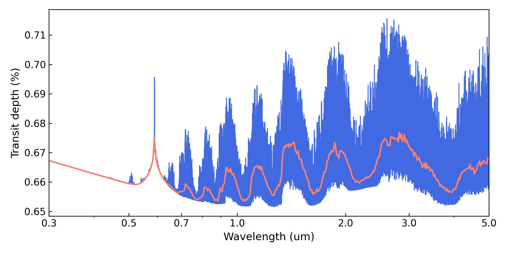

.. include:: _substitutions.rst

.. _spectral_synthesis:

Spectral Synthesis
==================

This tutorial shows how compute transmission, emission, or eclipse
spectra with ``Pyrat Bay``.

- :ref:`spec_config`
- :ref:`spec_wavelength`
- :ref:`spec_system`
- :ref:`spec_sed`
- :ref:`spec_atmosphere`
- :ref:`spec_cross_sec`
- :ref:`spec_tls`
- :ref:`spec_observations`
- :ref:`spec_outputs`
- :ref:`spec_demo`

.. _spec_config:

Configuration File
------------------

``Pyrat Bay`` runs are defined via configuration files.
Here is a sample configuration file to compute a transmission
spectrum:

.. raw:: html

   

   
Click here to show/hide: spectral_synthesis_transmission.cfg

.. literalinclude:: _static/data/spectral_synthesis_transmission.cfg
   :language: ini
   :caption: File `spectral_synthesis_transmission.cfg <_static/data/spectral_synthesis_transmission.cfg>`__
.. raw:: html

   

To compute forward-model spectra, a configuration file must have:

- a ``runmode`` key set to ``spectrum``
- a ``logfile`` key that defines the name of the output log and
  spectrum files
- a ``rt_path`` key that defines the observing geometry

.. code-block:: ini

    # Pyrat Bay run mode [tli atmosphere spectrum radeq opacity retrieval]
    runmode = spectrum

    # Output files
    logfile = transmission_spectrum_tutorial.log

    # Radiative-transer observing geometry, select from: [transit emission]
    rt_path = transit

.. _obs_geometry:

Observing Geometry
~~~~~~~~~~~~~~~~~~

The ``rt_path`` key sets the radiative-transfer scheme and observing
geometry to use.  These are the options:

.. list-table::
   :header-rows: 1
   :widths: 5, 10, 20, 30

   * - Observing geometry
     - ``rt_path``
     - Output spectrum
     - Comments

   * - Transmission
     - ``transit``
     - (|Rp|/|Rs|)\ :sup:`2`
     - Transmission spectrum

   * -
     -
     -
     -

   * - Eclipse
     - ``eclipse``
     - |Fp|/|Fs| * (|Rp|/|Rs|)\ :sup:`2`
     - Occultation spectrum

   * - Eclipse
     - ``eclipse_two_stream``
     - |Fp|/|Fs| * (|Rp|/|Rs|)\ :sup:`2`
     - Appendix B of [Heng2014]_

   * -
     -
     -
     -

   * - Emission
     - ``emission``
     - |Fp| (|flux_cgs|)
     - Flux at the planet's surface

   * - Emission
     - ``emission_two_stream``
     - |Fp| (|flux_cgs|)
     - Appendix B of [Heng2014]_

   * - Emission
     - ``f_lambda``
     - |Fp| (|flux_lambda|)
     - Flux measured at Earth

.. Note:: These |Fp| fluxes are at the surface of the object, except
          for the last option ``f_lambda``, which evaluates the flux
          received at Earth.

.. _spec_wavelength:

Spectrum sampling
-----------------

The ``wl_low`` and ``wl_high`` keys set the wavelength boundaries for
the output spectrum. Values should contain the units:

.. code-block:: ini

    # Wavelength sampling
    wl_low  = 0.3 um
    wl_high = 5.0 um

If the run includes sampled cross-section files (see :ref:`cs_sampled`),
the wavelength sampling will be taken from these files.  Otherwise, it
can be defined via the ``resolution`` key:

.. tab-set::

  .. tab-item:: From line sample file
     :selected:

     When reading from a ``sampled_cross_sec`` file, the wavelength
     array can optionally be down-sampled using the ``wl_thinning``
     key. For example, ``wl_thinning = 4`` means every 4th
     sample is kept.

     .. code-block:: ini

         # Wavelength sampling
         wl_low  = 0.3 um
         wl_high = 5.0 um
         # Down-sample by a factor of 4
         wl_thinning = 4

         # Line-sampled cross sections
         sampled_cross_sec =
             inputs/cross_section_0.15-33.0um_0200-5000K_R025K_H2O_exomol_pokazatel.npz

  .. tab-item:: From resolution

     Sampling resolution is defined as :math:`R=\lambda/\Delta\lambda`:

     .. code-block:: ini

         # Wavelength sampling
         wl_low  = 0.3 um
         wl_high = 5.0 um
         resolution = 50_000

.. _spec_system:

System parameters
-----------------

Users must define stellar and planetary system parameters:

.. tab-set::

  .. tab-item:: Minimum required
     :selected:

     These is the minimum set of parameter that must be defined:

     .. code-block:: ini

         # System parameters
         rstar = 1.27 rsun
         mplanet = 0.6 mjup
         rplanet = 1.0 rjup
         ref_pressure = 0.1 bar

  .. tab-item:: All parameters

     These are all available system parameters:

     .. code-block:: ini

         # System parameters
         rstar = 1.27 rsun
         mstar = 1.1 msun
         tstar = 6000.0
         log_gstar = 4.5
         distance = 91.5 parsec

         mplanet = 0.6 mjup
         rplanet = 1.0 rjup
         smaxis = 0.045 au
         tint = 100.0
         beta_irr = 0.66
         ref_pressure = 0.1 bar

These enable the code to compute planet-to-star radius ratios
(**transmission spectroscopy**), planet-to-star flux ratios (**eclipse
spectroscopy**, compute the atmospheric gravity, solve the
hydrostatic-equilibrium equation, and more.

Temperatures are always in K (no units are needed).  For other inputs
the :ref:`units <units>` can be chosen at convenience.

Here are some notes on the system parameters:

-  ``ref_pressure`` is the atmospheric pressure at ``rplanet``
- ``distance``: required to compute flux at Earth for the ``rt_path = f_lambda`` :ref:`observing geometry <obs_geometry>`
- ``tstar``: required to define stellar SED (see :ref:`SED <spec_sed>` section)
- ``log_gstar``: required for Kurucz input SED
- ``tint``: internal planetary heat, required for radiative equilibrium (see :ref:`radeq <wasp69b_config>` example)
- ``beta_irr``: incident irradiation factor, required for radiative
  equilibrium (see :ref:`radeq <wasp69b_config>` example)
- ``smaxis``: orbital semi-major axis. Required for radiative
  equilibrium (:ref:`radeq <wasp69b_config>`) or Hill-radius calculation
- ``mstar``: required to calculate planetary Hill radius

Radius ratio
~~~~~~~~~~~~

To compute eclipse depths from the emission spectra (|Fp|), the user
needs to set the ``rstar`` and ``rplanet`` keys, which define the
stellar and planetary radius.  The eclipse depths can then be computed as:

.. math::
    {\rm Eclipse\ depth} = \frac{F_{\rm p}}{F_{\rm s}}
                  \left(\frac{R_{\rm p}}{R_{\rm s}}\right)^2

Hill radius
~~~~~~~~~~~

When the ``mstar``, ``mplanet``, and ``smaxis`` keys are defined, the
code will compute the planetary Hill radius (:math:`R_{\rm H} = a
\sqrt[3]{M_{\rm p}/3M_{\rm s}}`).  In such case, ``Pyrat Bay`` will
neglect atmospheric layers at altitudes larger than :math:`R_{\rm H}`,
since they should not be gravitationally bound to the planet.

.. _spec_sed:

Stellar Spectrum
----------------

- For *eclipse* calculations, a stellar SED is required to compute the
  planet to star flux ratio.
- For *transit* calculations, a stellar SED is necessary in case a TLS
  model is required.

``Pyrat Bay`` provides several options to set a stellar spectrum.

.. tab-set::

  .. tab-item:: Custom spectrum
     :selected:

     Users can use their own custom stellar spectra via the
     ``starspec`` argument.  This must point to a plain file file
     containing a spectrum in two columns: the first column has the
     wavelength array in microns, the second column has the flux
     spectrum in erg s\ :sup:`-1` cm\ :sup:`-2` cm units.

     .. code-block:: ini

         # Custom stellar spectrum file
         starspec = inputs/WASP18_spectrum.dat

  .. tab-item:: PHOENIX model

     Users can use PHOENIX New-Era stellar models [Hauschildt2025]_
     via the ``phoenix`` argument of the configuration file, pointing
     to a PHOENIX model.

     .. code-block:: ini

         # PHOENIX New-Era stellar spectrum
         phoenix = inputs/lte04800-4.50+0.5.PHOENIX-NewEra-ACES-COND-2023.HSR.h5

     Note that only the **New-Era** PHOENIX models can be used.  These
     models can be downloaded using this python script:

     .. code-block:: python

         import pyratbay.spectrum as ps

         # Download model with closest T_eff, log_g, and metallicity:
         teff = 4790.0
         logg = 4.5
         metal = 0.4
         folder = 'inputs/'
         ps.fetch_phoenix(teff, logg, metal, folder)

  .. tab-item:: Kurucz model

     Users can use  Kurucz stellar models [Castelli2003]_ via the
     ``kurucz`` argument of the configuration file, pointing to a
     Kurucz model.  These models can be downloaded from `this link
     <http://kurucz.harvard.edu/grids/>`__.  The code selects the
     correct Kurucz model based on the stellar temperature and surface
     gravity values:

     .. code-block:: ini

         # Kurucz stellar spectrum
         tstar = 5700
         log_gstar = 4.5
         kurucz = inputs/fp00k2odfnew.pck

  .. tab-item:: Black body

     By defining the stellar effective temperature ``tstar``, the code
     will adopt a blackbody spectrum for the star (unless the
     ``starspec`` or ``kurucz`` arguments have been set).

     .. code-block:: ini

         # Stellar effective temperature (K)
         tstar = 5700

.. _spec_atmosphere:

Atmosphere Model
----------------

There are four main atmospheric properties to consider
(computed in this order): the pressure profile, the temperature, the
volume mixing ratios (VMRs), and the radius profile.

These properties can (a) be read from an input file (``atmfile``),
(b) be computed from parametric models, or (c) be calculated from a
mix of them.  The rules are simple:

- if there is an input atmosphere file,  read properties from file
- if a model and its parameters are defined, the property will be
  calculculated from the model (overwritting a )

.. tab-set::

  .. tab-item:: atmospheric file
     :selected:

     The ``atmfile`` key sets the input atmospheric model from which
     to compute the spectrum.  If the file pointed by ``atmfile`` does
     not exist, the codel will attempt to produce it (provided all
     necessary input parameters are set in the configuration file).
     The atmospheric model can be produced with ``Pyrat Bay`` or be a
     custom input from the user.

     .. code-block:: ini

         # Input atmospheric profile
         atmfile = wasp80b_custom_profile.atm

  .. tab-item:: atmospheric models

     See these sections to compute atmospheric profiles from models:

     - :ref:`pressure`
     - :ref:`temperature_profile`
     - :ref:`VMRs <abundance_profile>`
     - :ref:`radius_profile`

  .. tab-item:: combined file and models

     TBD

     .. if calculate p, any further reads (T,VMR,r) will interpolate

.. _spec_cross_sec:

Cross sections
--------------

See the following sections for available cross sections:

- :ref:`cs_sampled`
- :ref:`Continuum cross sections (CIA) <cs_cia>`
- :ref:`Alkali doublets <cs_alkali>`
- :ref:`cs_rayleigh`
- :ref:`cs_h_ion`
- :ref:`cs_clouds`

.. _spec_tls:

Transit light source
--------------------

A transit light source correction (TLS) due to unocculted spots and
faculae can be enabled with the ``tls_model`` argument.  This is an
implementation model from [Rackham2018]_. Details are TBD.

.. _spec_observations:

Observing bands and data
------------------------

Use the ``obsfile`` key to define observing bands and data to fit. For
example:

.. code-block:: ini

    # The observations
    obsfile = inputs/obs_jwst_transit_nirspec_miri.dat
    dunits = percent

Use the ``dunits`` key to specify the *output* units of the ``data``.
Valid units are: '*none*', '*percent*', or '*ppm*'.  The ``obsfile``
is a path to a plain-text file listing the bands (and optionally
data).

.. tab-set::

  .. tab-item:: Bands only
     :selected:

     Below there's an ``obsfile`` that contains only the bands
     information.  Each row defines a pass band, which can be set as a
     top-hat (wavelength and half-width) or as a tabulated pass band.

     .. code-block:: ini

         # obs_bands.dat file
         # Bands are defined as (1) a path to a file or (2) tophats.
         # Wavelength units are always microns.

         @DATA
         # wl (um)  half_width (um)  name
         1.100      0.050            hst_wfc3
         1.200      0.050            hst_wfc3
         1.300      0.050            hst_wfc3
         1.400      0.050            hst_wfc3
         1.500      0.050            hst_wfc3
         1.600      0.050            hst_wfc3
         1.700      0.050            hst_wfc3
         {FILTERS}spitzer_irac1.dat
         {FILTERS}spitzer_irac2.dat

  .. tab-item:: Bands and data

     An ``obsfile`` can also contain data/uncertainty values, e.g., to be
     fit in retrieval runs.  To include data, an ``obsfile`` must
     specify the ``@DEPTH_UNITS`` flag, which also sets the units of
     the input depths and uncertainties.  In this case the depth and
     uncertainties should be the first two columns of the file.

     .. code-block:: ini

         # obs_bands_and_data.dat file
         # Bands info could be (1) a path to a file or (2) a tophat filter
         # @DEPTH_UNITS flag indicates there's data/uncerts to read
         #   and defines the input depth units (none, percent, ppt, ppm)
         @DEPTH_UNITS
         ppm

         @DATA
         # depth uncert  wl(um)  half_width  passband_name
             107    82   1.100       0.050       hst_wfc3
             162    83   1.200       0.050       hst_wfc3
             207    82   1.300       0.050       hst_wfc3
             310    97   1.400       0.050       hst_wfc3
             382   101   1.500       0.050       hst_wfc3
             366   107   1.600       0.050       hst_wfc3
             497   116   1.700       0.050       hst_wfc3
            1118    84   {FILTERS}spitzer_irac1.dat
            1465    92   {FILTERS}spitzer_irac2.dat

Top-hat band can (optionally) be named.  Names are important when
defining instrumental offsets or TLS corrections that are specific to
certain observations.

Note that ``pyratbay`` provides a few commonly used broadbands. The
``{FILTERS}`` flag is a shortcut that points to these band files. Here
are all provided bands:

================  =========================  ================
Pass band         Central wavelength (um)    File
================  =========================  ================
CHEOPS            0.64                       `cheops.dat <https://github.com/pcubillos/pyratbay/blob/master/pyratbay/data/filters/cheops.dat>`__
Kepler            0.64                       `kepler.dat <https://github.com/pcubillos/pyratbay/blob/master/pyratbay/data/filters/kepler.dat>`__
TESS              0.80                       `tess.dat <https://github.com/pcubillos/pyratbay/blob/master/pyratbay/data/filters/tess.dat>`__
Spitzer/IRAC1     3.6                        `spitzer_irac1.dat <https://github.com/pcubillos/pyratbay/blob/master/pyratbay/data/filters/spitzer_irac1.dat>`__
Spitzer/IRAC2     4.5                        `spitzer_irac2.dat <https://github.com/pcubillos/pyratbay/blob/master/pyratbay/data/filters/spitzer_irac2.dat>`__
Spitzer/IRAC3     5.6                        `spitzer_irac3.dat <https://github.com/pcubillos/pyratbay/blob/master/pyratbay/data/filters/spitzer_irac3.dat>`__
Spitzer/IRAC4     8.0                        `spitzer_irac4.dat <https://github.com/pcubillos/pyratbay/blob/master/pyratbay/data/filters/spitzer_irac4.dat>`__
Spitzer/MIPS      24.0                       `spitzer_mips.dat <https://github.com/pcubillos/pyratbay/blob/master/pyratbay/data/filters/spitzer_mips.dat>`__
================  =========================  ================

.. _spec_parameters:

Other parameters
----------------

.. _spec_dilution:

Flux dilution factor
~~~~~~~~~~~~~~~~~~~~

Set the ``f_dilution`` argument to set an flux dilution factor
[Taylor2020]_, with values between 0--1, which compensates for
emission from an inhomogeneous atmosphere.  The dilution factor
represents the fractional area of the hottest region on the planet
(assuming that the colder regions flux is negligible in comparison).

.. code-block:: python

  # Flux dilution factor, value between [0--1]:
  f_dilution = 0.85

.. _spec_outputs:

Figures and screen outputs
--------------------------

These options define screen and figure options:

.. code-block:: python

  # Screen-output verbosity
  verb = 2

  # Plotting options
  theme = xkcd:blue
  fig_resolution = 150.0
  data_color = black
  log_wl = 0.3 0.5 0.7 1.0 2.0 3.0 5.0

Verbosity
~~~~~~~~~

The ``verb`` key sets the screen-output verbosity.  Higher ``verb``
values will display increasingly levels of detail according to the
following table:

========  =====================
``verb``  Screen Outputs
========  =====================
<0        Only errors
0         Errors and warnings
1         Minimal output
2         Detailed outputs
3         Everything (for debugging)
========  =====================

Figures
~~~~~~~

- ``theme`` sets the *color* theme for the models. This can be any valid `matplotlib color value <https://matplotlib.org/stable/users/explain/colors/colors.html#colors-def>`__
- ``data_color`` sets the color for data points
- ``fig_resolution`` sets the spectral resolution of the *output figures*
- ``log_wl``, *if defined*, spectra will be plotted in log scale for the
  wavelength, and place wavelength tick marks at the specified values (in
  microns)

----------------------------------------------------------------------

.. _spec_demo:

Examples
--------

Here's a quick transmission-spectrum example using the configure file
from :ref:`above <spec_config>`.  You will need to download these two
files, e.g, with the ``wget`` command:

.. code-block:: shell

    wget https://github.com/pcubillos/pyratbay/blob/master/docs/_static/data/spectral_synthesis_transmission.cfg
    wget https://zenodo.org/records/16965391/files/cross_section_0.15-33.0um_0200-5000K_R025K_H2O_exomol_pokazatel.npz

In an interactive run, the code creates a ``pyrat`` object that
contains all input and output variables used to compute the spectrum.
The following Python script computes and plots a transmission spectrum
using the configuration file found at the top of this tutorial:

.. code-block:: python

    import matplotlib.pyplot as plt
    plt.ion()

    import pyratbay as pb
    import pyratbay.constants as pc
    import pyratbay.spectrum as ps

    pyrat = pb.run('spectral_synthesis_transmission.cfg')

    # Plot the resulting spectrum
    wl = pyrat.spec.wl
    depth = pyrat.spec.spectrum / pc.percent
    bin_wl = ps.constant_resolution_spectrum(0.3, 5.0, resolution=150.0)
    bin_depth = ps.bin_spectrum(bin_wl, wl, depth)

    fig = plt.figure(1)
    fig.set_size_inches(8, 4)
    plt.clf()
    ax = plt.subplot(111)
    ax.plot(wl, depth, color='royalblue', lw=1.0)
    ax.plot(bin_wl, bin_depth, color='salmon', lw=1.75)
    ax.set_xscale('log')
    ax.get_xaxis().set_major_formatter(matplotlib.ticker.ScalarFormatter())
    ax.set_xticks(pyrat.fig.log_wl)
    ax.set_xlim(0.3, 5.0)
    ax.set_ylabel("Transit depth (%)", fontsize=12)
    ax.set_xlabel("Wavelength (um)", fontsize=12)
    ax.tick_params(direction='in', labelsize=11)
    plt.tight_layout()

And the results should look like this:

Or, alternatively:

.. code-block:: python

    import pyratbay as pb

    pyrat = pb.run('spectral_synthesis_transmission.cfg')
    ax = pyrat.plot_spectrum(resolution=500)
